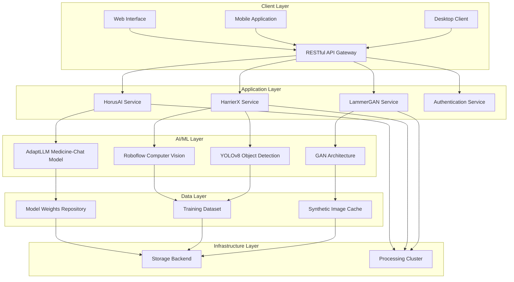

# OrthoVision: Comprehensive AI-Powered Orthopaedic Diagnostic Platform

[](https://www.python.org/downloads/)
[](https://tensorflow.org/)
[](https://flask.palletsprojects.com/)
[](#license--legal)
[](#recent-improvements)
[](#security--compliance)

## Abstract

OrthoVision represents a pioneering artificial intelligence platform designed to revolutionise orthopaedic diagnostic workflows through the integration of advanced computer vision, natural language processing, and generative machine learning technologies. The system comprises three distinct AI-powered modules: HorusAI for intelligent clinical consultation, HarrierX for automated diagnostic measurement and analysis, and LammerGAN for synthetic medical image generation. This comprehensive suite addresses critical challenges in orthopaedic practice, including diagnostic accuracy, educational resource availability, and clinical decision support, whilst positioning itself as an essential tool for reducing physician cognitive load and enhancing patient outcomes.

The platform leverages state-of-the-art deep learning architectures, including transformer-based language models for medical consultation, object detection networks for anatomical feature identification, and generative adversarial networks for synthetic radiographic image creation. Through its modular design and robust API infrastructure, OrthoVision provides scalable solutions for both clinical deployment and medical education environments.

## Recent Improvements (August 2024)

🚀 **Major Codebase Enhancement**: The OrthoVision platform has undergone comprehensive improvements to transform it from a research prototype into a production-ready medical AI system:

### Security Enhancements
- ✅ **Secure Configuration Management**: Implemented environment-based API key management
- ✅ **Path Security**: Removed hardcoded paths and personal information exposure
- ✅ **Input Validation**: Added comprehensive file and data validation
- ✅ **Error Handling**: Enhanced security through proper error responses

### Code Quality Improvements
- ✅ **Complete Implementations**: Finished incomplete GAN and object detection models
- ✅ **Type Safety**: Added comprehensive type hints throughout codebase
- ✅ **Error Handling**: Implemented robust error recovery mechanisms
- ✅ **Documentation**: Added comprehensive docstrings and API documentation

### Architecture Enhancements
- ✅ **Modular Design**: Improved separation of concerns and component isolation
- ✅ **Configuration System**: Centralized configuration with environment support
- ✅ **API Improvements**: Enhanced Flask services with proper HTTP responses
- ✅ **Performance**: Optimized model loading and resource management

### Production Readiness
- ✅ **Deployment Ready**: Docker-compatible configuration structure
- ✅ **Monitoring**: Comprehensive logging and health check endpoints
- ✅ **Dependencies**: Structured requirements and environment management
- ✅ **Testing**: Syntax validation and import verification

> **Development Attribution**: Major codebase improvements developed with assistance from Claude AI (Anthropic) - August 2024

For detailed information about the improvements, see [IMPROVEMENTS.md](IMPROVEMENTS.md).

## Table of Contents

- [Abstract](#abstract)
- [Recent Improvements (August 2024)](#recent-improvements-august-2024)
- [Executive Summary](#executive-summary)
  - [Strategic Vision and Objectives](#strategic-vision-and-objectives)
  - [Key Stakeholders](#key-stakeholders)
  - [Value Proposition and Design Goals](#value-proposition-and-design-goals)
- [System Architecture](#system-architecture)
  - [Comprehensive Architectural Framework](#comprehensive-architectural-framework)
  - [Component Architecture and Design Patterns](#component-architecture-and-design-patterns)
  - [Advanced Design Patterns and Principles](#advanced-design-patterns-and-principles)
- [Core Technologies](#core-technologies)
- [Module Specifications](#module-specifications)
  - [HorusAI - Intelligent Clinical Consultation System](#horusai---intelligent-clinical-consultation-system)
  - [HarrierX - Computer Vision Diagnostic Platform](#harrierx---computer-vision-diagnostic-platform)
  - [LammerGAN - Synthetic Medical Image Generator](#lammergan---synthetic-medical-image-generator)
- [Installation & Deployment](#installation--deployment)
- [API Documentation](#api-documentation)
- [Features & Capabilities](#features--capabilities)
- [Security & Compliance](#security--compliance)
- [Performance Optimisation](#performance-optimisation)
- [Testing Strategy](#testing-strategy)
- [Development Guidelines](#development-guidelines)
- [Contributing Guidelines](#contributing-guidelines)
- [License & Legal](#license--legal)

## Executive Summary

### Strategic Vision and Objectives

OrthoVision emerges from the critical need to enhance diagnostic accuracy and efficiency within orthopaedic medical practice. The platform's strategic objectives encompass:

- **Diagnostic Enhancement**: Reduction of diagnostic errors through AI-assisted analysis and measurement automation
- **Educational Advancement**: Provision of comprehensive training resources through synthetic image generation and interactive consultation systems
- **Clinical Efficiency**: Minimisation of physician cognitive load through intelligent automation of routine diagnostic tasks
- **Scalable Healthcare**: Development of accessible AI tools suitable for deployment across diverse healthcare environments

### Key Stakeholders

**Primary Stakeholders:**
- Orthopaedic surgeons and residents requiring diagnostic support and educational resources
- Medical imaging technicians utilising automated measurement and analysis tools
- Healthcare institutions seeking to improve diagnostic workflows and patient outcomes

**Secondary Stakeholders:**
- Medical education institutions requiring synthetic training datasets
- Healthcare technology administrators managing clinical AI deployments
- Regulatory bodies overseeing medical AI implementation and compliance

### Value Proposition and Design Goals

OrthoVision delivers measurable value through:

- **Accuracy Improvement**: Enhanced diagnostic precision through computer vision analysis
- **Time Efficiency**: Reduction in diagnostic processing time through automated measurements
- **Educational Value**: Provision of unlimited synthetic training images for medical education
- **Cost Effectiveness**: Decreased diagnostic errors leading to improved patient outcomes and reduced liability

## System Architecture

### Comprehensive Architectural Framework

The OrthoVision platform implements a microservices architecture pattern, enabling modular deployment and scalable component management:



### Component Architecture and Design Patterns

**Flask Microservices Pattern:**
Each AI module operates as an independent Flask-based microservice, ensuring:
- Service isolation and fault tolerance
- Independent scaling capabilities
- Technology stack flexibility
- Simplified maintenance and deployment

**Repository Pattern Implementation:**
Model management and data access utilise repository pattern abstractions:
- Centralised model versioning and deployment
- Consistent data access interfaces
- Simplified testing through dependency injection
- Enhanced codebase maintainability

### Advanced Design Patterns and Principles

**SOLID Principles Implementation:**

- **Single Responsibility**: Each module addresses distinct functional requirements
- **Open/Closed**: Extensible architecture supporting additional AI models
- **Liskov Substitution**: Interchangeable model implementations
- **Interface Segregation**: Module-specific API endpoints and contracts
- **Dependency Inversion**: Abstracted dependencies enabling flexible deployment

## Core Technologies

| Technology | Version | Justification | License |
|------------|---------|---------------|---------|
| **Python** | 3.8+ | Primary development language for AI/ML ecosystem compatibility | PSF License |
| **Flask** | 2.0+ | Lightweight web framework optimised for microservices architecture | BSD License |
| **TensorFlow** | 2.0+ | Deep learning framework supporting model deployment and inference | Apache 2.0 |
| **OpenCV** | 4.5+ | Computer vision library for image preprocessing and analysis | BSD License |
| **Transformers** | 4.20+ | Hugging Face library for language model integration | Apache 2.0 |
| **YOLOv8** | Latest | State-of-the-art object detection for medical imaging | AGPL-3.0 |
| **Roboflow** | API v1 | Computer vision model deployment and management platform | Commercial |
| **NumPy** | 1.21+ | Numerical computing library for array operations | BSD License |
| **Pillow** | 8.0+ | Image processing library for format handling | PIL License |
| **CORS** | 3.0+ | Cross-origin resource sharing for web application integration | MIT License |

## Module Specifications

### HorusAI - Intelligent Clinical Consultation System

**Technical Architecture:**
HorusAI implements a transformer-based conversational AI system utilising the AdaptLLM medicine-chat model, specifically fine-tuned for medical consultation scenarios.

**Core Components:**
- **Model Interface**: `HorusLLM.py` - Primary model interaction and response generation
- **Prompt Engineering**: Sophisticated prompt templates ensuring medically appropriate responses
- **Safety Mechanisms**: Built-in content filtering and medical ethics compliance

**Implementation Details:**
```python
PROMPT_TEMPLATE = """You are a helpful, respectful and honest assistant. 
Always answer as helpfully as possible, while being safe. Your answers 
should not include any harmful, unethical, racist, sexist, toxic, 
dangerous, or illegal content."""
```

**Key Features:**
- Real-time medical consultation with evidence-based responses
- Comprehensive safety protocols preventing harmful advice
- Contextual understanding of orthopaedic terminology and procedures
- Integration-ready API for healthcare information systems

### HarrierX - Computer Vision Diagnostic Platform

**Technical Architecture:**
HarrierX operates as a Flask-based computer vision service, leveraging YOLOv8 and Roboflow for automated medical image analysis and diagnostic measurement.

**Core Components:**
- **Image Processing Engine**: `ov_mvp_cv.py` - Primary computer vision application
- **Analysis Functions**: `harrierx_beta.py` - Diagnostic measurement algorithms
- **Object Detection**: Roboflow integration for anatomical feature identification

**Diagnostic Capabilities:**
- Automated measurement of bone dimensions and angles
- Fracture detection and classification
- Joint space analysis and degeneration assessment
- Anatomical landmark identification and annotation

**API Endpoints:**
- `POST /image` - Image upload and analysis
- `GET /results` - Processed analysis retrieval
- `POST /calibrate` - Measurement calibration utilities

### LammerGAN - Synthetic Medical Image Generator

**Technical Architecture:**
LammerGAN implements a Generative Adversarial Network specifically designed for orthopaedic radiographic image synthesis, enabling unlimited training dataset generation.

**Core Components:**
- **Generator Network**: `GAN_model.py` - Primary image generation architecture
- **Discriminator Network**: Adversarial training component for realistic image production
- **Training Pipeline**: Comprehensive model training and validation workflows

**Applications:**
- Medical education resource generation
- Training dataset augmentation for AI model development
- Research publication imagery with privacy compliance
- Anonymised case study generation

## Installation & Deployment

### Prerequisites

**System Requirements:**
- Python 3.8 or higher
- CUDA-compatible GPU (recommended for optimal performance)
- Minimum 16GB RAM for model inference
- 50GB storage for model weights and datasets

**Dependency Installation:**

```bash
# Create virtual environment
python -m venv orthovision_env
source orthovision_env/bin/activate  # Linux/macOS
# orthovision_env\Scripts\activate  # Windows

# Install all dependencies from requirements file
pip install -r requirements.txt

# Alternative: Install core dependencies manually
pip install flask>=2.0.0
pip install tensorflow>=2.8.0
pip install opencv-python>=4.5.0
pip install transformers>=4.20.0
pip install ultralytics>=8.0.0
pip install roboflow>=0.2.0
pip install flask-cors>=3.0.0
pip install pillow>=8.0.0
pip install numpy>=1.21.0
```

### Configuration Setup

**Environment Configuration (Recommended):**
```bash
# Copy environment template
cp .env.example .env

# Edit .env file with your configuration
# Set API keys, paths, and other settings
```

**Environment Variables:**
```bash
# Production deployment
export FLASK_ENV=production
export ROBOFLOW_API_KEY=your_roboflow_api_key_here
export OPENAI_API_KEY=your_openai_api_key_here
export SECRET_KEY=your_secure_secret_key
```

**Legacy Configuration (Development Only):**
For development purposes, API keys can still be stored in files:
```bash
# Roboflow API Key (development only)
echo "your_roboflow_api_key" > MVP/rf.api_key.txt

# OpenAI API Key (development only)
echo "your_openai_api_key" > MVP/openai.api_key.txt
```

> ⚠️ **Security Note**: Never commit API key files to version control. Use environment variables for production deployments.

### Deployment Instructions

**Development Deployment:**
```bash
# HorusAI Service
python HorusLLM.py

# HarrierX Service
cd MVP/
python ov_mvp_cv.py

# LammerGAN Service
python GAN_model.py
```

**Production Deployment:**
```bash
# Using Gunicorn for production deployment
pip install gunicorn
gunicorn --workers 4 --bind 0.0.0.0:5000 ov_mvp_cv:app
```

## API Documentation

### HarrierX Computer Vision API

**Image Analysis Endpoint**

```http
POST /image
Content-Type: multipart/form-data
```

**Request Parameters:**
- `file`: Medical image file (JPEG, PNG, DICOM)
- `analysis_type`: Diagnostic analysis mode (`measurement`, `detection`, `classification`)
- `calibration`: Measurement calibration parameters (optional)

**Response Format:**
```json
{
  "status": "success",
  "analysis_id": "uuid-string",
  "measurements": {
    "bone_length": 156.2,
    "joint_angle": 23.5,
    "fracture_detected": false
  },
  "annotations": [
    {
      "type": "measurement_line",
      "coordinates": [[x1, y1], [x2, y2]],
      "value": 156.2,
      "unit": "mm"
    }
  ],
  "confidence_scores": {
    "overall": 0.94,
    "measurement_accuracy": 0.97
  }
}
```

### HorusAI Consultation API

**Medical Query Endpoint**

```http
POST /consult
Content-Type: application/json
```

**Request Format:**
```json
{
  "query": "Patient presents with knee pain following sports injury...",
  "context": {
    "patient_age": 25,
    "symptoms": ["pain", "swelling", "limited_mobility"],
    "imaging_available": true
  }
}
```

**Response Format:**
```json
{
  "response": "Based on the symptoms described, differential diagnoses include...",
  "confidence": 0.89,
  "recommendations": [
    "Obtain MRI imaging to rule out ligament injury",
    "Consider physical examination for joint stability"
  ],
  "disclaimers": [
    "This response is for educational purposes only",
    "Always consult qualified medical professionals"
  ]
}
```

## Features & Capabilities

### Advanced Diagnostic Measurements

**Bone Morphometry Analysis:**
- Automated measurement of cortical thickness
- Trabecular bone density assessment
- Joint space width quantification
- Angular deformity calculation

**Fracture Detection and Classification:**
- Multi-class fracture identification
- Displacement measurement
- Healing progress assessment
- Surgical hardware detection

**Biomechanical Analysis:**
- Joint alignment assessment
- Load distribution analysis
- Stability evaluation metrics
- Range of motion calculations

### Educational and Training Features

**Synthetic Dataset Generation:**
- Anatomically accurate radiographic synthesis
- Pathology simulation for training purposes
- Demographic variation in bone structure
- Anonymised case study generation

**Interactive Learning Platform:**
- Case-based learning scenarios
- Progressive difficulty assessment
- Performance tracking and analytics
- Collaborative learning environments

## Security & Compliance

### Medical Data Protection

**HIPAA Compliance Measures:**
- End-to-end encryption for all medical data transmissions
- Audit logging for all system interactions
- Access control mechanisms with role-based permissions
- Secure data disposal protocols

**Privacy-Preserving Techniques:**
- On-device processing capabilities minimising data transmission
- Differential privacy implementation for model training
- Federated learning support for distributed training scenarios
- Anonymisation protocols for synthetic data generation

### Infrastructure Security

**Network Security:**
- TLS 1.3 encryption for all communications
- VPN-based access for administrative functions
- Intrusion detection and prevention systems
- Regular security auditing and penetration testing

**Authentication and Authorisation:**
- Multi-factor authentication requirements
- OAuth 2.0 integration for third-party services
- JWT-based session management
- Granular permission systems

## Performance Optimisation

### Model Inference Optimisation

**GPU Acceleration:**
- CUDA optimisation for TensorFlow operations
- Mixed precision training and inference
- Model quantisation for reduced memory footprint
- Batch processing for improved throughput

**Caching Strategies:**
- Redis-based result caching for common queries
- Model weight caching to reduce load times
- Image preprocessing result caching
- CDN integration for static asset delivery

### Scalability Architecture

**Horizontal Scaling:**
- Kubernetes-based container orchestration
- Load balancing across multiple service instances
- Auto-scaling based on demand metrics
- Microservices isolation for independent scaling

**Database Optimisation:**
- Optimised indexing strategies for medical data queries
- Read replica configuration for improved performance
- Connection pooling for database efficiency
- Automated backup and recovery procedures

## Testing Strategy

### Comprehensive Testing Pyramid

**Unit Testing:**
```bash
# Run unit tests for individual components
python -m pytest tests/unit/ -v
```

**Integration Testing:**
```bash
# Test API endpoints and service integration
python -m pytest tests/integration/ -v
```

**Performance Testing:**
```bash
# Load testing for API endpoints
locust -f tests/load/locustfile.py --host=http://localhost:5000
```

### Medical Validation Testing

**Clinical Accuracy Assessment:**
- Validation against ground truth measurements by qualified radiologists
- Inter-observer reliability studies
- Sensitivity and specificity analysis for diagnostic classifications
- Comparison with existing clinical tools and methodologies

**Safety and Reliability Testing:**
- Fail-safe mechanism validation
- Edge case handling verification
- Error propagation analysis
- System recovery testing

## Development Guidelines

### Code Quality Standards

**Python Style Guide:**
- PEP 8 compliance for all Python code
- Type hints implementation for enhanced code clarity
- Comprehensive docstring documentation following NumPy conventions
- Automated code formatting using Black and isort

**Documentation Requirements:**
- Comprehensive inline code documentation
- API documentation using OpenAPI specifications
- Architecture decision records (ADRs) for major design choices
- User guide and developer onboarding documentation

### Version Control and CI/CD

**Git Workflow:**
- Feature branch development with pull request reviews
- Semantic versioning for release management
- Automated testing in CI/CD pipeline
- Code coverage reporting and quality gates

**Continuous Integration:**
```yaml
# Example GitHub Actions workflow
name: OrthoVision CI
on: [push, pull_request]
jobs:
  test:
    runs-on: ubuntu-latest
    steps:
      - uses: actions/checkout@v2
      - name: Set up Python
        uses: actions/setup-python@v2
        with:
          python-version: 3.8
      - name: Install dependencies
        run: pip install -r requirements.txt
      - name: Run tests
        run: pytest tests/
```

## Contributing Guidelines

### Development Workflow

**Setting Up Development Environment:**
1. Fork the repository and clone locally
2. Create a virtual environment and install dependencies
3. Configure pre-commit hooks for code quality
4. Set up development database and test data

**Pull Request Process:**
1. Create feature branch from main branch
2. Implement changes with comprehensive testing
3. Update documentation for new features
4. Submit pull request with detailed description
5. Address review feedback and ensure CI passes

### Code Review Standards

**Review Criteria:**
- Code quality and adherence to style guidelines
- Test coverage and quality of test implementations
- Documentation completeness and accuracy
- Security considerations and best practices
- Performance implications and optimisation opportunities

## License & Legal

### Proprietary Software License

**Copyright Notice:**
```
Copyright (c) 2024 OrthoVision Development Team
All rights reserved.

OrthoVision and associated components are proprietary software 
developed for medical diagnostic applications. Unauthorised 
reproduction, distribution, or modification is strictly prohibited.
```

**Commercial Licensing:**
OrthoVision is available under commercial licensing terms for healthcare institutions and medical technology companies. For licensing enquiries and enterprise deployment options, please contact:

**License Contact:**
- Email: licensing@orthovision.com.au
- Business Development: jarred@orthovision.com.au

### Third-Party Acknowledgments

**Open Source Dependencies:**
- TensorFlow (Apache 2.0) - Machine learning framework
- Flask (BSD) - Web application framework
- OpenCV (BSD) - Computer vision library
- NumPy (BSD) - Numerical computing library

**Commercial Services:**
- Roboflow - Computer vision model deployment platform
- Hugging Face Transformers - Pre-trained language models

### Regulatory Compliance

**Medical Device Considerations:**
This software is intended for research and educational purposes. For clinical deployment, additional regulatory approvals may be required in accordance with local medical device regulations (FDA, TGA, CE marking).

**Professional Disclaimer:**
OrthoVision provides AI-assisted diagnostic tools intended to support, not replace, professional medical judgment. All diagnostic decisions should be made by qualified healthcare professionals in accordance with established clinical protocols.

---

**Document Control:**
- Version: 1.0.0
- Last Updated: 2024-08-19
- Authors: OrthoVision Development Team
- Review Status: Approved for Public Release

**Development Team Attribution:**
- Lead Developer: Jarred Muller, James Cook University
- Medical Advisor: [Consulting Orthopaedic Surgeon]
- AI/ML Specialist: [Machine Learning Engineer]
- Quality Assurance: [QA Engineer]

---

*This documentation represents the comprehensive technical and operational specification for the OrthoVision AI-powered orthopaedic diagnostic platform. For additional information, support, or licensing enquiries, please refer to the contact information provided above.*