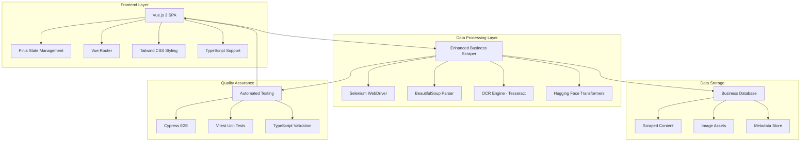

# Help-Now: AI-Enhanced Local Business Discovery Platform

[](https://vuejs.org/)
[](https://www.python.org/downloads/)
[](https://www.typescriptlang.org/)
[](https://vitejs.dev/)
[](https://tensorflow.org/)
[](https://selenium.dev/)
[](#license)
[](#machine-learning-framework)

## Abstract

Help-Now is a comprehensive Vue.js 3 web application coupled with advanced Python-based web scraping infrastructure designed to revolutionise local business discovery and community service mapping. This platform integrates modern frontend technologies with sophisticated data harvesting capabilities to create an intelligent business directory that serves both consumers seeking services and businesses requiring digital visibility. The system employs machine learning-enhanced web scraping, optical character recognition (OCR), and automated data validation to maintain accurate, up-to-date business information across Australian localities.

## System Architecture



## Core Technologies

### Frontend Stack
- **Vue.js 3.4**: Composition API with `<script setup>` syntax for reactive user interfaces
- **TypeScript**: Full type safety across components and business logic
- **Vite 6.1**: High-performance build tooling with hot module replacement
- **Pinia 3.0**: Modern state management with TypeScript support
- **Tailwind CSS 3.4**: Utility-first styling framework with responsive design
- **Vue Router**: Client-side routing for single-page application navigation

### Data Harvesting Infrastructure
- **Selenium WebDriver**: JavaScript-enabled web scraping with Chrome automation
- **BeautifulSoup**: HTML/XML parsing and DOM manipulation
- **Tesseract OCR**: Optical character recognition for image-based content extraction
- **Hugging Face Transformers**: Natural language processing for content analysis
- **PIL (Python Imaging Library)**: Image processing and optimisation
- **Concurrent Futures**: Parallel processing for high-performance scraping

### Testing & Quality Assurance
- **Cypress**: End-to-end testing framework with visual debugging
- **Vitest**: Unit testing with Vue.js component support
- **TypeScript Compiler**: Static type checking and validation
- **Vue Test Utils**: Component testing utilities

## Feature Specifications

### 1. Business Discovery Interface

**Primary Components:**
- Responsive business listing interface with infinite scroll
- Advanced filtering system (location, category, rating, hours)
- Interactive map integration with geolocation services
- Real-time search with fuzzy matching algorithms
- Mobile-first responsive design with touch optimisation

**Implementation Details:**
```typescript
// Business search component with reactive filtering
import { ref, computed, watch } from 'vue'
import { useBusinessStore } from '@/stores/business'

export interface BusinessFilter {
  location: string
  category: string
  radius: number
  isOpen: boolean
}

const businessStore = useBusinessStore()
const filters = ref<BusinessFilter>({
  location: '',
  category: '',
  radius: 5,
  isOpen: false
})

const filteredBusinesses = computed(() => 
  businessStore.filterBusinesses(filters.value)
)
```

### 2. Enhanced Web Scraping Engine

**Core Capabilities:**
- Multi-threaded scraping with configurable concurrency limits
- JavaScript-rendered content extraction using Selenium
- Image-based content analysis through OCR processing
- Intelligent retry mechanisms with exponential backoff
- Data validation and cleansing pipelines

**Scraper Architecture:**
```python
class EnhancedBusinessScraper:
    def __init__(self, business_name=None, use_selenium=True, use_ocr=True):
        self.business_name = business_name
        self.use_selenium = use_selenium
        self.use_ocr = use_ocr
        self.setup_webdriver()
        self.initialize_nlp_pipeline()
    
    async def scrape_business_data(self, url: str) -> BusinessData:
        """
        Comprehensive business data extraction with multiple fallback methods
        """
        content = await self.extract_html_content(url)
        images = await self.extract_and_process_images(url)
        ocr_text = await self.process_images_with_ocr(images)
        
        return self.merge_and_validate_data(content, ocr_text)
```

### 3. Machine Learning Integration

**Natural Language Processing:**
- Business description extraction using transformer models
- Sentiment analysis for review processing
- Named entity recognition for contact information
- Classification of business categories and services

**Computer Vision Applications:**
- Logo detection and brand recognition
- Menu/price list extraction from images
- Opening hours extraction from signage
- Quality assessment of business imagery

## API Documentation

### Business Data Model
```typescript
interface BusinessEntity {
  id: string
  name: string
  description: string
  category: BusinessCategory
  location: {
    address: string
    coordinates: {
      latitude: number
      longitude: number
    }
    suburb: string
    state: string
    postcode: string
  }
  contact: {
    phone?: string
    email?: string
    website?: string
    socialMedia: SocialMediaLinks
  }
  operatingHours: OperatingHours[]
  rating: number
  reviews: Review[]
  imagery: BusinessImage[]
  lastUpdated: Date
  verificationStatus: VerificationLevel
}
```

### Data Scraping Endpoints
```python
# Web scraping service API
class ScrapingService:
    @route('/api/scrape/business')
    async def scrape_business(self, request: ScrapeRequest) -> ScrapeResponse:
        """Extract comprehensive business data from provided URLs"""
        
    @route('/api/scrape/validate')
    async def validate_business_data(self, data: BusinessData) -> ValidationResult:
        """Validate and enrich scraped business information"""
        
    @route('/api/scrape/images')
    async def process_business_images(self, image_urls: List[str]) -> ImageProcessingResult:
        """Extract text and metadata from business imagery"""
```

## Development Workflow

### Local Development Setup
```bash
# Frontend development
cd my-vue-app
npm install
npm run dev

# Backend scraping service
cd web_scrape
python -m venv venv
source venv/bin/activate  # Linux/macOS
pip install -r requirements.txt
python scraper.py
```

### Testing Strategy
```bash
# Unit testing
npm run test:unit

# End-to-end testing
npm run test:e2e:dev

# Type checking
npm run type-check

# Production build validation
npm run build
npm run test:e2e
```

### Code Quality Standards
- **TypeScript Strict Mode**: Enforced type safety across all components
- **ESLint + Prettier**: Automated code formatting and style enforcement
- **Cypress Testing**: Comprehensive E2E test coverage for user workflows
- **Component Testing**: Unit tests for all Vue components and composables

## Security & Privacy Framework

### Data Protection Measures
- **GDPR Compliance**: User consent management for data processing
- **Rate Limiting**: API protection against excessive requests
- **Input Sanitisation**: XSS and injection attack prevention
- **Secure Headers**: CSP, HSTS, and security header implementation

### Web Scraping Ethics
- **Robots.txt Compliance**: Respectful scraping practices
- **Request Throttling**: Configurable delays between requests
- **User-Agent Identification**: Transparent bot identification
- **Data Minimisation**: Collection of only necessary business information

## Performance Optimisation

### Frontend Performance
- **Code Splitting**: Dynamic imports for route-based chunking
- **Image Optimisation**: WebP format with responsive sizing
- **Caching Strategy**: Service worker implementation for offline capability
- **Bundle Analysis**: Regular monitoring of build size and dependencies

### Scraping Performance
- **Concurrent Processing**: Parallel request handling with ThreadPoolExecutor
- **Intelligent Caching**: Redis-based result caching for repeated requests
- **Resource Monitoring**: Memory and CPU usage optimisation
- **Error Recovery**: Robust retry mechanisms with circuit breaker patterns

## Deployment Architecture

### Production Environment
```yaml
# Docker containerisation
services:
  frontend:
    build: ./my-vue-app
    ports:
      - "80:80"
    environment:
      - NODE_ENV=production
      
  scraper:
    build: ./web_scrape
    environment:
      - PYTHON_ENV=production
      - SELENIUM_GRID_URL=http://selenium:4444
      
  selenium:
    image: selenium/standalone-chrome:latest
    shm_size: 2gb
```

### Continuous Integration
- **GitHub Actions**: Automated testing and deployment pipelines
- **Quality Gates**: Test coverage requirements and performance benchmarks
- **Environment Promotion**: Staging to production deployment validation
- **Monitoring Integration**: Application performance monitoring setup

## Research Applications

### Community Service Mapping
- **Local Business Ecosystem Analysis**: Understanding service distribution patterns
- **Digital Divide Research**: Measuring business digital presence gaps
- **Economic Development Insights**: Tracking business growth and decline trends
- **Accessibility Mapping**: Identifying service accessibility for different demographics

### Data Science Applications
- **Business Intelligence**: Predictive analytics for market trends
- **Recommendation Systems**: ML-powered business suggestions
- **Sentiment Analysis**: Community satisfaction with local services
- **Geospatial Analytics**: Location-based service optimisation

## Educational Integration

### Learning Outcomes
- **Full-Stack Development**: Modern web application architecture
- **Data Engineering**: ETL pipelines and data processing workflows
- **Machine Learning**: Practical NLP and computer vision applications
- **Software Engineering**: Testing, deployment, and maintenance practices

### Research Extensions
- **Advanced ML Models**: Custom business classification algorithms
- **Real-Time Processing**: WebSocket-based live data updates
- **Mobile Applications**: React Native or Flutter companion apps
- **API Integration**: Third-party service provider connections

## Contributing Guidelines

### Development Standards
- **Git Workflow**: Feature branch development with pull request reviews
- **Documentation**: Comprehensive JSDoc comments for all public APIs
- **Testing Requirements**: 80% minimum test coverage for new features
- **Performance Benchmarks**: Response time and memory usage monitoring

### Community Contributions
- **Issue Templates**: Structured bug reports and feature requests
- **Code Reviews**: Collaborative development practices
- **Documentation Updates**: Community-driven knowledge base maintenance
- **Extension Development**: Plugin architecture for custom features

## License & Attribution

**License**: MIT License - Open source software for community benefit

**Third-Party Acknowledgements**:
- Vue.js Team for reactive framework architecture
- Selenium Contributors for web automation capabilities
- Tesseract OCR Community for optical character recognition
- Hugging Face for transformer model ecosystem

## Project Roadmap

### Phase 1: Foundation (Current)
- ✅ Vue.js 3 application scaffolding
- ✅ TypeScript integration and configuration
- ✅ Advanced web scraping infrastructure
- ✅ OCR and ML pipeline implementation

### Phase 2: Enhancement
- 🔄 Real-time data synchronisation
- 🔄 Advanced search and filtering
- 🔄 Mobile application development
- 🔄 API marketplace integration

### Phase 3: Intelligence
- 📋 Machine learning recommendations
- 📋 Predictive business analytics
- 📋 Community feedback integration
- 📋 Automated content moderation

---

*© 2025 Help-Now Platform. Developed for community service discovery and local business support across Australian markets.*