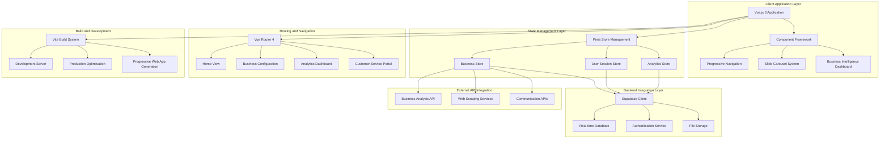

# KAITY: Intelligent Customer Service and Business Intelligence Platform

[](https://vuejs.org/)
[](https://vitejs.dev/)
[](https://supabase.com/)
[](#license--legal)

## Abstract

KAITY represents a cutting-edge customer service and business intelligence platform engineered to revolutionise customer communication management through intelligent automation, real-time analytics, and comprehensive business workflow optimisation. Built upon Vue.js 3's composition API and powered by Supabase's real-time infrastructure, the platform delivers sophisticated customer service tools designed to enhance business-customer interactions whilst providing comprehensive business intelligence capabilities for data-driven decision making.

The system integrates advanced business analysis algorithms with automated customer service workflows, intelligent call centre management, and comprehensive FAQ generation systems. Through its modular architecture combining progressive web application capabilities, real-time data synchronisation, and intelligent business process automation, KAITY establishes itself as an essential platform for businesses seeking to optimise customer service delivery and enhance operational efficiency through technology-driven solutions.

## Table of Contents

- [Abstract](#abstract)
- [Executive Summary](#executive-summary)
  - [Strategic Vision and Business Objectives](#strategic-vision-and-business-objectives)
  - [Key Stakeholders](#key-stakeholders)
  - [Value Proposition and Operational Impact](#value-proposition-and-operational-impact)
- [System Architecture](#system-architecture)
  - [Frontend Architecture and Component Framework](#frontend-architecture-and-component-framework)
  - [Backend Infrastructure and Data Management](#backend-infrastructure-and-data-management)
  - [Progressive Web Application Design](#progressive-web-application-design)
- [Core Technologies](#core-technologies)
- [Feature Specifications](#feature-specifications)
  - [Business Intelligence Dashboard](#business-intelligence-dashboard)
  - [Customer Service Management System](#customer-service-management-system)
  - [Automated Business Analysis](#automated-business-analysis)
  - [Real-time Communication Platform](#real-time-communication-platform)
- [Installation & Deployment](#installation--deployment)
- [API Documentation](#api-documentation)
- [Component Architecture](#component-architecture)
- [State Management](#state-management)
- [Business Intelligence Analytics](#business-intelligence-analytics)
- [Security & Authentication](#security--authentication)
- [Performance Optimisation](#performance-optimisation)
- [Testing Strategy](#testing-strategy)
- [Development Guidelines](#development-guidelines)
- [Contributing Guidelines](#contributing-guidelines)
- [License & Legal](#license--legal)

## Executive Summary

### Strategic Vision and Business Objectives

KAITY addresses fundamental challenges in customer service delivery and business intelligence through intelligent automation and comprehensive data-driven insights. The platform's strategic business objectives encompass:

- **Customer Service Excellence**: Enhancement of customer communication quality through intelligent automation and streamlined service delivery workflows
- **Business Process Optimisation**: Comprehensive analysis and optimisation of business operations through data-driven insights and automated workflow management
- **Operational Efficiency**: Reduction of customer service operational overhead through intelligent automation and self-service capabilities
- **Data-Driven Decision Making**: Provision of comprehensive business intelligence enabling informed strategic planning and operational optimisation

### Key Stakeholders

**Primary Business Stakeholders:**
- Small to medium-sized business owners seeking comprehensive customer service solutions
- Customer service managers requiring intelligent workflow automation and analytics
- Call centre operators and customer service representatives
- Business analysts and operations managers requiring business intelligence tools

**Secondary Stakeholders:**
- Business consultants implementing customer service optimisation strategies
- Technology service providers offering managed customer service solutions
- Franchise operations requiring standardised customer service frameworks
- E-commerce platforms seeking integrated customer communication solutions

### Value Proposition and Operational Impact

KAITY delivers measurable business value through:

- **Service Quality Enhancement**: Improvement in customer satisfaction through intelligent automation and response optimisation
- **Operational Cost Reduction**: Reduction of customer service costs through automated FAQ generation and intelligent call routing
- **Business Intelligence**: Comprehensive analytics providing actionable insights for strategic business planning and operational improvement
- **Scalability**: Flexible platform architecture supporting business growth and expanding customer service requirements

## System Architecture

### Frontend Architecture and Component Framework

The KAITY platform implements a modern, scalable Vue.js architecture optimised for progressive web application delivery and real-time user interaction:



### Backend Infrastructure and Data Management

**Supabase Integration Architecture:**
```javascript
// Core Supabase configuration and business logic
class BusinessIntelligenceService {
  constructor() {
    this.supabaseClient = createClient(
      process.env.SUPABASE_URL,
      process.env.SUPABASE_ANON_KEY
    )
  }
  
  async analyzeBusinessProfile(businessData) {
    // Comprehensive business analysis workflow
    const analysis = await this.processBusinessMetrics(businessData)
    const recommendations = await this.generateActionableInsights(analysis)
    const automationRules = await this.createAutomationRules(businessData)
    
    return {
      businessProfile: analysis,
      strategicRecommendations: recommendations,
      automationConfiguration: automationRules,
      performanceMetrics: await this.calculatePerformanceIndicators(analysis)
    }
  }
  
  async optimizeCustomerServiceWorkflows(serviceData) {
    // Intelligent customer service optimisation
    const workflowAnalysis = await this.analyzeCurrentWorkflows(serviceData)
    const bottleneckIdentification = await this.identifyServiceBottlenecks(workflowAnalysis)
    const automationOpportunities = await this.identifyAutomationOpportunities(serviceData)
    
    return {
      workflowOptimisation: workflowAnalysis,
      performanceImprovements: bottleneckIdentification,
      automationRecommendations: automationOpportunities
    }
  }
}
```

### Progressive Web Application Design

**PWA Architecture and Capabilities:**
```javascript
// Progressive Web Application configuration
class PWAConfiguration {
  constructor() {
    this.serviceWorkerConfig = {
      caching_strategies: ['cache_first', 'network_first', 'stale_while_revalidate'],
      offline_capabilities: true,
      background_sync: true,
      push_notifications: true
    }
  }
  
  async enableOfflineCapabilities() {
    // Configure offline business intelligence access
    const offlineStore = await this.initializeOfflineStorage()
    const syncManager = await this.configureSyncManager()
    const cachingStrategy = await this.implementIntelligentCaching()
    
    return {
      offline_storage: offlineStore,
      synchronisation_manager: syncManager,
      caching_configuration: cachingStrategy
    }
  }
  
  async configureRealTimeUpdates() {
    // Real-time business intelligence updates
    const subscriptions = await this.setupRealtimeSubscriptions()
    const notificationManager = await this.configureNotificationSystem()
    
    return {
      realtime_subscriptions: subscriptions,
      notification_system: notificationManager
    }
  }
}
```

## Core Technologies

| Technology | Version | Justification | License |
|------------|---------|---------------|---------|
| **Vue.js** | 3.5+ | Progressive framework for building sophisticated user interfaces with composition API | MIT License |
| **Vite** | 6.2+ | Lightning-fast build tool optimised for modern web development | MIT License |
| **Pinia** | 3.0+ | Intuitive state management solution for Vue.js applications | MIT License |
| **Vue Router** | 4.5+ | Official routing library for Vue.js single-page applications | MIT License |
| **Supabase** | 2.49+ | Backend-as-a-Service providing real-time database and authentication | Apache 2.0 |
| **Tailwind CSS** | 4.0+ | Utility-first CSS framework for rapid UI development | MIT License |
| **Axios** | 1.8+ | Promise-based HTTP client for API communication | MIT License |
| **ESLint** | 9.21+ | JavaScript and Vue.js code quality analysis and error prevention | MIT License |
| **Prettier** | 3.5+ | Code formatting and style consistency enforcement | MIT License |
| **OXLint** | 0.15+ | High-performance JavaScript/TypeScript linter for code quality | MIT License |

## Feature Specifications

### Business Intelligence Dashboard

**Comprehensive Business Analytics Framework:**
The platform implements sophisticated business intelligence capabilities designed for comprehensive business performance analysis:

```javascript
// Business Intelligence Component Architecture
export const useBusinessStore = defineStore('business', {
  state: () => ({
    businessDetails: {
      businessUrl: '',
      businessName: '',
      openingHours: '',
      services: [],
      businessPhoneNumber: '',
      personalPhoneNumber: '',
      faqs: [],
      agentResponse: '',
      email: '',
      performanceMetrics: {
        customerSatisfactionScore: 0,
        averageResponseTime: 0,
        resolutionRate: 0,
        serviceEfficiencyIndex: 0
      }
    },
    analyticsData: {
      customerInteractions: [],
      serviceMetrics: {},
      businessPerformance: {},
      predictiveInsights: {}
    },
    isLoading: false,
    errorMessage: ''
  }),
  
  actions: {
    async analyzeBusinessPerformance() {
      this.isLoading = true
      try {
        // Comprehensive business analysis
        const performanceData = await this.fetchPerformanceMetrics()
        const customerInsights = await this.analyzeCustomerBehavior()
        const operationalEfficiency = await this.assessOperationalEfficiency()
        
        // Generate predictive analytics
        const predictiveModel = await this.generatePredictiveInsights({
          performance: performanceData,
          customer_behavior: customerInsights,
          operational_data: operationalEfficiency
        })
        
        this.analyticsData = {
          performance_metrics: performanceData,
          customer_insights: customerInsights,
          operational_efficiency: operationalEfficiency,
          predictive_analytics: predictiveModel
        }
        
        return this.analyticsData
      } catch (error) {
        this.errorMessage = `Business analysis failed: ${error.message}`
        throw error
      } finally {
        this.isLoading = false
      }
    }
    
    async optimizeBusinessOperations() {
      // Intelligent business process optimisation
      const currentProcesses = await this.analyzeCurrentProcesses()
      const inefficiencies = await this.identifyInefficiencies(currentProcesses)
      const optimisationRecommendations = await this.generateOptimisationStrategies(inefficiencies)
      
      return {
        current_state: currentProcesses,
        improvement_areas: inefficiencies,
        optimization_recommendations: optimisationRecommendations,
        expected_impact: await this.calculateOptimisationImpact(optimisationRecommendations)
      }
    }
  }
})
```

**Real-time Analytics and Reporting:**
```vue
<template>
  <div class="business-intelligence-dashboard">
    <div class="analytics-overview">
      <div class="performance-metrics">
        <MetricCard 
          title="Customer Satisfaction"
          :value="businessMetrics.customerSatisfaction"
          :trend="performanceTrends.satisfaction"
          icon="customer-service"
        />
        <MetricCard 
          title="Response Efficiency"
          :value="businessMetrics.responseEfficiency"
          :trend="performanceTrends.efficiency"
          icon="stopwatch"
        />
        <MetricCard 
          title="Service Quality Index"
          :value="businessMetrics.serviceQuality"
          :trend="performanceTrends.quality"
          icon="target"
        />
      </div>
      
      <div class="predictive-insights">
        <PredictiveAnalyticsChart 
          :data="predictiveData"
          :forecast-period="forecastSettings.period"
          @insight-selected="handleInsightSelection"
        />
      </div>
    </div>
    
    <div class="actionable-recommendations">
      <RecommendationEngine 
        :business-data="businessProfile"
        :performance-metrics="performanceData"
        @recommendation-applied="updateBusinessStrategy"
      />
    </div>
  </div>
</template>

<script setup>
import { computed, onMounted } from 'vue'
import { useBusinessStore } from '@/stores/businessStore'

const businessStore = useBusinessStore()

const businessMetrics = computed(() => ({
  customerSatisfaction: businessStore.calculateSatisfactionScore(),
  responseEfficiency: businessStore.calculateEfficiencyMetrics(),
  serviceQuality: businessStore.assessServiceQuality()
}))

const performanceTrends = computed(() => 
  businessStore.analyzePerformanceTrends()
)

onMounted(async () => {
  await businessStore.initializeBusinessIntelligence()
  await businessStore.startRealTimeMonitoring()
})
</script>
```

### Customer Service Management System

**Intelligent Customer Communication Platform:**
```javascript
class CustomerServiceManager {
  constructor() {
    this.communicationChannels = ['phone', 'email', 'chat', 'social_media']
    this.automationRules = new Map()
    this.serviceMetrics = new ServiceMetricsCollector()
  }
  
  async processCustomerInquiry(inquiry) {
    // Intelligent inquiry processing and routing
    const inquiryAnalysis = await this.analyzeInquiryContent(inquiry)
    const urgencyAssessment = await this.assessInquiryUrgency(inquiry)
    const routingDecision = await this.determineOptimalRouting(inquiryAnalysis, urgencyAssessment)
    
    // Generate automated response if appropriate
    if (routingDecision.automation_eligible) {
      const automatedResponse = await this.generateAutomatedResponse(inquiry, inquiryAnalysis)
      return {
        response_type: 'automated',
        response_content: automatedResponse,
        escalation_required: false,
        satisfaction_prediction: await this.predictCustomerSatisfaction(automatedResponse)
      }
    }
    
    // Route to appropriate human agent
    const agentAssignment = await this.assignToOptimalAgent(routingDecision)
    return {
      response_type: 'human_assisted',
      assigned_agent: agentAssignment,
      estimated_resolution_time: await this.estimateResolutionTime(inquiry, agentAssignment),
      priority_level: urgencyAssessment.priority
    }
  }
  
  async generateBusinessFAQs(businessData) {
    // Intelligent FAQ generation based on business analysis
    const commonInquiries = await this.analyzeCommonCustomerQuestions(businessData)
    const businessSpecificQuestions = await this.generateContextualQuestions(businessData)
    const industryStandardQuestions = await this.getIndustryBestPractices(businessData.industry)
    
    const comprehensiveFAQs = await this.synthesizeFAQDatabase({
      common_inquiries: commonInquiries,
      business_specific: businessSpecificQuestions,
      industry_standards: industryStandardQuestions
    })
    
    return {
      faqs: comprehensiveFAQs,
      automation_coverage: await this.calculateAutomationCoverage(comprehensiveFAQs),
      implementation_recommendations: await this.generateImplementationStrategy(comprehensiveFAQs)
    }
  }
}
```

### Automated Business Analysis

**Web-Based Business Intelligence Extraction:**
```javascript
class BusinessAnalysisEngine {
  constructor() {
    this.analysisModules = {
      web_content_analyzer: new WebContentAnalyzer(),
      competitor_analyzer: new CompetitorAnalyzer(),
      market_research: new MarketResearchEngine(),
      performance_optimizer: new PerformanceOptimizer()
    }
  }
  
  async analyzeBusinessWebsite(businessUrl) {
    // Comprehensive website analysis for business intelligence
    const websiteAnalysis = await this.analysisModules.web_content_analyzer.analyze(businessUrl)
    const competitiveAnalysis = await this.analysisModules.competitor_analyzer.analyzeCompetitors(businessUrl)
    const marketInsights = await this.analysisModules.market_research.generateMarketIntelligence(websiteAnalysis)
    
    const businessProfile = {
      website_analysis: {
        content_quality: websiteAnalysis.content_assessment,
        user_experience: websiteAnalysis.ux_evaluation,
        technical_performance: websiteAnalysis.technical_metrics,
        seo_optimization: websiteAnalysis.seo_analysis
      },
      competitive_landscape: {
        competitor_profiles: competitiveAnalysis.competitors,
        market_positioning: competitiveAnalysis.positioning,
        competitive_advantages: competitiveAnalysis.advantages,
        improvement_opportunities: competitiveAnalysis.opportunities
      },
      market_intelligence: {
        industry_trends: marketInsights.trends,
        customer_segments: marketInsights.segments,
        growth_opportunities: marketInsights.opportunities,
        risk_factors: marketInsights.risks
      }
    }
    
    return {
      business_profile: businessProfile,
      strategic_recommendations: await this.generateStrategicRecommendations(businessProfile),
      action_plan: await this.createActionPlan(businessProfile),
      roi_projections: await this.calculateROIProjections(businessProfile)
    }
  }
  
  extractBusinessNameFromUrl(url) {
    // Intelligent business name extraction from URL
    try {
      // Remove protocol and www prefix
      let domain = url.replace(/https?:\/\//, '').replace(/www\./, '')
      
      // Extract domain without path
      domain = domain.split('/')[0]
      
      // Remove TLD and extract business name
      const domainParts = domain.split('.')
      if (domainParts.length > 1) {
        const businessName = domainParts[0]
        
        // Clean and format business name
        return this.formatBusinessName(businessName)
      }
      
      return domain
    } catch (error) {
      throw new Error(`Business name extraction failed: ${error.message}`)
    }
  }
  
  formatBusinessName(rawName) {
    // Intelligent business name formatting
    return rawName
      .replace(/[-_]/g, ' ')
      .split(' ')
      .map(word => word.charAt(0).toUpperCase() + word.slice(1).toLowerCase())
      .join(' ')
  }
}
```

### Real-time Communication Platform

**Multi-Channel Communication Integration:**
```vue
<template>
  <div class="communication-platform">
    <div class="communication-channels">
      <ChannelManager 
        v-for="channel in activeChannels"
        :key="channel.id"
        :channel="channel"
        :real-time-data="realtimeData[channel.id]"
        @message-received="handleIncomingMessage"
        @response-sent="trackResponseMetrics"
      />
    </div>
    
    <div class="intelligent-routing">
      <RoutingEngine 
        :routing-rules="intelligentRoutingRules"
        :agent-availability="agentStatus"
        :customer-priority="customerPriorityMatrix"
        @routing-decision="executeRouting"
      />
    </div>
    
    <div class="automation-center">
      <AutomationRuleEngine 
        :business-rules="automationConfiguration"
        :learning-model="mlBasedAutomation"
        @automation-triggered="logAutomationEvent"
      />
    </div>
  </div>
</template>

<script setup>
import { ref, computed, onMounted } from 'vue'
import { useBusinessStore } from '@/stores/businessStore'
import { supabase } from '@/supabase'

const businessStore = useBusinessStore()
const activeChannels = ref([])
const realtimeData = ref({})

const intelligentRoutingRules = computed(() => ({
  urgency_based_routing: businessStore.urgencyRoutingConfig,
  skill_based_assignment: businessStore.skillBasedRouting,
  load_balancing: businessStore.loadBalancingRules,
  customer_history_priority: businessStore.customerHistoryRules
}))

const automationConfiguration = computed(() => ({
  faq_automation: businessStore.faqAutomationRules,
  escalation_triggers: businessStore.escalationConfiguration,
  response_templates: businessStore.responseTemplates,
  sentiment_analysis: businessStore.sentimentAnalysisConfig
}))

onMounted(async () => {
  // Initialize real-time communication infrastructure
  await initializeCommunicationChannels()
  await setupRealtimeSubscriptions()
  await configureIntelligentAutomation()
})

async function setupRealtimeSubscriptions() {
  // Supabase real-time subscriptions for live communication
  const subscription = supabase
    .channel('customer_communications')
    .on('postgres_changes', {
      event: '*',
      schema: 'public',
      table: 'customer_messages'
    }, handleRealtimeMessage)
    .subscribe()
    
  return subscription
}
</script>
```

## Installation & Deployment

### Development Environment Setup

**Prerequisites and Environment Configuration:**
```bash
# Prerequisites verification
node --version  # Requires Node.js 18+
npm --version   # Requires npm 8+

# Clone repository and install dependencies
git clone https://github.com/yourorg/kait-platform.git
cd kait-platform

# Install project dependencies
npm install

# Install development tools
npm install -g @vue/cli
npm install -g vite
```

**Environment Configuration:**
```bash
# Create environment configuration
cp .env.example .env.local

# Configure Supabase connection
echo "VITE_SUPABASE_URL=your_supabase_project_url" >> .env.local
echo "VITE_SUPABASE_ANON_KEY=your_supabase_anon_key" >> .env.local

# Configure external APIs
echo "VITE_BUSINESS_ANALYSIS_API=your_analysis_api_url" >> .env.local
echo "VITE_COMMUNICATION_API_KEY=your_communication_api_key" >> .env.local
```

**Supabase Backend Configuration:**
```sql
-- Database schema for KAITY platform
CREATE TABLE businesses (
  id UUID DEFAULT gen_random_uuid() PRIMARY KEY,
  business_name VARCHAR(255) NOT NULL,
  business_url VARCHAR(500),
  email VARCHAR(255),
  phone_number VARCHAR(50),
  opening_hours JSONB,
  services JSONB DEFAULT '[]',
  faqs JSONB DEFAULT '[]',
  created_at TIMESTAMP WITH TIME ZONE DEFAULT NOW(),
  updated_at TIMESTAMP WITH TIME ZONE DEFAULT NOW()
);

CREATE TABLE customer_interactions (
  id UUID DEFAULT gen_random_uuid() PRIMARY KEY,
  business_id UUID REFERENCES businesses(id),
  customer_id VARCHAR(255),
  interaction_type VARCHAR(50) NOT NULL,
  channel VARCHAR(50) NOT NULL,
  content TEXT,
  sentiment_score DECIMAL(3,2),
  resolved BOOLEAN DEFAULT FALSE,
  resolution_time INTEGER,
  created_at TIMESTAMP WITH TIME ZONE DEFAULT NOW()
);

CREATE TABLE business_analytics (
  id UUID DEFAULT gen_random_uuid() PRIMARY KEY,
  business_id UUID REFERENCES businesses(id),
  metric_type VARCHAR(100) NOT NULL,
  metric_value DECIMAL(10,2),
  measurement_date DATE DEFAULT CURRENT_DATE,
  metadata JSONB,
  created_at TIMESTAMP WITH TIME ZONE DEFAULT NOW()
);

-- Real-time subscriptions
ALTER TABLE customer_interactions ENABLE ROW LEVEL SECURITY;
ALTER TABLE business_analytics ENABLE ROW LEVEL SECURITY;

-- Performance indexes
CREATE INDEX idx_businesses_url ON businesses(business_url);
CREATE INDEX idx_interactions_business ON customer_interactions(business_id, created_at);
CREATE INDEX idx_analytics_business_date ON business_analytics(business_id, measurement_date);
```

### Development Commands

**Development Workflow:**
```bash
# Start development server with hot reload
npm run dev

# Run code quality checks
npm run lint          # Run all linters
npm run lint:eslint   # ESLint analysis
npm run lint:oxlint   # OXLint performance analysis

# Format code
npm run format        # Prettier code formatting

# Build for production
npm run build         # Production build
npm run preview       # Preview production build

# Type checking (if using TypeScript)
npm run type-check    # Vue TypeScript validation
```

### Production Deployment

**Optimised Production Build:**
```bash
# Production build with optimisations
npm run build

# Analyse bundle size
npm run analyze

# Deploy to hosting service
# (Netlify, Vercel, AWS S3, etc.)
```

**Docker Deployment Configuration:**
```dockerfile
# Production Docker configuration
FROM node:18-alpine AS builder

WORKDIR /app
COPY package*.json ./
RUN npm ci --only=production

COPY . .
RUN npm run build

FROM nginx:alpine AS production

COPY --from=builder /app/dist /usr/share/nginx/html
COPY nginx.conf /etc/nginx/nginx.conf

EXPOSE 80
CMD ["nginx", "-g", "daemon off;"]
```

## API Documentation

### Business Intelligence API

**Core Business Analysis Endpoints:**
```javascript
// Business analysis service integration
class BusinessAnalysisAPI {
  constructor(baseURL, apiKey) {
    this.client = axios.create({
      baseURL,
      headers: {
        'Authorization': `Bearer ${apiKey}`,
        'Content-Type': 'application/json'
      }
    })
  }
  
  async analyzeBusinessWebsite(businessData) {
    /**
     * Analyze business website for intelligence gathering
     * 
     * @param {Object} businessData - Business information
     * @param {string} businessData.url - Business website URL
     * @param {string} businessData.industry - Business industry
     * @param {string} businessData.location - Business location
     * 
     * @returns {Promise<Object>} Comprehensive business analysis
     */
    try {
      const response = await this.client.post('/analysis/website', {
        business_url: businessData.url,
        analysis_depth: 'comprehensive',
        include_competitor_analysis: true,
        include_market_research: true,
        generate_recommendations: true
      })
      
      return {
        business_profile: response.data.profile,
        market_analysis: response.data.market_insights,
        competitive_landscape: response.data.competitors,
        strategic_recommendations: response.data.recommendations,
        performance_metrics: response.data.metrics
      }
    } catch (error) {
      throw new Error(`Business analysis failed: ${error.message}`)
    }
  }
  
  async generateCustomerServiceStrategy(businessProfile) {
    /**
     * Generate customer service strategy based on business analysis
     * 
     * @param {Object} businessProfile - Analyzed business profile
     * @returns {Promise<Object>} Customer service optimization strategy
     */
    const response = await this.client.post('/strategy/customer-service', {
      business_profile: businessProfile,
      optimization_goals: ['efficiency', 'satisfaction', 'cost_reduction'],
      automation_preference: 'balanced',
      implementation_timeline: '6_months'
    })
    
    return {
      service_strategy: response.data.strategy,
      automation_recommendations: response.data.automation,
      training_requirements: response.data.training,
      implementation_roadmap: response.data.roadmap,
      roi_projections: response.data.projections
    }
  }
}
```

### Customer Communication API

**Real-time Communication Management:**
```javascript
class CustomerCommunicationAPI {
  constructor(supabaseClient) {
    this.supabase = supabaseClient
    this.realtimeSubscriptions = new Map()
  }
  
  async initializeCommunicationChannel(businessId, channelConfig) {
    /**
     * Initialize real-time communication channel
     * 
     * @param {string} businessId - Business identifier
     * @param {Object} channelConfig - Channel configuration
     * @returns {Promise<Object>} Channel initialization result
     */
    const channel = this.supabase
      .channel(`business_${businessId}_communications`)
      .on('postgres_changes', {
        event: 'INSERT',
        schema: 'public',
        table: 'customer_interactions',
        filter: `business_id=eq.${businessId}`
      }, (payload) => {
        this.handleIncomingMessage(payload.new)
      })
      .subscribe()
    
    this.realtimeSubscriptions.set(businessId, channel)
    
    return {
      channel_id: channel.id,
      status: 'active',
      configuration: channelConfig
    }
  }
  
  async processCustomerMessage(messageData) {
    /**
     * Process incoming customer message with intelligent routing
     * 
     * @param {Object} messageData - Customer message data
     * @returns {Promise<Object>} Processing result and routing decision
     */
    // Store message in database
    const { data: storedMessage } = await this.supabase
      .from('customer_interactions')
      .insert({
        business_id: messageData.business_id,
        customer_id: messageData.customer_id,
        interaction_type: messageData.type,
        channel: messageData.channel,
        content: messageData.content,
        sentiment_score: await this.analyzeSentiment(messageData.content)
      })
      .select()
      .single()
    
    // Intelligent routing decision
    const routingDecision = await this.determineRouting(messageData)
    
    return {
      message_id: storedMessage.id,
      routing_decision: routingDecision,
      automation_applied: routingDecision.automated,
      estimated_resolution: routingDecision.estimated_resolution_time
    }
  }
}
```

## Component Architecture

### Vue.js Component Ecosystem

**Core Component Structure:**
```vue
<!-- ProgressNavigation.vue - Intelligent navigation component -->
<template>
  <div class="progress-navigation">
    <div class="navigation-header">
      <h2>{{ currentStepTitle }}</h2>
      <div class="progress-indicator">
        <ProgressBar 
          :current-step="currentStep"
          :total-steps="totalSteps"
          :completion-percentage="completionPercentage"
        />
      </div>
    </div>
    
    <div class="navigation-content">
      <TransitionGroup name="slide" tag="div">
        <div 
          v-for="step in visibleSteps"
          :key="step.id"
          class="navigation-step"
          :class="{ active: step.id === currentStep }"
        >
          <component 
            :is="step.component"
            :step-data="step.data"
            :business-context="businessContext"
            @step-completed="handleStepCompletion"
            @step-validated="validateStepData"
          />
        </div>
      </TransitionGroup>
    </div>
    
    <div class="navigation-controls">
      <ActionButton 
        @click="previousStep"
        :disabled="isFirstStep"
        variant="secondary"
      >
        Previous
      </ActionButton>
      
      <ActionButton 
        @click="nextStep"
        :disabled="!isCurrentStepValid"
        variant="primary"
      >
        {{ isLastStep ? 'Complete Setup' : 'Next Step' }}
      </ActionButton>
    </div>
  </div>
</template>

<script setup>
import { ref, computed, watch } from 'vue'
import { useBusinessStore } from '@/stores/businessStore'

const props = defineProps({
  steps: {
    type: Array,
    required: true
  },
  businessContext: {
    type: Object,
    required: true
  }
})

const emit = defineEmits(['navigation-completed', 'step-changed'])

const businessStore = useBusinessStore()
const currentStep = ref(1)
const stepValidation = ref(new Map())

const totalSteps = computed(() => props.steps.length)
const isFirstStep = computed(() => currentStep.value === 1)
const isLastStep = computed(() => currentStep.value === totalSteps.value)
const completionPercentage = computed(() => 
  (currentStep.value / totalSteps.value) * 100
)

const currentStepTitle = computed(() => {
  const step = props.steps.find(s => s.id === currentStep.value)
  return step?.title || 'Setup Step'
})

async function nextStep() {
  if (isLastStep.value) {
    await completeNavigation()
  } else {
    currentStep.value++
    emit('step-changed', currentStep.value)
  }
}

async function completeNavigation() {
  const businessProfile = await businessStore.finalizeBusinessSetup()
  emit('navigation-completed', businessProfile)
}
</script>
```

**Business Intelligence Components:**
```vue
<!-- SlideCarousel.vue - Dynamic content presentation -->
<template>
  <div class="slide-carousel">
    <div class="carousel-container">
      <TransitionGroup 
        name="carousel"
        tag="div"
        class="slides-wrapper"
      >
        <div 
          v-for="(slide, index) in slides"
          :key="slide.id"
          v-show="index === currentSlideIndex"
          class="carousel-slide"
        >
          <div class="slide-content">
            <div class="slide-media">
              
            </div>
            
            <div class="slide-information">
              <h3 class="slide-title">{{ slide.title }}</h3>
              <p class="slide-description">{{ slide.description }}</p>
              
              <div class="slide-metrics" v-if="slide.metrics">
                <MetricDisplay 
                  v-for="metric in slide.metrics"
                  :key="metric.id"
                  :metric="metric"
                  :animated="isCurrentSlide(index)"
                />
              </div>
              
              <div class="slide-actions">
                <ActionButton 
                  v-for="action in slide.actions"
                  :key="action.id"
                  @click="executeSlideAction(action)"
                  :variant="action.style"
                >
                  {{ action.label }}
                </ActionButton>
              </div>
            </div>
          </div>
        </div>
      </TransitionGroup>
    </div>
    
    <div class="carousel-navigation">
      <button 
        v-for="(slide, index) in slides"
        :key="`nav-${slide.id}`"
        @click="goToSlide(index)"
        class="navigation-dot"
        :class="{ active: index === currentSlideIndex }"
      />
    </div>
    
    <div class="carousel-controls">
      <button @click="previousSlide" class="control-button">
        <ChevronLeftIcon />
      </button>
      <button @click="nextSlide" class="control-button">
        <ChevronRightIcon />
      </button>
    </div>
  </div>
</template>

<script setup>
import { ref, onMounted, onUnmounted } from 'vue'

const props = defineProps({
  slides: {
    type: Array,
    required: true
  },
  autoplay: {
    type: Boolean,
    default: true
  },
  autoplayInterval: {
    type: Number,
    default: 5000
  }
})

const currentSlideIndex = ref(0)
let autoplayTimer = null

function nextSlide() {
  currentSlideIndex.value = (currentSlideIndex.value + 1) % props.slides.length
}

function previousSlide() {
  currentSlideIndex.value = currentSlideIndex.value === 0 
    ? props.slides.length - 1 
    : currentSlideIndex.value - 1
}

function startAutoplay() {
  if (props.autoplay) {
    autoplayTimer = setInterval(nextSlide, props.autoplayInterval)
  }
}

onMounted(() => {
  startAutoplay()
})

onUnmounted(() => {
  if (autoplayTimer) {
    clearInterval(autoplayTimer)
  }
})
</script>
```

## State Management

### Pinia Store Architecture

**Comprehensive Business State Management:**
```javascript
// stores/businessStore.js - Advanced business intelligence state management
export const useBusinessStore = defineStore('business', {
  state: () => ({
    // Core business information
    businessDetails: {
      businessUrl: '',
      businessName: '',
      openingHours: '',
      services: [],
      businessPhoneNumber: '',
      personalPhoneNumber: '',
      faqs: [],
      agentResponse: '',
      email: '',
      industry: '',
      location: '',
      establishedDate: null
    },
    
    // Business intelligence and analytics
    businessIntelligence: {
      marketAnalysis: {},
      competitorAnalysis: {},
      customerInsights: {},
      performanceMetrics: {},
      predictiveAnalytics: {},
      automationOpportunities: []
    },
    
    // Customer service configuration
    customerServiceConfig: {
      channels: ['phone', 'email', 'chat', 'social_media'],
      automationRules: [],
      escalationProcedures: [],
      responseTemplates: [],
      serviceLevelAgreements: {}
    },
    
    // Real-time operational data
    realtimeData: {
      activeCustomerSessions: [],
      queueStatus: {},
      agentAvailability: {},
      systemPerformance: {},
      alertNotifications: []
    },
    
    // Application state
    isLoading: false,
    errorMessage: '',
    lastUpdated: null
  }),
  
  getters: {
    // Business profile computed properties
    businessProfile: (state) => ({
      basic_info: {
        name: state.businessDetails.businessName,
        url: state.businessDetails.businessUrl,
        industry: state.businessDetails.industry,
        contact: {
          email: state.businessDetails.email,
          phone: state.businessDetails.businessPhoneNumber
        }
      },
      operational_info: {
        services: state.businessDetails.services,
        hours: state.businessDetails.openingHours,
        faqs: state.businessDetails.faqs
      },
      intelligence_summary: state.businessIntelligence
    }),
    
    // Performance metrics calculations
    performanceScores: (state) => {
      const metrics = state.businessIntelligence.performanceMetrics
      return {
        customer_satisfaction: metrics.customerSatisfactionScore || 0,
        operational_efficiency: metrics.operationalEfficiencyScore || 0,
        market_competitiveness: metrics.marketCompetitivenessScore || 0,
        growth_potential: metrics.growthPotentialScore || 0,
        overall_score: (
          (metrics.customerSatisfactionScore || 0) +
          (metrics.operationalEfficiencyScore || 0) +
          (metrics.marketCompetitivenessScore || 0) +
          (metrics.growthPotentialScore || 0)
        ) / 4
      }
    },
    
    // Customer service metrics
    serviceMetrics: (state) => ({
      response_time: state.realtimeData.systemPerformance.averageResponseTime || 0,
      resolution_rate: state.realtimeData.systemPerformance.resolutionRate || 0,
      customer_satisfaction: state.businessIntelligence.customerInsights.satisfactionScore || 0,
      automation_coverage: calculateAutomationCoverage(state.customerServiceConfig.automationRules)
    }),
    
    // Business health indicators
    businessHealthIndicators: (state) => {
      const performance = state.businessIntelligence.performanceMetrics
      const service = state.customerServiceConfig
      
      return {
        operational_health: calculateOperationalHealth(performance, service),
        customer_health: calculateCustomerHealth(state.businessIntelligence.customerInsights),
        financial_health: calculateFinancialHealth(performance.financialMetrics),
        growth_health: calculateGrowthHealth(state.businessIntelligence.predictiveAnalytics)
      }
    }
  },
  
  actions: {
    // Business intelligence initialization
    async initializeBusinessIntelligence() {
      this.isLoading = true
      try {
        // Initialize comprehensive business analysis
        await this.analyzeBusinessWebsite()
        await this.generateCustomerServiceStrategy()
        await this.setupRealtimeMonitoring()
        await this.configureAutomationRules()
        
        this.lastUpdated = new Date().toISOString()
      } catch (error) {
        this.errorMessage = `Initialization failed: ${error.message}`
        throw error
      } finally {
        this.isLoading = false
      }
    },
    
    // Comprehensive business website analysis
    async analyzeBusinessWebsite() {
      if (!this.businessDetails.businessUrl) {
        throw new Error('Business URL required for analysis')
      }
      
      try {
        // Web content analysis
        const websiteAnalysis = await this.performWebsiteAnalysis()
        
        // Competitor analysis
        const competitorAnalysis = await this.analyzeCompetitors()
        
        // Market research
        const marketAnalysis = await this.conductMarketResearch()
        
        // Customer insights
        const customerInsights = await this.generateCustomerInsights()
        
        this.businessIntelligence = {
          marketAnalysis,
          competitorAnalysis,
          customerInsights,
          performanceMetrics: await this.calculatePerformanceMetrics(),
          predictiveAnalytics: await this.generatePredictiveAnalytics(),
          automationOpportunities: await this.identifyAutomationOpportunities()
        }
        
        return this.businessIntelligence
      } catch (error) {
        throw new Error(`Business analysis failed: ${error.message}`)
      }
    },
    
    // Extract business name from URL with intelligent processing
    extractBusinessNameFromUrl(url) {
      try {
        // Clean URL and extract domain
        let domain = url.replace(/https?:\/\//, '').replace(/www\./, '')
        domain = domain.split('/')[0]
        
        // Extract business name from domain
        const domainParts = domain.split('.')
        if (domainParts.length > 1) {
          let businessName = domainParts[0]
          
          // Format business name intelligently
          businessName = businessName
            .replace(/[-_]/g, ' ')
            .split(' ')
            .map(word => word.charAt(0).toUpperCase() + word.slice(1).toLowerCase())
            .join(' ')
          
          return businessName
        }
        
        return domain
      } catch (error) {
        console.error('Business name extraction error:', error)
        return ''
      }
    },
    
    // Real-time monitoring setup
    async setupRealtimeMonitoring() {
      // Configure Supabase real-time subscriptions
      const subscription = supabase
        .channel('business_monitoring')
        .on('postgres_changes', {
          event: '*',
          schema: 'public',
          table: 'customer_interactions'
        }, (payload) => {
          this.handleRealtimeUpdate(payload)
        })
        .subscribe()
      
      return subscription
    },
    
    // Handle real-time data updates
    handleRealtimeUpdate(payload) {
      const { eventType, new: newRecord, old: oldRecord } = payload
      
      switch (eventType) {
        case 'INSERT':
          this.realtimeData.activeCustomerSessions.push(newRecord)
          break
        case 'UPDATE':
          this.updateCustomerSession(newRecord)
          break
        case 'DELETE':
          this.removeCustomerSession(oldRecord.id)
          break
      }
      
      // Update performance metrics
      this.updatePerformanceMetrics()
    },
    
    // Generate customer service automation rules
    async generateCustomerServiceAutomation() {
      const businessProfile = this.businessProfile
      const customerInsights = this.businessIntelligence.customerInsights
      
      const automationRules = await this.createIntelligentAutomationRules({
        business_profile: businessProfile,
        customer_patterns: customerInsights.behaviorPatterns,
        service_history: customerInsights.serviceHistory
      })
      
      this.customerServiceConfig.automationRules = automationRules
      return automationRules
    }
  }
})

// Helper functions for calculations
function calculateAutomationCoverage(automationRules) {
  // Calculate percentage of inquiries that can be automated
  return automationRules.reduce((coverage, rule) => {
    return coverage + (rule.coverage_percentage || 0)
  }, 0) / automationRules.length
}

function calculateOperationalHealth(performance, service) {
  // Calculate operational health score based on performance and service metrics
  const efficiency = performance.operationalEfficiencyScore || 0
  const serviceQuality = service.serviceLevelAgreements.qualityScore || 0
  
  return (efficiency + serviceQuality) / 2
}
```

## Business Intelligence Analytics

### Advanced Analytics Framework

**Predictive Analytics Engine:**
```javascript
class PredictiveAnalyticsEngine {
  constructor() {
    this.models = {
      customer_satisfaction: new SatisfactionPredictionModel(),
      business_growth: new GrowthPredictionModel(),
      operational_efficiency: new EfficiencyOptimizationModel(),
      market_trends: new MarketTrendAnalysisModel()
    }
  }
  
  async generateBusinessInsights(businessData) {
    // Comprehensive predictive analytics for business intelligence
    const insights = {
      customer_satisfaction_forecast: await this.models.customer_satisfaction.predict({
        historical_satisfaction: businessData.customerMetrics.satisfaction,
        service_improvements: businessData.plannedImprovements,
        market_conditions: businessData.marketData
      }),
      
      business_growth_projection: await this.models.business_growth.predict({
        revenue_history: businessData.financialMetrics.revenue,
        market_expansion: businessData.marketOpportunities,
        competitive_landscape: businessData.competitorAnalysis
      }),
      
      operational_optimization: await this.models.operational_efficiency.optimize({
        current_processes: businessData.operationalData,
        resource_allocation: businessData.resourceData,
        efficiency_targets: businessData.performanceGoals
      }),
      
      market_trend_analysis: await this.models.market_trends.analyze({
        industry_data: businessData.industryMetrics,
        consumer_behavior: businessData.consumerInsights,
        economic_indicators: businessData.economicData
      })
    }
    
    // Generate actionable recommendations
    const recommendations = await this.synthesizeRecommendations(insights)
    
    return {
      predictive_insights: insights,
      strategic_recommendations: recommendations,
      implementation_roadmap: await this.createImplementationPlan(recommendations),
      roi_projections: await this.calculateROIProjections(recommendations)
    }
  }
  
  async optimizeCustomerServiceWorkflow(serviceData) {
    // Intelligent customer service workflow optimization
    const workflowAnalysis = {
      current_efficiency: this.calculateCurrentEfficiency(serviceData),
      bottleneck_identification: await this.identifyBottlenecks(serviceData),
      automation_opportunities: await this.identifyAutomationOpportunities(serviceData),
      resource_optimization: await this.optimizeResourceAllocation(serviceData)
    }
    
    const optimizationPlan = {
      workflow_improvements: await this.generateWorkflowImprovements(workflowAnalysis),
      automation_implementation: await this.planAutomationImplementation(workflowAnalysis),
      training_requirements: await this.identifyTrainingNeeds(workflowAnalysis),
      technology_upgrades: await this.recommendTechnologyUpgrades(workflowAnalysis)
    }
    
    return {
      current_analysis: workflowAnalysis,
      optimization_plan: optimizationPlan,
      expected_improvements: await this.projectImprovements(optimizationPlan),
      implementation_timeline: await this.createImplementationTimeline(optimizationPlan)
    }
  }
}
```

## Security & Authentication

### Comprehensive Security Framework

**Supabase Authentication Integration:**
```javascript
class SecurityManager {
  constructor() {
    this.authService = new SupabaseAuthService()
    this.permissionManager = new PermissionManager()
    this.securityAuditor = new SecurityAuditor()
  }
  
  async authenticateUser(credentials) {
    // Multi-factor authentication implementation
    const primaryAuth = await this.authService.signIn(credentials)
    
    if (primaryAuth.requires_mfa) {
      const mfaToken = await this.authService.requestMFAToken(primaryAuth.user_id)
      return {
        status: 'mfa_required',
        mfa_token: mfaToken,
        user_id: primaryAuth.user_id
      }
    }
    
    // Comprehensive user session creation
    const userSession = await this.createSecureSession(primaryAuth.user)
    const permissions = await this.permissionManager.getUserPermissions(primaryAuth.user.id)
    
    return {
      status: 'authenticated',
      user: primaryAuth.user,
      session: userSession,
      permissions: permissions,
      security_context: await this.establishSecurityContext(primaryAuth.user)
    }
  }
  
  async createSecureSession(user) {
    // Secure session management with comprehensive audit trail
    const sessionConfig = {
      user_id: user.id,
      session_token: await this.generateSecureToken(),
      expiry_time: new Date(Date.now() + 8 * 60 * 60 * 1000), // 8 hours
      ip_address: await this.getCurrentIPAddress(),
      user_agent: await this.getUserAgent(),
      security_level: await this.assessSecurityLevel(user)
    }
    
    // Log security event
    await this.securityAuditor.logAuthenticationEvent({
      user_id: user.id,
      event_type: 'session_created',
      security_level: sessionConfig.security_level,
      timestamp: new Date().toISOString()
    })
    
    return sessionConfig
  }
  
  async validateBusinessDataAccess(userId, businessId, operation) {
    // Row-level security validation
    const permissions = await this.permissionManager.getBusinessPermissions(userId, businessId)
    const operationAllowed = permissions.allowed_operations.includes(operation)
    
    if (!operationAllowed) {
      await this.securityAuditor.logUnauthorizedAccess({
        user_id: userId,
        business_id: businessId,
        attempted_operation: operation,
        timestamp: new Date().toISOString()
      })
      
      throw new Error('Unauthorized access to business data')
    }
    
    return permissions
  }
}
```

**Data Privacy and Compliance Framework:**
```javascript
class PrivacyComplianceManager {
  constructor() {
    this.dataClassifier = new DataClassificationService()
    this.encryptionService = new EncryptionService()
    this.auditLogger = new ComplianceAuditLogger()
  }
  
  async processBusinessData(businessData, processingPurpose) {
    // GDPR-compliant data processing
    const dataClassification = await this.dataClassifier.classifyData(businessData)
    const processingLegal = await this.validateProcessingLegality(dataClassification, processingPurpose)
    
    if (!processingLegal.is_legal) {
      throw new Error(`Data processing not permitted: ${processingLegal.reason}`)
    }
    
    // Apply appropriate data protection measures
    const protectedData = await this.applyDataProtection(businessData, dataClassification)
    
    // Log compliance event
    await this.auditLogger.logDataProcessing({
      data_types: dataClassification.data_types,
      processing_purpose: processingPurpose,
      protection_measures: protectedData.protection_measures,
      legal_basis: processingLegal.legal_basis,
      timestamp: new Date().toISOString()
    })
    
    return protectedData
  }
  
  async handleDataSubjectRequest(request) {
    // Handle GDPR data subject rights requests
    const requestType = request.type // 'access', 'rectification', 'erasure', 'portability'
    const subjectId = request.subject_id
    
    switch (requestType) {
      case 'access':
        return await this.generateDataAccessReport(subjectId)
      case 'rectification':
        return await this.rectifyPersonalData(subjectId, request.corrections)
      case 'erasure':
        return await this.erasePersonalData(subjectId, request.erasure_scope)
      case 'portability':
        return await this.exportPortableData(subjectId)
      default:
        throw new Error(`Unsupported request type: ${requestType}`)
    }
  }
}
```

## License & Legal

### Proprietary Software License

**Copyright Notice:**
```
Copyright (c) 2024 Clive Payton, Jarred Muller
All rights reserved.

KAITY Customer Service and Business Intelligence Platform and associated 
components are proprietary software developed for customer service 
automation and business intelligence. Unauthorised reproduction, 
distribution, or modification is strictly prohibited.
```

**Commercial Licensing:**
KAITY is available under commercial licensing terms for businesses, customer service providers, and technology consultants. The platform offers flexible licensing models including:

- **Small Business License**: For businesses with up to 50 customer service interactions per month
- **Enterprise License**: For large-scale customer service operations with unlimited interactions
- **White Label License**: For technology providers offering KAITY as part of their service portfolio
- **Custom Integration License**: For businesses requiring custom integrations and modifications

**License Contact:**
- Contact: info@helloworldai.com.au

### Third-Party Dependencies and Acknowledgments

**Open Source Dependencies:**
- Vue.js Framework (MIT) - Progressive JavaScript framework
- Vite Build Tool (MIT) - Next generation frontend tooling
- Pinia State Management (MIT) - Intuitive Vue store
- Tailwind CSS (MIT) - Utility-first CSS framework

**Commercial Services:**
- Supabase Platform - Backend-as-a-Service infrastructure
- Business Intelligence APIs - Third-party data analysis services
- Communication APIs - Multi-channel communication integration

### Privacy Policy and Business Data Handling

**Business Data Collection and Usage:**
KAITY collects and processes business and customer data in accordance with applicable privacy laws including GDPR, CCPA, and regional privacy regulations. Data collection is limited to functionality essential for customer service automation, business intelligence generation, and platform operation.

**Data Security Measures:**
- End-to-end encryption for all business and customer communications
- Regular security audits and vulnerability assessments
- SOC 2 Type II compliance for enterprise deployments
- Multi-factor authentication and role-based access controls

**Business Intelligence Ethics:**
- Transparent data usage policies for business analysis
- Opt-out capabilities for data analytics participation
- Anonymization protocols for competitive analysis
- Ethical AI principles in automated decision making

---

## Development Team

**Technical Attribution:**
- Lead Developer: Clive Payton
- Backend Systems: Jarred Muller
- Frontend Architect: Clive Payton
- Business Intelligence Engineer: Jarred Muller
- Database Engineer: Jarred Muller
- UX/UI Designer: Clive Payton

**Contact:** info@helloworldai.com.au

---

*This documentation represents the comprehensive technical and operational specification for the KAITY Customer Service and Business Intelligence Platform. For additional information, licensing enquiries, or partnership opportunities, please refer to the contact information provided above.*