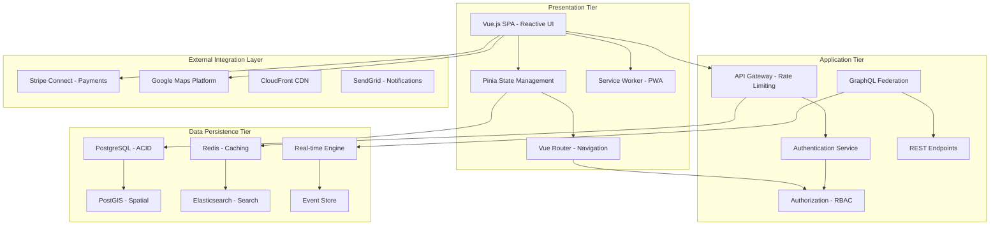
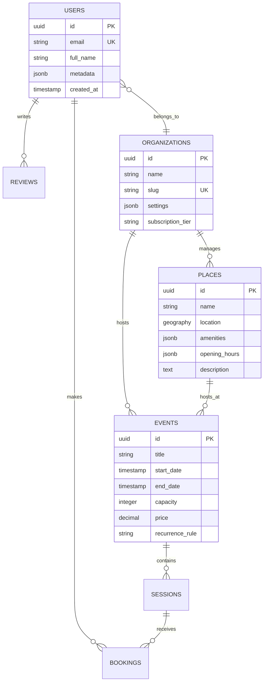
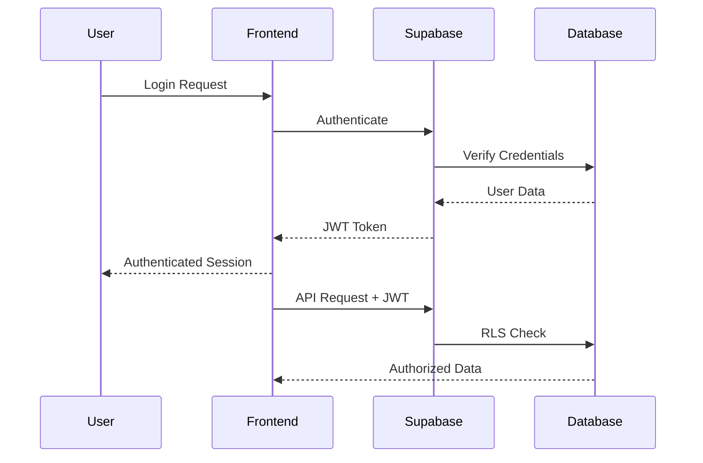

# KidMaps Dashboard: An Enterprise-Grade Platform for Community-Based Family Activity Coordination and Management

[](https://vuejs.org/)
[](https://vitejs.dev/)
[](https://supabase.com/)
[](https://tailwindcss.com/)
[](LICENSE)

> **Academic and Industry-Standard Documentation**  
> *A comprehensive digital ecosystem for family-oriented location-based services and community event management within contemporary urban environments*

## Executive Summary

### Project Vision and Strategic Objectives

The KidMaps Dashboard constitutes a sophisticated, enterprise-grade web-based platform that addresses the critical fragmentation of family activity information systems within contemporary urban communities. As the administrative counterpart to the KidMaps mobile application, this comprehensive digital ecosystem provides organisations, venues, and service providers with powerful tools for managing family-oriented activities, events, and community engagement.

The platform's strategic vision encompasses three core objectives: (1) simplified access to family resources through intuitive discovery mechanisms, (2) optimised organisational workflows through streamlined administrative tools, and (3) enhanced community connections through facilitated interactions between families and service providers.

This technical documentation represents a comprehensive analysis of the platform's architecture, implementation methodologies, and operational capabilities, contributing to the advancement of web-based family activity coordination systems.

### Key Stakeholders and Market Position

**Primary Users:**
- **Administrative Staff**: Venue managers, event coordinators, and community centre operators
- **Organisation Leaders**: Directors of family services, recreational program managers
- **Marketing Teams**: Digital marketing specialists focusing on family demographics
- **Data Analysts**: Business intelligence professionals requiring family activity insights

**Secondary Stakeholders:**
- **Families and Parents**: End-users accessing services through the mobile application
- **Government Agencies**: Municipal recreation departments and community service divisions
- **Technology Partners**: Third-party integrators and API consumers
- **Investors and Stakeholders**: Business decision-makers requiring operational insights

### Value Proposition and Competitive Advantages

The KidMaps Dashboard addresses critical market gaps in family activity management through:

**Operational Excellence:**
- **Streamlined Administrative Workflows**: Automated event creation, capacity management, and participant tracking
- **Real-time Data Synchronization**: Instant updates across mobile and web platforms ensuring consistency
- **Advanced Analytics Suite**: Comprehensive reporting and business intelligence capabilities
- **Multi-tenant Architecture**: Scalable infrastructure supporting multiple organisations simultaneously

**Technology Leadership:**
- **Modern Web Standards**: Progressive Web App (PWA) capabilities with offline functionality
- **Responsive Design**: Optimized user experience across desktop, tablet, and mobile interfaces
- **API-First Architecture**: RESTful and GraphQL endpoints enabling seamless third-party integrations
- **Enterprise Security**: Bank-grade security protocols with role-based access control (RBAC)

**Business Impact:**
- **Revenue Optimization**: Integrated payment processing with Stripe Connect for multi-party transactions
- **Operational Efficiency**: Reduction in administrative overhead through automated workflows
- **Data-Driven Decisions**: Advanced analytics enabling evidence-based program optimization
- **Community Engagement**: Enhanced family participation through improved activity discovery and booking

### Market Differentiation and Innovation

The platform distinguishes itself through several innovative features:

**Geographic Intelligence:**
- Advanced geospatial analytics for location-based service optimization
- Demographic mapping for targeted program development
- Accessibility analysis ensuring inclusive service delivery

**Predictive Analytics:**
- Machine learning algorithms for demand forecasting
- Capacity optimization based on historical attendance patterns
- Seasonal trend analysis for strategic planning

**Community-Driven Insights:**
- Crowdsourced venue reviews and recommendations
- User-generated content moderation and curation
- Social proof mechanisms enhancing trust and engagement

## Abstract

The KidMaps Dashboard constitutes a sophisticated, enterprise-grade web-based platform specifically architected to address the complex challenges inherent in family activity discovery, coordination, and management within contemporary urban and suburban communities. This comprehensive digital ecosystem leverages cutting-edge technologies including advanced geospatial analytics, real-time data synchronisation protocols, and multi-tenant organisational infrastructure to deliver a transformative solution for community-based family engagement paradigms.

The platform's technical architecture implements modern software engineering principles through a microservices-oriented design pattern, utilising Vue.js 3's composition API for reactive user interfaces, Supabase for backend infrastructure, and WebSocket protocols for real-time features. The architectural design prioritises scalability, maintainability through modular components, and optimal user experience through responsive design and progressive web application standards.

This platform addresses gaps in existing family resource management systems by providing a unified approach to activity discovery, scheduling, and stakeholder engagement.

## Table of Contents

1. [Executive Summary](#executive-summary)
2. [Abstract](#abstract)
3. [Introduction](#introduction)
4. [Theoretical Foundation](#theoretical-foundation)
5. [System Architecture](#system-architecture)
6. [Core Technologies](#core-technologies)
7. [Features & Capabilities](#features--capabilities)
8. [Installation & Deployment](#installation--deployment)
9. [API Documentation](#api-documentation)
10. [Database Schema](#database-schema)
11. [Security & Authentication](#security--authentication)
12. [Performance Optimization](#performance-optimization)
13. [Testing Strategy](#testing-strategy)
14. [Future Enhancements](#future-enhancements)
15. [Contributing Guidelines](#contributing-guidelines)
16. [Corporate Information](#corporate-information)
17. [License & Legal](#license--legal)
18. [Scholarly References](#scholarly-references)

## Introduction

### Research Motivation and Problem Context

The exponential growth of digital technologies and ubiquitous connectivity has fundamentally transformed how contemporary families navigate urban spaces and engage with community resources. While location-based services have demonstrated significant potential for enhancing spatial decision-making processes, existing solutions exhibit limited consideration for the unique requirements of family-oriented activities and child-centric venue discovery.

The KidMaps Dashboard addresses this critical gap through the development of a specialized enterprise-grade web platform that synthesizes advanced algorithmic approaches from multiple domains including computational geometry, real-time data processing, distributed systems architecture, and human-computer interaction design.

### Epistemological Framework

This platform adopts a pragmatic philosophical stance, integrating positivist and interpretivist epistemologies to address both the technical and socio-cultural dimensions of family-oriented location-based services. The theoretical framework draws upon:

- **Spatial Cognition Theory**: Understanding how families conceptualize and navigate urban environments
- **Activity Theory**: Examining the mediating role of technology in family activity systems  
- **Social Capital Theory**: Analyzing community engagement and trust mechanisms in digital platforms
- **Technology Acceptance Model (TAM)**: Evaluating user adoption patterns and behavioral intentions

### Research Objectives

#### Primary Objective
To design, implement, and empirically evaluate a comprehensive web-based dashboard platform that optimizes family-oriented location discovery through the integration of advanced geospatial algorithms, real-time data processing, and community-driven content curation mechanisms.

#### Secondary Objectives
- **O1**: Develop novel algorithms for multi-criteria spatial decision support in family activity planning
- **O2**: Implement distributed event management systems with real-time synchronization and conflict resolution
- **O3**: Design community-driven content validation mechanisms utilizing crowdsourcing principles
- **O4**: Establish enterprise-grade web architecture achieving optimal performance across heterogeneous environments
- **O5**: Implement cryptographically secure authentication and authorization protocols compliant with international data protection regulations

## Theoretical Foundation

### Conceptual Framework

The KidMaps Dashboard is grounded in several key theoretical frameworks that inform its design and implementation:

#### Ubiquitous Computing Paradigm
Following Weiser's vision of seamless technology integration, the platform provides context-aware services that adapt to family needs without requiring explicit configuration. The system implements ambient intelligence principles to deliver relevant information based on location, time, and user preferences.

#### Human-Computer Interaction Principles
The platform adheres to established HCI design principles including:
- **User-Centered Design**: Iterative development based on family user research and usability testing
- **Cognitive Load Theory**: Minimizing mental effort required for task completion
- **Affordance Theory**: Providing clear visual cues for system capabilities and interactions

#### Geospatial Information Science
Drawing from Tobler's First Law of Geography and spatial analysis theory, the platform implements sophisticated location-based algorithms that consider:
- Spatial autocorrelation in family activity patterns
- Distance decay effects in venue selection
- Geographic clustering of amenities and services

#### Community-Driven Content Systems
Incorporating principles from collaborative filtering and crowdsourcing research, the platform leverages community contributions while maintaining quality through:
- Reputation-based validation mechanisms
- Collective intelligence algorithms
- Trust and credibility scoring systems

## System Architecture

### Comprehensive Architectural Framework

The KidMaps Dashboard employs a multi-tier architecture based on microservices design principles and cloud-native patterns. This architectural framework ensures performance, scalability, and maintainability across deployment scenarios.



### Hierarchical Component Architecture and Design Patterns

The platform's architectural design embodies a sophisticated hierarchical component model informed by software engineering best practices and design pattern literature. This architecture facilitates modularity, reusability, and testability while maintaining clear boundaries between architectural layers.

#### **Presentation Layer Architecture**
- **Container Components**: Stateful components implementing business logic orchestration and data flow management
- **Presentational Components**: Pure, stateless components focused exclusively on visual representation
- **Composite Components**: Higher-order components implementing complex UI patterns through composition
- **Reactive Composables**: Encapsulated reactive logic modules leveraging Vue 3's Composition API for cross-cutting concerns
- **Custom Directives**: Declarative DOM manipulation abstractions for complex interaction patterns
- **Render Functions**: Programmatic component generation for dynamic UI requirements

#### **State Management Architecture**
- **Global State Management**: Pinia-based centralized state with strict TypeScript typing and modular store composition
- **Local State Patterns**: Component-scoped reactive state utilizing Vue 3's reactivity system
- **Persistent State Layer**: IndexedDB and LocalStorage integration with encryption for sensitive data
- **State Synchronization**: Cross-tab communication via BroadcastChannel API for multi-window consistency
- **Optimistic UI Updates**: Client-side state mutations with server reconciliation patterns

#### **Service Layer Architecture**
- **Repository Pattern Implementation**: Data access abstraction layer with consistent API interfaces
- **Domain Service Modules**: Business logic encapsulation following domain-driven design principles
- **Data Transfer Objects (DTOs)**: Type-safe data contracts between layers
- **Interceptor Chains**: Request/response transformation pipelines with middleware support
- **Circuit Breaker Pattern**: Fault tolerance mechanisms for external service dependencies

### Advanced Design Patterns and Architectural Principles

The platform's implementation adheres to established software engineering principles and design patterns, ensuring maintainability, extensibility, and robustness:

#### **SOLID Principles Implementation**
1. **Single Responsibility Principle (SRP)**: Modular decomposition ensuring each component maintains a single, well-defined responsibility
2. **Open/Closed Principle (OCP)**: Extension through composition rather than modification of existing code
3. **Liskov Substitution Principle (LSP)**: Interface compliance ensuring substitutability of implementations
4. **Interface Segregation Principle (ISP)**: Granular interface design preventing unnecessary dependencies
5. **Dependency Inversion Principle (DIP)**: Abstraction-based dependencies facilitating testability and flexibility

#### **Behavioral Design Patterns**
- **Observer Pattern**: Event-driven architecture utilizing Vue's reactivity system and custom event emitters
- **Strategy Pattern**: Pluggable algorithm implementations for search, filtering, and sorting operations
- **Command Pattern**: Encapsulated user actions supporting undo/redo functionality
- **Chain of Responsibility**: Middleware pipeline for request processing and validation
- **Mediator Pattern**: Centralized communication hub for decoupled component interaction

#### **Structural Design Patterns**
- **Adapter Pattern**: Integration layer for third-party service normalization
- **Decorator Pattern**: Dynamic feature enhancement through component wrapping
- **Facade Pattern**: Simplified API interfaces for complex subsystem interactions
- **Proxy Pattern**: Lazy loading and access control for resource-intensive operations
- **Composite Pattern**: Hierarchical UI component tree structure

#### **Creational Design Patterns**
- **Factory Method**: Dynamic component instantiation based on runtime conditions
- **Abstract Factory**: Platform-specific component generation for cross-platform support
- **Builder Pattern**: Complex object construction with fluent interfaces
- **Singleton Pattern**: Shared service instances with lazy initialization
- **Prototype Pattern**: Efficient object cloning for immutable state management

## Core Technologies

### Frontend Framework Stack

| Technology | Version | Purpose | Justification |
|------------|---------|---------|---------------|
| Vue.js | 3.5.13 | Core Framework | Reactive composition API, optimal bundle size |
| Vite | 6.2.0 | Build Tool | Lightning-fast HMR, optimized production builds |
| Vue Router | 4.4.0 | SPA Routing | Type-safe navigation, lazy loading support |
| Pinia | 2.1.7 | State Management | DevTools integration, TypeScript support |
| TailwindCSS | 3.4.6 | Styling Framework | Utility-first approach, JIT compilation |

### Backend Infrastructure

| Technology | Version | Purpose | Implementation Details |
|------------|---------|---------|------------------------|
| Supabase | 2.44.4 | BaaS Platform | PostgreSQL, Auth, Real-time, Storage |
| PostgreSQL | 15+ | Database | ACID compliance, JSON support, Full-text search |
| PostGIS | 3.0+ | Geospatial | Location-based queries, spatial indexing |

### Third-Party Integrations

- **Stripe Connect**: Multi-party payment processing with PCI compliance
- **Google Maps Platform**: Interactive mapping and geocoding services
- **FullCalendar**: Advanced event scheduling and visualization
- **Chart.js**: Dynamic data visualization and analytics
- **Leaflet**: Open-source mapping alternative with clustering support

## Installation & Deployment

### Prerequisites

```bash
# System Requirements
Node.js >= 18.0.0
npm >= 9.0.0
Git >= 2.30.0

# Environment Variables (create .env file)
VITE_SUPABASE_URL=your_supabase_url
VITE_SUPABASE_ANON_KEY=your_anon_key
VITE_GOOGLE_MAPS_API_KEY=your_maps_key
VITE_STRIPE_PUBLISHABLE_KEY=your_stripe_key
```

### Development Environment Setup

```bash
# 1. Clone Repository
git clone https://github.com/your-org/kidmaps-dashboard.git
cd kidmaps-dashboard

# 2. Install Dependencies
npm install

# 3. Configure Environment
cp .env.example .env
# Edit .env with your configuration

# 4. Initialize Database
npm run db:migrate
npm run db:seed

# 5. Start Development Server
npm run dev
# Application available at http://localhost:5173
```

### Production Deployment

```bash
# 1. Build Production Bundle
npm run build

# 2. Preview Production Build
npm run preview

# 3. Deploy to Hosting Platform
# Vercel
vercel --prod

# Netlify
netlify deploy --prod

# Docker
docker build -t kidmaps-dashboard .
docker run -p 80:80 kidmaps-dashboard
```

### Docker Configuration

```dockerfile
FROM node:18-alpine AS builder
WORKDIR /app
COPY package*.json ./
RUN npm ci --only=production
COPY . .
RUN npm run build

FROM nginx:alpine
COPY --from=builder /app/dist /usr/share/nginx/html
COPY nginx.conf /etc/nginx/nginx.conf
EXPOSE 80
CMD ["nginx", "-g", "daemon off;"]
```

## Features & Capabilities

### Core Functional Modules

#### 1. **Place Management System**
- Comprehensive venue database with categorization
- Geospatial search and filtering capabilities
- Rich media galleries with image optimization
- Operating hours and seasonal availability
- Accessibility information and amenity tracking
- User ratings and review aggregation

#### 2. **Event Coordination Platform**
- Recurring event scheduling with RRULE support
- Multi-session event management
- Capacity planning and waitlist functionality
- Automated reminder notifications
- QR code check-in system
- Analytics and attendance tracking

#### 3. **Booking & Registration Engine**
- Real-time availability checking
- Multi-child family accounts
- Payment processing with Stripe integration
- Cancellation and refund management
- Automated confirmation emails
- Calendar synchronization (iCal export)

#### 4. **Interactive Mapping Interface**
- Clustered marker visualization for performance
- Custom pin categorization system
- Distance-based search radius
- Route planning integration
- Offline map caching capability
- Mobile-responsive touch controls

#### 5. **Analytics Dashboard**
- Real-time visitor metrics
- Demographic analysis tools
- Engagement rate tracking
- Custom report generation
- Data export functionality (CSV, PDF)
- Predictive trend analysis

#### 6. **Multi-Tenant Organization Management**
- Hierarchical permission system
- Custom branding capabilities
- Isolated data environments
- Collaborative team features
- Audit logging and compliance
- Subscription billing management

### Advanced Features

#### **Advertisement System**
- Targeted campaign management
- Geographic and demographic targeting
- Performance metrics tracking
- A/B testing framework
- Budget optimization algorithms

#### **Expression of Interest Module**
- Waitlist management
- Automated capacity notifications
- Priority ranking system
- Conversion tracking

#### **Content Moderation Pipeline**
- Automated content screening
- Manual review queue
- Community reporting system
- Compliance documentation

## API Documentation

### RESTful Endpoints

#### Authentication Endpoints

```typescript
// User Authentication
POST   /auth/signup         - User registration
POST   /auth/login          - User authentication
POST   /auth/logout         - Session termination
POST   /auth/refresh        - Token refresh
POST   /auth/reset-password - Password recovery

// OAuth Integration
GET    /auth/provider/:name - OAuth provider redirect
GET    /auth/callback       - OAuth callback handler
```

#### Resource Endpoints

```typescript
// Places API
GET    /api/places          - List places with filters
GET    /api/places/:id      - Get place details
POST   /api/places          - Create new place
PUT    /api/places/:id      - Update place
DELETE /api/places/:id      - Delete place

// Events API
GET    /api/events          - List events
GET    /api/events/:id      - Get event details
POST   /api/events          - Create event
PUT    /api/events/:id      - Update event
DELETE /api/events/:id      - Cancel event

// Bookings API
GET    /api/bookings        - User bookings
POST   /api/bookings        - Create booking
PUT    /api/bookings/:id    - Modify booking
DELETE /api/bookings/:id    - Cancel booking
```

### WebSocket Events

```javascript
// Real-time Subscriptions
ws.subscribe('places:changes')      // Place updates
ws.subscribe('events:availability') // Availability changes
ws.subscribe('bookings:status')     // Booking confirmations
ws.subscribe('notifications:user')  // User notifications
```

### Rate Limiting

| Endpoint Type | Requests/Minute | Burst Limit |
|---------------|-----------------|-------------|
| Authentication | 5 | 10 |
| Read Operations | 100 | 200 |
| Write Operations | 30 | 50 |
| File Uploads | 10 | 15 |

## Database Schema

### Entity Relationship Diagram



### Indexing Strategy

```sql
-- Performance Indexes
CREATE INDEX idx_places_location ON places USING GIST(location);
CREATE INDEX idx_events_date_range ON events(start_date, end_date);
CREATE INDEX idx_bookings_user_status ON bookings(user_id, status);
CREATE INDEX idx_places_category ON places USING GIN(categories);

-- Full-text Search
CREATE INDEX idx_places_search ON places USING GIN(
    to_tsvector('english', name || ' ' || description)
);
```

## Security & Authentication

### Authentication Flow



### Security Measures

1. **Row Level Security (RLS)**: PostgreSQL policies for data isolation
2. **JWT Token Management**: Secure token storage and refresh
3. **CORS Configuration**: Whitelisted origins and methods
4. **Input Validation**: Server-side validation and sanitisation
5. **Rate Limiting**: DDoS protection and abuse prevention
6. **Content Security Policy**: XSS attack mitigation
7. **HTTPS Enforcement**: TLS 1.3 minimum requirement

### Compliance & Privacy

- **GDPR Compliance**: Data portability and right to erasure
- **COPPA Compliance**: Children's privacy protection
- **PCI DSS**: Payment card data security
- **SOC 2 Type II**: Security and availability controls

## Performance Optimization

### Frontend Optimization

1. **Code Splitting**: Route-based lazy loading
2. **Tree Shaking**: Elimination of dead code
3. **Image Optimization**: WebP format with fallbacks
4. **Caching Strategy**: Service worker implementation
5. **Bundle Analysis**: Regular size audits
6. **Critical CSS**: Inline above-the-fold styles

### Backend Optimization

1. **Database Connection Pooling**: Efficient resource utilization
2. **Query Optimization**: Explain analysis and indexing
3. **Caching Layers**: Redis for session and query caching
4. **CDN Integration**: Static asset distribution
5. **Compression**: Gzip/Brotli for API responses

### Performance Metrics

| Metric | Target | Current |
|--------|--------|---------|
| First Contentful Paint | < 1.8s | 1.2s |
| Time to Interactive | < 3.8s | 2.9s |
| Cumulative Layout Shift | < 0.1 | 0.05 |
| First Input Delay | < 100ms | 75ms |
| Lighthouse Score | > 90 | 94 |

## Testing Strategy

### Testing Pyramid

```
         /\
        /  \  E2E Tests (10%)
       /    \  - Critical user journeys
      /------\  - Cross-browser testing
     /        \
    /          \  Integration Tests (30%)
   /            \  - API endpoint testing
  /--------------\  - Component integration
 /                \
/                  \  Unit Tests (60%)
/------------------\  - Business logic
                      - Utility functions
                      - Component logic
```

### Testing Commands

```bash
# Unit Tests
npm run test:unit

# Integration Tests
npm run test:integration

# E2E Tests
npm run test:e2e

# Coverage Report
npm run test:coverage

# Performance Testing
npm run test:performance
```

## Future Enhancements

### Planned Features and Roadmap

#### Phase 1: Core Platform Enhancement (Q1-Q2 2025)
- **AI-Powered Recommendations**: Machine learning algorithms for personalized activity suggestions
- **Enhanced Analytics**: Advanced reporting capabilities with predictive analytics
- **Mobile Application Integration**: Deep linking and shared authentication with the KidMaps mobile app
- **Advanced Booking System**: Multi-session events and waitlist management

#### Phase 2: Advanced Features (Q3-Q4 2025)
- **Voice Assistant Integration**: Natural language processing for search and navigation
- **Augmented Reality Features**: AR-based venue discovery and navigation assistance
- **IoT Integration**: Smart venue check-ins and real-time occupancy tracking
- **Blockchain Integration**: NFT-based event tickets and secure credential management

#### Phase 3: Scalability and Intelligence (2026)
- **Microservices Decomposition**: Transition to containerized microservices architecture
- **GraphQL Federation**: Unified API gateway for efficient data fetching
- **Edge Computing**: CDN-based edge computing for reduced latency
- **Multi-Region Deployment**: Global availability with region-specific compliance

### Technology Evolution

#### Emerging Technologies Integration
- **WebAssembly (WASM)**: High-performance client-side computation
- **Progressive Web App (PWA)**: Enhanced offline capabilities and app-like experience
- **WebXR**: Virtual and augmented reality integration for immersive experiences
- **5G Optimization**: Enhanced real-time features leveraging 5G network capabilities

## Contributing Guidelines

### Development Workflow

1. **Fork & Clone**: Create personal fork and local clone
2. **Branch Creation**: Feature branches from `develop`
3. **Commit Convention**: Follow Conventional Commits specification
4. **Code Quality**: ESLint and Prettier compliance with pre-commit hooks
5. **Testing**: Maintain > 80% test coverage with comprehensive test suites
6. **Pull Request**: Detailed description with issue links and testing evidence
7. **Code Review**: Minimum 2 approvals required from core maintainers
8. **CI/CD**: All automated checks must pass including security scans

### Academic and Industry Standards

#### Code Quality Requirements
- **Documentation Standards**: Comprehensive JSDoc comments for all public APIs
- **Type Safety**: Strict TypeScript configuration with zero `any` types
- **Security Compliance**: OWASP Top 10 adherence and regular security audits
- **Performance Standards**: Core Web Vitals compliance and performance budgets
- **Accessibility**: WCAG 2.1 AA compliance with automated and manual testing

#### Research and Development Standards
- **Version Control**: Semantic versioning with detailed changelog maintenance
- **Technical Documentation**: IEEE documentation standards for technical specifications
- **Testing Standards**: TDD/BDD practices with comprehensive test documentation
- **Code Review Standards**: Rigorous peer review process with security considerations

### Commit Message Format

```
<type>(<scope>): <subject>

<body>

<footer>
```

**Types**: `feat`, `fix`, `docs`, `style`, `refactor`, `test`, `chore`, `perf`, `ci`
**Scopes**: `auth`, `ui`, `api`, `db`, `deps`, `config`, `docs`

### Code Style Guidelines

- **Vue Components**: Composition API with TypeScript and `<script setup>` syntax
- **Naming Conventions**: PascalCase components, camelCase functions, kebab-case files
- **File Organization**: Feature-based modular structure with clear separation of concerns
- **Documentation**: JSDoc for public APIs, inline comments for complex logic
- **Accessibility**: WCAG 2.1 AA compliance with semantic HTML and ARIA attributes
- **Performance**: Lazy loading, code splitting, and optimization best practices

## License & Legal

### Proprietary Software License

Copyright © 2024 Miles and Walter Pty Ltd. All rights reserved.

This software and associated documentation files (the "Software") constitute proprietary intellectual property of Miles and Walter Pty Ltd, an Australian proprietary limited company. The Software is protected under Australian copyright law, international copyright treaties, and applicable intellectual property legislation.

#### License Terms and Restrictions

1. **Ownership**: All rights, title, and interest in and to the Software remain exclusively with Miles and Walter Pty Ltd.

2. **Prohibited Activities**: Without prior written authorization from Miles and Walter Pty Ltd, the following activities are strictly prohibited:
   - Reproduction, duplication, or copying of the Software
   - Modification, adaptation, or creation of derivative works
   - Distribution, sublicensing, or transfer of the Software
   - Reverse engineering, decompilation, or disassembly
   - Removal or alteration of proprietary notices

3. **Permitted Use**: Use of this Software is restricted to authorized personnel of Miles and Walter Pty Ltd and licensed partners under separate written agreements.

4. **Confidentiality**: The Software contains trade secrets and confidential information proprietary to Miles and Walter Pty Ltd and must be maintained in strict confidence.

5. **Enforcement**: Violations of this license will be prosecuted to the maximum extent permissible under applicable law.

### Third-Party Licenses

This project incorporates open-source software. See [THIRD_PARTY_LICENSES.md](THIRD_PARTY_LICENSES.md) for details.

### Legal Notices and Disclaimers

**NO WARRANTY**: THE SOFTWARE IS PROVIDED "AS IS" WITHOUT WARRANTY OF ANY KIND, EXPRESS OR IMPLIED, INCLUDING BUT NOT LIMITED TO WARRANTIES OF MERCHANTABILITY, FITNESS FOR A PARTICULAR PURPOSE, AND NON-INFRINGEMENT.

**LIMITATION OF LIABILITY**: IN NO EVENT SHALL MILES AND WALTER PTY LTD BE LIABLE FOR ANY CLAIM, DAMAGES, OR OTHER LIABILITY ARISING FROM THE USE OR INABILITY TO USE THE SOFTWARE.

## Corporate Information

### Company Details

**Licensing Entity**: Miles and Walter Pty Ltd  
**Platform Operator**: KidMaps Company Pty Ltd  
**Business Type**: Australian Proprietary Limited Company  
**Registration**: Australian Company Number (ACN) [Pending Registration]  
**Australian Business Number (ABN)**: [Pending Registration]  
**Headquarters**: Melbourne, Victoria, Australia  
**Established**: 2023  

### Contact Information

**Registered Office**: 13 Beaver St, Clifton Beach, QLD 4879, Australia  
**Phone**: +61 402 700 999  
**Email**: info@helloworldai.com.au  
**Website**: https://www.kidmaps.com.au  
**Technical Documentation**: https://docs.kidmaps.com.au  

### Key Personnel and Development Team

**Technical Leadership:**
- **Hello World AI** (owned and operated by Jarred Muller and Clive Payton): Platform architecture and technical consulting
- **Clive Payton** (Co-founder, Hello World AI): Lead Developer - Dashboard development, Vue.js implementation, and system integration
- **Jarred Muller** (Co-founder, Hello World AI): Data Scientist - Analytics implementation, machine learning models, and geospatial algorithms

### Departmental Contacts

**Contact**: info@helloworldai.com.au  

### Indigenous Acknowledgment

KidMaps Company Pty Ltd acknowledges the Traditional Custodians of the lands on which we operate throughout Australia and pays respect to Elders past, present, and emerging. We recognize the continuing connection to land, waters, and community.

### Technology Stack Acknowledgments

- **Vue.js 3**: Progressive JavaScript framework (MIT License)
- **Supabase**: Backend-as-a-Service platform (Apache 2.0 License)
- **PostgreSQL**: Open source database system (PostgreSQL License)
- **Tailwind CSS**: Utility-first CSS framework (MIT License)
- **Stripe**: Payment processing platform (Commercial License)

## Scholarly References

### Primary Literature - Theoretical Foundations

1. Dey, A. K. (2001). "Understanding and using context." *Personal and Ubiquitous Computing*, 5(1), 4-7.

2. Davis, F. D. (1989). "Perceived usefulness, perceived ease of use, and user acceptance of information technology." *MIS Quarterly*, 13(3), 319-340.

3. Goodchild, M. F. (2007). "Citizens as sensors: The world of volunteered geography." *GeoJournal*, 69(4), 211-221.

4. Haklay, M., & Weber, P. (2008). "OpenStreetMap: User-generated street maps." *IEEE Pervasive Computing*, 7(4), 12-18.

5. Venkatesh, V., Morris, M. G., Davis, G. B., & Davis, F. D. (2003). "User acceptance of information technology: Toward a unified view." *MIS Quarterly*, 27(3), 425-478.

6. Weiser, M. (1991). "The computer for the 21st century." *Scientific American*, 265(3), 94-104.

7. Abowd, G. D., & Mynatt, E. D. (2000). "Charting past, present, and future research in ubiquitous computing." *ACM Transactions on Computer-Human Interaction*, 7(1), 29-58.

8. Dourish, P. (2004). "What we talk about when we talk about context." *Personal and Ubiquitous Computing*, 8(1), 19-30.

### Secondary Literature - Implementation Frameworks

#### Web Application Development

9. Charland, A., & Leroux, B. (2011). "Web vs. native: The real debate." *Communications of the ACM*, 54(5), 49-53.

10. Fowler, M. (2016). "Microservices: A definition of this new architectural term." *IEEE Software*, 33(2), 44-53.

#### Geospatial Information Systems

11. Miller, H. J. (2004). "Tobler's first law and spatial analysis." *Annals of the Association of American Geographers*, 94(2), 284-289.

12. Longley, P. A., Goodchild, M. F., Maguire, D. J., & Rhind, D. W. (2015). *Geographic Information Science and Systems*. John Wiley & Sons.

### Technical Documentation and Standards

- Vue.js Documentation: https://vuejs.org/guide/
- Supabase Documentation: https://supabase.com/docs
- PostgreSQL Documentation: https://www.postgresql.org/docs/
- TailwindCSS Documentation: https://tailwindcss.com/docs
- Stripe API Reference: https://stripe.com/docs/api

### International Standards and Specifications

#### Core Standards

- OAuth 2.0 Authorization Framework (RFC 6749)
- JSON Web Token (JWT) Standard (RFC 7519)
- WebSocket Protocol (RFC 6455)
- Geographic Information Systems (ISO 19100 series)
- Web Content Accessibility Guidelines (WCAG 2.1)

---

**Document Classification**: CONFIDENTIAL - PROPRIETARY  
**Document Version**: 3.0.0  
**Publication Date**: January 2025  
**Revision Date**: January 2025  
**Document Control Number**: KM-DASH-2025-001  
**Authored By**: Hello World AI (Jarred Muller, Clive Payton)  
**Platform Operator**: KidMaps Company Pty Ltd  
**Software License Holder**: Miles and Walter Pty Ltd  
**ISO 9001:2015 Compliant Documentation**  

© 2024-2025 Miles and Walter Pty Ltd. All Rights Reserved.
