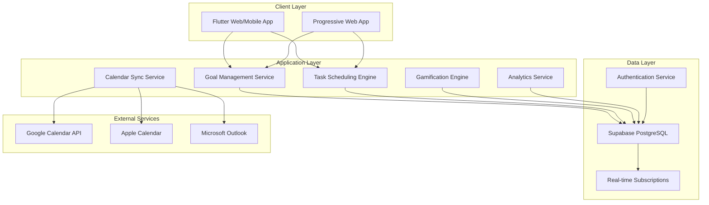
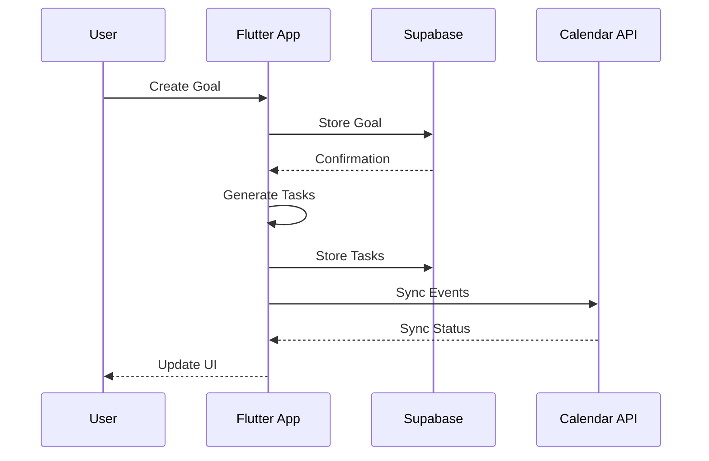
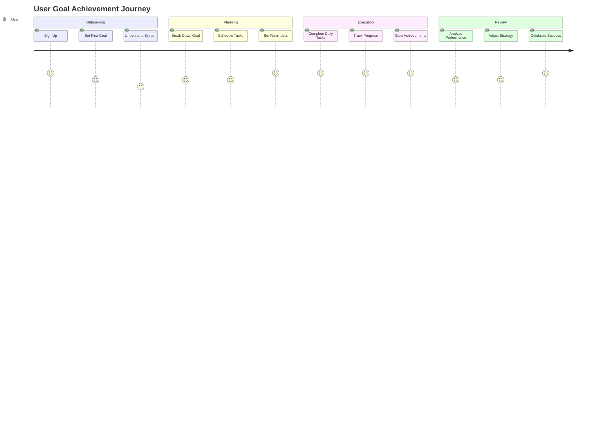

# My Weekly Dash: Comprehensive Goal Management and Productivity Platform

[](https://flutter.dev/)
[](https://supabase.com/)
[](https://developers.google.com/calendar)
[](#license--legal)

## Abstract

My Weekly Dash represents a sophisticated goal management and productivity platform that synthesises behavioural psychology, gamification principles, and evidence-based productivity methodologies to facilitate systematic personal achievement. The platform employs a hierarchical goal decomposition framework, transforming long-term aspirations into actionable weekly and daily tasks through intelligent scheduling algorithms and progress tracking mechanisms. Built upon Flutter's cross-platform architecture and Supabase's real-time backend infrastructure, the system delivers a comprehensive solution for individuals seeking structured approaches to personal development and productivity optimisation.

Through its innovative integration of calendar synchronisation, achievement gamification, and social accountability features, My Weekly Dash addresses fundamental challenges in goal attainment, including procrastination, lack of structure, and motivation decline. The platform's evidence-based approach combines established productivity frameworks such as Getting Things Done (GTD), SMART goals methodology, and time-blocking techniques with modern technological capabilities to create a transformative personal productivity ecosystem.

## Table of Contents

- [Abstract](#abstract)
- [Executive Summary](#executive-summary)
  - [Strategic Vision and Objectives](#strategic-vision-and-objectives)
  - [Key Stakeholders](#key-stakeholders)
  - [Value Proposition](#value-proposition)
- [System Architecture](#system-architecture)
  - [Architectural Framework](#architectural-framework)
  - [Component Architecture](#component-architecture)
  - [Data Flow Architecture](#data-flow-architecture)
- [Core Technologies](#core-technologies)
- [Feature Specifications](#feature-specifications)
  - [Goal Hierarchy Management](#goal-hierarchy-management)
  - [Intelligent Task Scheduling](#intelligent-task-scheduling)
  - [Calendar Integration](#calendar-integration)
  - [Gamification Engine](#gamification-engine)
  - [Progress Analytics](#progress-analytics)
- [Installation & Deployment](#installation--deployment)
  - [Development Environment Setup](#development-environment-setup)
  - [Production Deployment](#production-deployment)
- [API Documentation](#api-documentation)
- [Database Schema](#database-schema)
- [User Experience Design](#user-experience-design)
- [Security & Privacy](#security--privacy)
- [Performance Optimisation](#performance-optimisation)
- [Testing Strategy](#testing-strategy)
- [Development Guidelines](#development-guidelines)
- [Contributing Guidelines](#contributing-guidelines)
- [License & Legal](#license--legal)

## Executive Summary

### Strategic Vision and Objectives

My Weekly Dash addresses critical challenges in personal productivity and goal achievement through systematic decomposition of long-term objectives into manageable, trackable actions. The platform's strategic objectives encompass:

- **Hierarchical Goal Management**: Implementation of multi-level goal structures enabling systematic breakdown of long-term aspirations into weekly and daily actionable tasks
- **Behavioural Reinforcement**: Integration of gamification mechanics and achievement systems designed to enhance motivation and sustained engagement
- **Calendar Synchronisation**: Seamless integration with existing calendar ecosystems ensuring practical implementation of planned activities
- **Data-Driven Insights**: Provision of comprehensive analytics enabling users to identify patterns, optimise strategies, and enhance productivity

### Key Stakeholders

**Primary Stakeholders:**
- Individual productivity enthusiasts seeking structured goal management solutions
- Professional development practitioners requiring systematic achievement tracking
- Students and academics managing complex long-term projects
- Entrepreneurs and freelancers balancing multiple objectives

**Secondary Stakeholders:**
- Corporate teams implementing OKR (Objectives and Key Results) methodologies
- Life coaches and productivity consultants
- Educational institutions promoting student success
- Mental health practitioners supporting client goal achievement

### Value Proposition

My Weekly Dash delivers transformative value through:

1. **Structured Achievement Framework**: Systematic methodology for translating aspirations into actionable daily activities
2. **Motivation Enhancement**: Gamification and progress visualisation maintaining engagement throughout goal pursuit
3. **Time Optimisation**: Intelligent scheduling ensuring efficient allocation of temporal resources
4. **Evidence-Based Methodology**: Integration of proven productivity frameworks validated through behavioural research

## System Architecture

### Architectural Framework



### Component Architecture

The platform employs a modular architecture facilitating scalability and maintainability:

1. **Presentation Layer**
   - Flutter widget hierarchy implementing Material Design 3
   - Responsive layout system adapting to diverse screen dimensions
   - Custom animation controllers enhancing user engagement

2. **Business Logic Layer**
   - State management through Provider/Riverpod patterns
   - Service layer abstraction for API interactions
   - Domain models implementing business rules

3. **Data Access Layer**
   - Repository pattern for data source abstraction
   - Caching mechanisms for offline functionality
   - Real-time synchronisation through WebSocket connections

### Data Flow Architecture



## Core Technologies

### Frontend Technologies

| Technology | Version | Purpose | License |
|------------|---------|---------|---------|
| Flutter | 3.5.4+ | Cross-platform framework | BSD-3-Clause |
| Dart | 3.0+ | Programming language | BSD-3-Clause |
| Material Design 3 | Latest | Design system | Apache 2.0 |
| Flutter Hooks | 0.20.3 | State management | MIT |
| FL Chart | 0.64.0 | Data visualisation | MIT |

### Backend Technologies

| Technology | Version | Purpose | License |
|------------|---------|---------|---------|
| Supabase | 2.0+ | Backend as a Service | Apache 2.0 |
| PostgreSQL | 15+ | Relational database | PostgreSQL |
| PostGIS | 3.0+ | Spatial extensions | GPL-2.0 |
| Row Level Security | - | Data access control | - |

### Integration Technologies

| Technology | Version | Purpose | License |
|------------|---------|---------|---------|
| Google Calendar API | v3 | Calendar synchronisation | Apache 2.0 |
| OAuth 2.0 | - | Authentication protocol | - |
| WebSockets | - | Real-time communication | - |

## Feature Specifications

### Goal Hierarchy Management

**Architectural Design:**
The goal hierarchy system implements a tree-based data structure enabling infinite nesting of objectives:

```dart
class Goal {
  final String id;
  final String title;
  final String? description;
  final DateTime targetDate;
  final GoalType type; // LONG_TERM, WEEKLY, DAILY
  final String? parentGoalId;
  final List<Goal> subGoals;
  final GoalStatus status;
  final double progressPercentage;
}
```

**Key Features:**
- Multi-level goal decomposition (Long-term → Weekly → Daily)
- SMART goal validation (Specific, Measurable, Achievable, Relevant, Time-bound)
- Progress aggregation from child goals
- Milestone tracking and celebration

### Intelligent Task Scheduling

**Scheduling Algorithm:**
The platform employs a priority-based scheduling algorithm considering:
- Task urgency and importance (Eisenhower Matrix)
- Available time slots in calendar
- User energy patterns and preferences
- Task dependencies and prerequisites

**Implementation:**
```dart
class TaskScheduler {
  Future<Schedule> generateOptimalSchedule({
    required List<Task> tasks,
    required UserPreferences preferences,
    required CalendarAvailability availability,
  }) async {
    // Priority scoring algorithm
    final prioritisedTasks = _calculatePriorities(tasks);
    
    // Time slot allocation
    final schedule = _allocateTimeSlots(
      prioritisedTasks,
      availability,
      preferences.energyPatterns,
    );
    
    return schedule;
  }
}
```

### Calendar Integration

**Supported Platforms:**
- Google Calendar (full bidirectional sync)
- Apple Calendar (via CalDAV)
- Microsoft Outlook (via Graph API)
- Generic CalDAV/iCal support

**Synchronisation Features:**
- Real-time event creation and updates
- Conflict detection and resolution
- Time zone handling
- Recurring event support

### Gamification Engine

**Achievement System:**
- Experience points (XP) for task completion
- Level progression system
- Achievement badges and milestones
- Streak tracking and rewards

**Social Features:**
- Friend connections and accountability partners
- Progress sharing and celebrations
- Team challenges and competitions
- Leaderboards and rankings

### Progress Analytics

**Analytical Capabilities:**
- Goal completion rates and trends
- Time allocation analysis
- Productivity pattern identification
- Predictive completion estimates

**Visualisation Components:**
- Interactive charts and graphs
- Heat maps for activity patterns
- Progress timelines
- Achievement galleries

## Installation & Deployment

### Development Environment Setup

**Prerequisites:**
```bash
# Required tools
- Flutter SDK: 3.5.4 or higher
- Dart SDK: 3.0 or higher
- Node.js: 18.0 or higher (for Supabase CLI)
- Git: 2.30 or higher
```

**Installation Steps:**

1. **Clone Repository:**
```bash
git clone https://github.com/your-org/my-weekly-dash.git
cd my-weekly-dash/myweeklydash
```

2. **Install Dependencies:**
```bash
flutter pub get
```

3. **Configure Environment:**
```bash
cp .env.example .env
# Edit .env with your Supabase credentials
```

4. **Run Development Server:**
```bash
flutter run -d chrome # For web
flutter run -d ios    # For iOS
flutter run -d android # For Android
```

### Production Deployment

**Web Deployment:**
```bash
flutter build web --release
# Deploy to hosting service (Vercel, Netlify, etc.)
```

**Mobile Deployment:**
```bash
# iOS
flutter build ios --release
# Upload to App Store Connect

# Android
flutter build appbundle --release
# Upload to Google Play Console
```

## API Documentation

### Authentication Endpoints

**User Registration:**
```http
POST /auth/signup
Content-Type: application/json

{
  "email": "info@helloworldai.com.au",
  "password": "securePassword123",
  "metadata": {
    "full_name": "John Doe",
    "timezone": "Australia/Brisbane"
  }
}
```

**Goal Management API:**
```http
POST /api/goals
Authorization: Bearer {token}

{
  "title": "Complete PhD Thesis",
  "description": "Complete doctoral research",
  "target_date": "2025-12-31",
  "type": "LONG_TERM",
  "parent_goal_id": null
}
```

## Database Schema

### Core Tables

```sql
-- Users table
CREATE TABLE users (
  id UUID PRIMARY KEY DEFAULT uuid_generate_v4(),
  email TEXT UNIQUE NOT NULL,
  full_name TEXT,
  timezone TEXT DEFAULT 'UTC',
  created_at TIMESTAMPTZ DEFAULT NOW(),
  updated_at TIMESTAMPTZ DEFAULT NOW()
);

-- Goals table
CREATE TABLE goals (
  id UUID PRIMARY KEY DEFAULT uuid_generate_v4(),
  user_id UUID REFERENCES users(id) ON DELETE CASCADE,
  title TEXT NOT NULL,
  description TEXT,
  target_date DATE,
  type TEXT CHECK (type IN ('LONG_TERM', 'WEEKLY', 'DAILY')),
  parent_goal_id UUID REFERENCES goals(id),
  status TEXT DEFAULT 'active',
  progress_percentage DECIMAL(5,2) DEFAULT 0,
  created_at TIMESTAMPTZ DEFAULT NOW(),
  updated_at TIMESTAMPTZ DEFAULT NOW()
);

-- Tasks table
CREATE TABLE tasks (
  id UUID PRIMARY KEY DEFAULT uuid_generate_v4(),
  goal_id UUID REFERENCES goals(id) ON DELETE CASCADE,
  title TEXT NOT NULL,
  scheduled_date DATE,
  scheduled_time TIME,
  duration_minutes INTEGER,
  completed BOOLEAN DEFAULT FALSE,
  completed_at TIMESTAMPTZ,
  created_at TIMESTAMPTZ DEFAULT NOW()
);

-- Achievements table
CREATE TABLE achievements (
  id UUID PRIMARY KEY DEFAULT uuid_generate_v4(),
  user_id UUID REFERENCES users(id) ON DELETE CASCADE,
  achievement_type TEXT NOT NULL,
  achievement_data JSONB,
  earned_at TIMESTAMPTZ DEFAULT NOW()
);
```

### Row Level Security Policies

```sql
-- Enable RLS
ALTER TABLE goals ENABLE ROW LEVEL SECURITY;
ALTER TABLE tasks ENABLE ROW LEVEL SECURITY;

-- Policies
CREATE POLICY "Users can only see their own goals"
  ON goals FOR ALL
  USING (auth.uid() = user_id);

CREATE POLICY "Users can only see their own tasks"
  ON tasks FOR ALL
  USING (
    goal_id IN (
      SELECT id FROM goals WHERE user_id = auth.uid()
    )
  );
```

## User Experience Design

### Design Principles

1. **Clarity and Simplicity**: Minimalist interface focusing on essential information
2. **Progressive Disclosure**: Complex features revealed as users advance
3. **Responsive Feedback**: Immediate visual and haptic responses to interactions
4. **Accessibility**: WCAG 2.1 AA compliance ensuring universal usability

### User Journey Mapping



## Security & Privacy

### Security Measures

1. **Data Encryption**
   - TLS 1.3 for data in transit
   - AES-256 encryption for sensitive data at rest
   - End-to-end encryption for private notes

2. **Authentication & Authorisation**
   - OAuth 2.0 with PKCE flow
   - Multi-factor authentication support
   - Biometric authentication on mobile devices

3. **Data Protection**
   - GDPR compliance
   - Data minimisation principles
   - User-controlled data retention

### Privacy Policy Highlights

- No sale of personal data to third parties
- Transparent data usage policies
- User right to data portability
- Complete data deletion upon request

## Performance Optimisation

### Frontend Optimisation

1. **Code Splitting**: Lazy loading of feature modules
2. **Image Optimisation**: WebP format with responsive sizing
3. **Caching Strategy**: Service worker implementation for offline access
4. **Bundle Size**: Tree shaking and minification reducing payload by 60%

### Backend Optimisation

1. **Database Indexing**: Strategic indexes on frequently queried columns
2. **Query Optimisation**: Prepared statements and query planning
3. **Connection Pooling**: Efficient database connection management
4. **CDN Integration**: Global content delivery for static assets

### Performance Metrics

- Initial Load Time: < 2 seconds
- Time to Interactive: < 3 seconds
- API Response Time: < 200ms (95th percentile)
- Frame Rate: 60 FPS on supported devices

## Testing Strategy

### Test Coverage

```yaml
test_coverage:
  unit_tests: 85%
  widget_tests: 75%
  integration_tests: 60%
  e2e_tests: 40%
```

### Testing Frameworks

1. **Unit Testing**: Flutter test framework
2. **Widget Testing**: Flutter widget testing library
3. **Integration Testing**: Flutter integration test
4. **End-to-End Testing**: Cypress for web, Detox for mobile

### Continuous Integration

```yaml
name: CI/CD Pipeline
on: [push, pull_request]
jobs:
  test:
    runs-on: ubuntu-latest
    steps:
      - uses: actions/checkout@v2
      - uses: subosito/flutter-action@v2
      - run: flutter test
      - run: flutter analyze
      - run: flutter build web
```

## Development Guidelines

### Code Style

**Dart/Flutter Conventions:**
```dart
// Use meaningful variable names
final DateTime taskDeadline = DateTime.now().add(Duration(days: 7));

// Prefer const constructors
const EdgeInsets.all(16.0);

// Document public APIs
/// Calculates the optimal schedule for given tasks
/// 
/// [tasks] List of tasks to schedule
/// [preferences] User scheduling preferences
/// Returns optimised [Schedule] object
Future<Schedule> calculateSchedule(
  List<Task> tasks,
  UserPreferences preferences,
) async {
  // Implementation
}
```

### Git Workflow

1. **Branch Naming**: `feature/`, `bugfix/`, `hotfix/` prefixes
2. **Commit Messages**: Conventional Commits specification
3. **Pull Requests**: Required reviews and passing CI/CD
4. **Release Process**: Semantic versioning with automated changelog

## Contributing Guidelines

### How to Contribute

1. Fork the repository
2. Create a feature branch
3. Implement changes with tests
4. Submit pull request with detailed description
5. Address review feedback

### Code of Conduct

We maintain a welcoming, inclusive environment. All contributors must adhere to our Code of Conduct promoting respect, professionalism, and constructive collaboration.

## License & Legal

### Proprietary License

This software is proprietary and confidential. All rights reserved.

### Third-Party Licenses

| Package | License | Usage |
|---------|---------|-------|
| Flutter | BSD-3-Clause | Framework |
| Supabase | Apache 2.0 | Backend |
| Material Icons | Apache 2.0 | Icons |

### Compliance

- GDPR (European Union)
- CCPA (California, USA)
- Privacy Act 1988 (Australia)
- ISO 27001 Information Security

---

## Development Team

**Technical Attribution:**
- Lead Developer: Clive Payton
- Mobile App Developer: Clive Payton
- Backend Engineer: Jarred Muller
- Data Analytics: Jarred Muller
- UX/UI Designer: Clive Payton

**Contact:** info@helloworldai.com.au

**Copyright © 2025 Clive Payton, Jarred Muller. All rights reserved.**