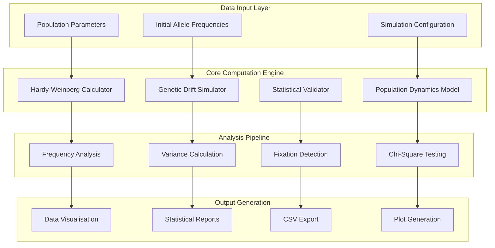

# Evolutionary Biology Computational Modelling Framework

[](https://python.org/)
[](https://numpy.org/)
[](https://matplotlib.org/)
[](https://scipy.org/)
[](#license)

## Abstract

This computational framework represents a comprehensive suite of evolutionary biology simulation tools designed for quantitative analysis of microevolutionary processes. The platform implements mathematically rigorous models for Hardy-Weinberg equilibrium analysis, genetic drift simulation, and population genetics dynamics, providing researchers and students with sophisticated tools for exploring fundamental principles of evolutionary biology through computational experimentation.

Built upon NumPy's numerical computing capabilities and enhanced with statistical analysis through SciPy, the framework addresses critical educational and research needs in evolutionary biology by providing accurate, reproducible simulations of genetic processes. The system's innovative approach combines theoretical population genetics principles with practical computational implementation, enabling comprehensive analysis of allele frequency dynamics, genetic drift effects, and equilibrium conditions across diverse population scenarios.

Through its integration of statistical testing frameworks, visualisation capabilities, and parametric analysis tools, this framework serves as an essential resource for advancing understanding of microevolutionary processes and their mathematical foundations in contemporary evolutionary biology research and education.

## Table of Contents

- [Abstract](#abstract)
- [Theoretical Framework](#theoretical-framework)
  - [Hardy-Weinberg Equilibrium](#hardy-weinberg-equilibrium)
  - [Genetic Drift Dynamics](#genetic-drift-dynamics)
  - [Population Genetics Principles](#population-genetics-principles)
- [System Architecture](#system-architecture)
  - [Computational Framework](#computational-framework)
  - [Statistical Analysis Pipeline](#statistical-analysis-pipeline)
  - [Visualisation Engine](#visualisation-engine)
- [Core Technologies](#core-technologies)
- [Module Specifications](#module-specifications)
  - [Hardy-Weinberg Equilibrium Analysis](#hardy-weinberg-equilibrium-analysis)
  - [Genetic Drift Simulation](#genetic-drift-simulation)
  - [Microevolution Modelling](#microevolution-modelling)
  - [Statistical Validation Framework](#statistical-validation-framework)
- [Installation & Setup](#installation--setup)
  - [Development Environment](#development-environment)
  - [Dependencies](#dependencies)
- [Usage Documentation](#usage-documentation)
- [Mathematical Foundations](#mathematical-foundations)
- [Data Analysis Framework](#data-analysis-framework)
- [Validation & Testing](#validation--testing)
- [Performance Optimisation](#performance-optimisation)
- [Educational Applications](#educational-applications)
- [Research Applications](#research-applications)
- [Contributing Guidelines](#contributing-guidelines)
- [License](#license)

## Theoretical Framework

### Hardy-Weinberg Equilibrium

The Hardy-Weinberg principle serves as the null hypothesis for population genetics, describing the genetic equilibrium in idealised populations. Under specific conditions (no mutation, no selection, no migration, random mating, and large population size), allele and genotype frequencies remain constant across generations.

**Mathematical Foundation:**
```
For a two-allele system with alleles A and a:
- p = frequency of allele A
- q = frequency of allele a
- p + q = 1

Genotype frequencies under equilibrium:
- AA: p²
- Aa: 2pq  
- aa: q²
```

**Implementation Philosophy:**
The framework implements Hardy-Weinberg calculations with rigorous mathematical validation, ensuring computational accuracy and providing statistical tests to assess deviations from equilibrium expectations.

### Genetic Drift Dynamics

Genetic drift represents the random sampling of alleles across generations, causing stochastic changes in allele frequencies particularly pronounced in small populations. The framework models drift using binomial sampling processes that accurately reflect the probabilistic nature of genetic inheritance.

**Theoretical Basis:**
- Drift magnitude inversely proportional to effective population size
- Variance in allele frequency change: σ² = pq/(2Ne)
- Long-term outcomes: fixation or loss of alleles

### Population Genetics Principles

The framework incorporates fundamental population genetics principles including:
- Effective population size effects
- Fixation probability calculations
- Allele frequency variance estimation
- Multi-population comparative analysis

## System Architecture

### Computational Framework



### Statistical Analysis Pipeline

The framework implements a comprehensive statistical analysis pipeline ensuring rigorous validation of evolutionary models:

```python
class EvolutionaryAnalysisPipeline:
    def __init__(self, data_source: str, analysis_config: Dict):
        self.data = self.load_data(data_source)
        self.config = analysis_config
        self.statistical_tests = StatisticalTestSuite()
        self.visualiser = EvolutionaryVisualiser()
    
    def execute_hardy_weinberg_analysis(self) -> HWAnalysisResult:
        """Execute comprehensive Hardy-Weinberg equilibrium analysis"""
        # Calculate expected frequencies
        expected_frequencies = self.calculate_hw_expectations()
        
        # Perform chi-square goodness-of-fit test
        chi_square_result = self.statistical_tests.chi_square_test(
            observed=self.data.observed_frequencies,
            expected=expected_frequencies
        )
        
        # Generate visualisations
        plots = self.visualiser.create_hw_plots(
            observed=self.data.observed_frequencies,
            expected=expected_frequencies
        )
        
        return HWAnalysisResult(
            expected_frequencies=expected_frequencies,
            chi_square_statistic=chi_square_result.statistic,
            p_value=chi_square_result.p_value,
            significance_level=self.config.alpha,
            plots=plots
        )
    
    def execute_drift_simulation(self, 
                               num_populations: int,
                               generations: int) -> DriftSimulationResult:
        """Execute genetic drift simulation across multiple populations"""
        simulation_results = {}
        
        for pop_id in range(num_populations):
            drift_trajectory = self.simulate_single_population_drift(
                population_size=self.config.population_size,
                initial_frequency=self.config.initial_allele_frequency,
                generations=generations
            )
            simulation_results[pop_id] = drift_trajectory
        
        # Analyse simulation results
        fixation_analysis = self.analyse_fixation_patterns(simulation_results)
        variance_analysis = self.analyse_frequency_variance(simulation_results)
        
        return DriftSimulationResult(
            trajectories=simulation_results,
            fixation_probabilities=fixation_analysis.probabilities,
            average_fixation_time=fixation_analysis.mean_time,
            frequency_variance=variance_analysis.variance_estimates
        )
```

### Visualisation Engine

```python
class EvolutionaryVisualiser:
    def __init__(self, style_config: Optional[Dict] = None):
        self.style = style_config or self.default_style()
        plt.style.use(self.style.matplotlib_style)
    
    def create_allele_frequency_trajectory_plot(self, 
                                              trajectories: Dict[int, List[float]],
                                              title: str = "Genetic Drift Simulation") -> plt.Figure:
        """Create publication-quality trajectory plots"""
        fig, ax = plt.subplots(figsize=(12, 8))
        
        for pop_id, frequencies in trajectories.items():
            generations = range(len(frequencies))
            ax.plot(generations, frequencies, 
                   alpha=0.7, linewidth=1.5, 
                   label=f'Population {pop_id}')
        
        ax.set_xlabel('Generation', fontsize=14, fontweight='bold')
        ax.set_ylabel('Allele Frequency', fontsize=14, fontweight='bold')
        ax.set_title(title, fontsize=16, fontweight='bold')
        ax.grid(True, alpha=0.3)
        ax.set_ylim(0, 1)
        
        # Add theoretical expectation line
        if len(trajectories) > 0:
            initial_freq = list(trajectories.values())[0][0]
            ax.axhline(y=initial_freq, color='red', linestyle='--', 
                      linewidth=2, label='Initial Frequency')
        
        if len(trajectories) <= 10:  # Only show legend for small number of populations
            ax.legend(bbox_to_anchor=(1.05, 1), loc='upper left')
        
        plt.tight_layout()
        return fig
    
    def create_hardy_weinberg_comparison_plot(self, 
                                            observed: Dict[str, float],
                                            expected: Dict[str, float]) -> plt.Figure:
        """Create Hardy-Weinberg equilibrium comparison visualisation"""
        genotypes = list(observed.keys())
        observed_freqs = list(observed.values())
        expected_freqs = list(expected.values())
        
        x = np.arange(len(genotypes))
        width = 0.35
        
        fig, ax = plt.subplots(figsize=(10, 6))
        
        bars1 = ax.bar(x - width/2, observed_freqs, width, 
                      label='Observed', color='skyblue', alpha=0.8)
        bars2 = ax.bar(x + width/2, expected_freqs, width,
                      label='Expected (HWE)', color='lightcoral', alpha=0.8)
        
        ax.set_xlabel('Genotype', fontsize=14, fontweight='bold')
        ax.set_ylabel('Frequency', fontsize=14, fontweight='bold')
        ax.set_title('Hardy-Weinberg Equilibrium Comparison', 
                    fontsize=16, fontweight='bold')
        ax.set_xticks(x)
        ax.set_xticklabels(genotypes)
        ax.legend()
        ax.grid(True, alpha=0.3, axis='y')
        
        # Add value labels on bars
        def add_value_labels(bars):
            for bar in bars:
                height = bar.get_height()
                ax.annotate(f'{height:.3f}',
                           xy=(bar.get_x() + bar.get_width() / 2, height),
                           xytext=(0, 3),  # 3 points vertical offset
                           textcoords="offset points",
                           ha='center', va='bottom', fontsize=10)
        
        add_value_labels(bars1)
        add_value_labels(bars2)
        
        plt.tight_layout()
        return fig
```

## Core Technologies

### Scientific Computing Stack

| Technology | Version | Purpose | License |
|------------|---------|---------|---------|
| Python | 3.8+ | Core programming language | PSF |
| NumPy | 1.21+ | Numerical computation | BSD-3-Clause |
| SciPy | 1.9+ | Statistical analysis | BSD-3-Clause |
| Pandas | 1.5+ | Data manipulation | BSD-3-Clause |
| Matplotlib | 3.5+ | Data visualisation | PSF |
| Seaborn | 0.11+ | Statistical visualisation | BSD-3-Clause |

### Mathematical Libraries

| Library | Purpose | Implementation |
|---------|---------|----------------|
| scipy.stats | Statistical testing | Chi-square tests, probability distributions |
| numpy.random | Stochastic simulation | Binomial sampling for genetic drift |
| pandas | Data analysis | Time series analysis of allele frequencies |

## Module Specifications

### Hardy-Weinberg Equilibrium Analysis

**Core Functions:**

```python
def calculate_hardy_weinberg_equilibrium(p: float, q: float) -> Dict[str, float]:
    """
    Calculate genotype frequencies under Hardy-Weinberg Equilibrium.
    
    Parameters:
    -----------
    p : float
        Frequency of allele A (0 ≤ p ≤ 1)
    q : float  
        Frequency of allele a (0 ≤ q ≤ 1)
        
    Returns:
    --------
    Dict[str, float]
        Dictionary containing frequencies of AA, Aa, and aa genotypes
        
    Raises:
    -------
    ValueError
        If p + q ≠ 1 or allele frequencies outside valid range
        
    Mathematical Foundation:
    -----------------------
    Under Hardy-Weinberg equilibrium:
    - P(AA) = p²
    - P(Aa) = 2pq
    - P(aa) = q²
    
    Example:
    --------
    >>> calculate_hardy_weinberg_equilibrium(0.6, 0.4)
    {'AA': 0.36, 'Aa': 0.48, 'aa': 0.16}
    """
    # Validate input parameters
    if not (0 <= p <= 1 and 0 <= q <= 1):
        raise ValueError("Allele frequencies must be between 0 and 1")
    
    if not np.isclose(p + q, 1.0, rtol=1e-10):
        raise ValueError("Allele frequencies must sum to 1")
    
    # Calculate genotype frequencies
    AA_frequency = p ** 2
    Aa_frequency = 2 * p * q  
    aa_frequency = q ** 2
    
    return {
        'AA': AA_frequency,
        'Aa': Aa_frequency, 
        'aa': aa_frequency
    }

def calculate_allele_frequencies_from_phenotypes(
    recessive_phenotype_freq: float
) -> Dict[str, float]:
    """
    Calculate allele frequencies from observed recessive phenotype frequency.
    
    Parameters:
    -----------
    recessive_phenotype_freq : float
        Frequency of recessive phenotype (homozygous recessive genotype)
        
    Returns:
    --------
    Dict[str, float]
        Dictionary containing dominant (p) and recessive (q) allele frequencies
        
    Mathematical Foundation:
    -----------------------
    If recessive phenotype frequency = q², then:
    - q = √(recessive_phenotype_freq)
    - p = 1 - q
    """
    if not (0 <= recessive_phenotype_freq <= 1):
        raise ValueError("Phenotype frequency must be between 0 and 1")
    
    q = np.sqrt(recessive_phenotype_freq)
    p = 1 - q
    
    return {
        'dominant_allele_freq': p,
        'recessive_allele_freq': q
    }

def test_hardy_weinberg_equilibrium(
    observed_genotype_counts: Dict[str, int],
    total_individuals: int,
    alpha: float = 0.05
) -> HWTestResult:
    """
    Perform chi-square test for Hardy-Weinberg equilibrium.
    
    Parameters:
    -----------
    observed_genotype_counts : Dict[str, int]
        Observed counts for each genotype ('AA', 'Aa', 'aa')
    total_individuals : int
        Total number of individuals in sample
    alpha : float
        Significance level for hypothesis test
        
    Returns:
    --------
    HWTestResult
        Contains chi-square statistic, p-value, and conclusion
    """
    # Calculate observed frequencies
    observed_freqs = {
        genotype: count / total_individuals 
        for genotype, count in observed_genotype_counts.items()
    }
    
    # Estimate allele frequencies from observed data
    p_hat = observed_freqs['AA'] + 0.5 * observed_freqs['Aa']
    q_hat = 1 - p_hat
    
    # Calculate expected frequencies under HWE
    expected_freqs = calculate_hardy_weinberg_equilibrium(p_hat, q_hat)
    expected_counts = {
        genotype: freq * total_individuals 
        for genotype, freq in expected_freqs.items()
    }
    
    # Perform chi-square test
    observed_values = list(observed_genotype_counts.values())
    expected_values = list(expected_counts.values())
    
    chi_square_stat, p_value = chisquare(observed_values, expected_values)
    
    # Degrees of freedom = number of genotypes - number of alleles
    df = len(observed_values) - 2
    
    return HWTestResult(
        chi_square_statistic=chi_square_stat,
        p_value=p_value,
        degrees_freedom=df,
        significance_level=alpha,
        reject_hwe=p_value < alpha,
        observed_frequencies=observed_freqs,
        expected_frequencies=expected_freqs
    )
```

### Genetic Drift Simulation

**Core Simulation Engine:**

```python
def simulate_drift_multiple_populations(
    initial_allele_freq: float,
    population_size: int, 
    num_generations: int,
    num_populations: int,
    random_seed: Optional[int] = None
) -> Dict[int, List[float]]:
    """
    Simulate genetic drift across multiple independent populations.
    
    Parameters:
    -----------
    initial_allele_freq : float
        Starting frequency of allele A (0 ≤ freq ≤ 1)
    population_size : int
        Number of diploid individuals per population
    num_generations : int
        Number of generations to simulate
    num_populations : int
        Number of independent populations to simulate
    random_seed : Optional[int]
        Seed for random number generator (reproducibility)
        
    Returns:
    --------
    Dict[int, List[float]]
        Dictionary mapping population ID to list of allele frequencies over time
        
    Mathematical Foundation:
    -----------------------
    Each generation, the number of A alleles follows binomial distribution:
    A_t+1 ~ Binomial(2N, p_t)
    
    Where:
    - N = population size (diploid individuals)
    - p_t = allele frequency at generation t
    - 2N = total number of alleles
    """
    if random_seed is not None:
        np.random.seed(random_seed)
    
    if not (0 <= initial_allele_freq <= 1):
        raise ValueError("Initial allele frequency must be between 0 and 1")
    
    if population_size <= 0 or num_generations <= 0 or num_populations <= 0:
        raise ValueError("Population size, generations, and population number must be positive")
    
    freq_histories = {}
    
    for pop_id in range(num_populations):
        frequencies = [initial_allele_freq]
        current_freq = initial_allele_freq
        
        for generation in range(num_generations):
            # Sample alleles for next generation using binomial distribution
            total_alleles = 2 * population_size
            num_A_alleles = np.random.binomial(total_alleles, current_freq)
            
            # Calculate new allele frequency
            current_freq = num_A_alleles / total_alleles
            frequencies.append(current_freq)
        
        freq_histories[pop_id] = frequencies
    
    return freq_histories

def calculate_fixation_generation(
    allele_freq_histories: Dict[int, List[float]],
    fixation_threshold: float = 1e-10
) -> Dict[int, Optional[int]]:
    """
    Determine generation at which allele fixation or loss occurs.
    
    Parameters:
    -----------
    allele_freq_histories : Dict[int, List[float]]
        Population ID mapped to allele frequency trajectories
    fixation_threshold : float
        Threshold below which allele considered lost (or above 1-threshold for fixation)
        
    Returns:
    --------
    Dict[int, Optional[int]]
        Population ID mapped to fixation generation (None if no fixation)
    """
    fixation_generations = {}
    
    for pop_id, frequencies in allele_freq_histories.items():
        fixation_gen = None
        
        for generation, freq in enumerate(frequencies):
            if freq <= fixation_threshold or freq >= (1 - fixation_threshold):
                fixation_gen = generation
                break
        
        fixation_generations[pop_id] = fixation_gen
    
    return fixation_generations

def calculate_drift_statistics(
    allele_freq_histories: Dict[int, List[float]]
) -> DriftStatistics:
    """
    Calculate comprehensive statistics for genetic drift simulation.
    
    Returns:
    --------
    DriftStatistics
        Contains mean frequencies, variances, fixation probabilities, etc.
    """
    # Convert to numpy array for easier computation
    frequencies_array = np.array(list(allele_freq_histories.values()))
    
    # Calculate statistics across populations for each generation
    mean_frequencies = np.mean(frequencies_array, axis=0)
    variance_frequencies = np.var(frequencies_array, axis=0)
    
    # Calculate fixation statistics
    final_frequencies = frequencies_array[:, -1]
    num_fixed_high = np.sum(final_frequencies > 0.99)
    num_fixed_low = np.sum(final_frequencies < 0.01)
    fixation_probability = (num_fixed_high + num_fixed_low) / len(final_frequencies)
    
    return DriftStatistics(
        mean_trajectory=mean_frequencies,
        variance_trajectory=variance_frequencies,
        final_mean_frequency=mean_frequencies[-1],
        final_variance=variance_frequencies[-1],
        fixation_probability=fixation_probability,
        high_fixation_probability=num_fixed_high / len(final_frequencies),
        loss_probability=num_fixed_low / len(final_frequencies)
    )
```

### Microevolution Modelling

**Advanced Population Dynamics:**

```python
class MicroevolutionSimulator:
    """
    Comprehensive microevolution simulation framework.
    """
    
    def __init__(self, config: SimulationConfig):
        self.config = config
        self.random_generator = np.random.RandomState(config.random_seed)
        
    def simulate_selection_and_drift(
        self,
        selection_coefficient: float,
        dominance_coefficient: float = 0.5
    ) -> SelectionDriftResult:
        """
        Simulate combined effects of natural selection and genetic drift.
        
        Parameters:
        -----------
        selection_coefficient : float
            Selection coefficient (s) favouring allele A
        dominance_coefficient : float
            Dominance coefficient (h) for heterozygote fitness
            
        Mathematical Foundation:
        -----------------------
        Fitness values:
        - w_AA = 1 + s
        - w_Aa = 1 + hs  
        - w_aa = 1
        
        Change in allele frequency due to selection:
        Δp = sp(1-p)[h + (1-2h)p] / w_bar
        """
        frequencies = [self.config.initial_frequency]
        current_freq = self.config.initial_frequency
        
        for generation in range(self.config.num_generations):
            # Apply selection
            w_AA = 1 + selection_coefficient
            w_Aa = 1 + dominance_coefficient * selection_coefficient
            w_aa = 1.0
            
            # Calculate mean fitness
            p = current_freq
            q = 1 - p
            w_bar = p**2 * w_AA + 2*p*q * w_Aa + q**2 * w_aa
            
            # Selection change in frequency
            delta_p_selection = (
                selection_coefficient * p * (1 - p) * 
                (dominance_coefficient + (1 - 2*dominance_coefficient) * p)
            ) / w_bar
            
            # Apply selection
            p_after_selection = p + delta_p_selection
            p_after_selection = max(0, min(1, p_after_selection))  # Bound check
            
            # Apply drift
            total_alleles = 2 * self.config.population_size
            num_A_alleles = self.random_generator.binomial(
                total_alleles, p_after_selection
            )
            current_freq = num_A_alleles / total_alleles
            
            frequencies.append(current_freq)
        
        return SelectionDriftResult(
            frequency_trajectory=frequencies,
            selection_coefficient=selection_coefficient,
            dominance_coefficient=dominance_coefficient,
            final_frequency=current_freq
        )
    
    def simulate_migration_model(
        self,
        migration_rate: float,
        source_population_frequency: float
    ) -> MigrationResult:
        """
        Simulate gene flow between populations.
        
        Parameters:
        -----------
        migration_rate : float
            Proportion of individuals that are migrants each generation
        source_population_frequency : float
            Allele frequency in source population
            
        Mathematical Foundation:
        -----------------------
        Change due to migration:
        p_t+1 = (1-m)p_t + m*p_m
        
        Where:
        - m = migration rate
        - p_m = migrant allele frequency
        """
        frequencies = [self.config.initial_frequency]
        current_freq = self.config.initial_frequency
        
        for generation in range(self.config.num_generations):
            # Apply migration
            new_freq_migration = (
                (1 - migration_rate) * current_freq + 
                migration_rate * source_population_frequency
            )
            
            # Apply drift
            total_alleles = 2 * self.config.population_size
            num_A_alleles = self.random_generator.binomial(
                total_alleles, new_freq_migration
            )
            current_freq = num_A_alleles / total_alleles
            
            frequencies.append(current_freq)
        
        return MigrationResult(
            frequency_trajectory=frequencies,
            migration_rate=migration_rate,
            source_frequency=source_population_frequency,
            equilibrium_frequency=source_population_frequency  # Theoretical equilibrium
        )
```

### Statistical Validation Framework

```python
class EvolutionaryStatistics:
    """
    Comprehensive statistical analysis for evolutionary simulations.
    """
    
    @staticmethod
    def effective_population_size_from_variance(
        frequency_variance: float,
        initial_frequency: float,
        generations: int
    ) -> float:
        """
        Estimate effective population size from observed frequency variance.
        
        Mathematical Foundation:
        -----------------------
        Theoretical variance after t generations:
        σ²_t = p₀(1-p₀)[1 - (1 - 1/(2Ne))^t]
        
        For large t: σ²_∞ = p₀(1-p₀)
        """
        p0 = initial_frequency
        theoretical_max_variance = p0 * (1 - p0)
        
        if frequency_variance >= theoretical_max_variance:
            return np.inf  # Infinite variance case
        
        # Solve for Ne using observed variance
        variance_ratio = frequency_variance / theoretical_max_variance
        
        if generations > 20:  # Use asymptotic approximation
            # σ²_t ≈ p₀(1-p₀) * t/(2Ne) for small t/(2Ne)
            Ne_estimate = generations / (2 * variance_ratio)
        else:
            # Use exact formula (requires numerical solution)
            def variance_equation(Ne):
                expected_variance = theoretical_max_variance * (
                    1 - (1 - 1/(2*Ne))**generations
                )
                return (expected_variance - frequency_variance)**2
            
            from scipy.optimize import minimize_scalar
            result = minimize_scalar(variance_equation, bounds=(1, 10000), method='bounded')
            Ne_estimate = result.x
        
        return Ne_estimate
    
    @staticmethod
    def calculate_confidence_intervals(
        simulation_results: Dict[int, List[float]],
        confidence_level: float = 0.95
    ) -> Dict[int, Tuple[float, float]]:
        """
        Calculate confidence intervals for allele frequency trajectories.
        """
        alpha = 1 - confidence_level
        lower_percentile = (alpha / 2) * 100
        upper_percentile = (1 - alpha / 2) * 100
        
        frequencies_array = np.array(list(simulation_results.values()))
        
        confidence_intervals = {}
        for generation in range(frequencies_array.shape[1]):
            generation_frequencies = frequencies_array[:, generation]
            lower_bound = np.percentile(generation_frequencies, lower_percentile)
            upper_bound = np.percentile(generation_frequencies, upper_percentile)
            confidence_intervals[generation] = (lower_bound, upper_bound)
        
        return confidence_intervals
    
    @staticmethod
    def goodness_of_fit_test(
        observed_trajectory: List[float],
        expected_model: Callable[[int], float],
        test_statistic: str = 'chi_square'
    ) -> GoodnessOfFitResult:
        """
        Test goodness of fit between observed and theoretical trajectories.
        """
        observed = np.array(observed_trajectory)
        expected = np.array([expected_model(i) for i in range(len(observed))])
        
        if test_statistic == 'chi_square':
            # Chi-square test (for count data)
            chi_stat = np.sum((observed - expected)**2 / expected)
            df = len(observed) - 1
            p_value = 1 - scipy.stats.chi2.cdf(chi_stat, df)
            
        elif test_statistic == 'kolmogorov_smirnov':
            # Kolmogorov-Smirnov test
            from scipy.stats import kstest
            ks_stat, p_value = kstest(observed, expected)
            chi_stat = ks_stat
            df = None
            
        return GoodnessOfFitResult(
            test_statistic=chi_stat,
            p_value=p_value,
            degrees_freedom=df,
            reject_null=p_value < 0.05
        )
```

## Installation & Setup

### Development Environment

**Prerequisites:**
```bash
# System Requirements
- Python 3.8 or higher
- pip package manager
- Git version control
- Minimum 4GB RAM for large simulations
```

**Installation Steps:**

1. **Clone Repository:**
```bash
git clone https://github.com/your-org/evolutionary-biology-framework.git
cd evolutionary-biology-framework
```

2. **Create Virtual Environment:**
```bash
python -m venv evolutionary_env
source evolutionary_env/bin/activate  # Linux/Mac
# or
evolutionary_env\Scripts\activate  # Windows
```

3. **Install Dependencies:**
```bash
pip install -r requirements.txt
```

4. **Verify Installation:**
```bash
python -m pytest tests/test_installation.py
```

### Dependencies

**Core Requirements (requirements.txt):**
```txt
numpy>=1.21.0
scipy>=1.9.0
pandas>=1.5.0
matplotlib>=3.5.0
seaborn>=0.11.0

# Development dependencies
pytest>=7.0.0
pytest-cov>=4.0.0
black>=22.0.0
flake8>=5.0.0
mypy>=0.991

# Documentation
sphinx>=5.0.0
sphinx-rtd-theme>=1.0.0
```

## Usage Documentation

### Basic Hardy-Weinberg Analysis

```python
import numpy as np
from evolutionary_biology import calculate_hardy_weinberg_equilibrium, test_hardy_weinberg_equilibrium

# Calculate theoretical genotype frequencies
p = 0.7  # Frequency of allele A
q = 0.3  # Frequency of allele a

genotype_frequencies = calculate_hardy_weinberg_equilibrium(p, q)
print(f"Expected genotype frequencies: {genotype_frequencies}")

# Test observed data against HWE expectations
observed_counts = {'AA': 490, 'Aa': 420, 'aa': 90}
total_individuals = sum(observed_counts.values())

hw_test_result = test_hardy_weinberg_equilibrium(
    observed_genotype_counts=observed_counts,
    total_individuals=total_individuals
)

print(f"Chi-square statistic: {hw_test_result.chi_square_statistic:.4f}")
print(f"P-value: {hw_test_result.p_value:.4f}")
print(f"Reject HWE: {hw_test_result.reject_hwe}")
```

### Genetic Drift Simulation

```python
from evolutionary_biology import simulate_drift_multiple_populations, calculate_drift_statistics
import matplotlib.pyplot as plt

# Simulation parameters
initial_frequency = 0.5
population_size = 100
num_generations = 50
num_populations = 20

# Run simulation
drift_results = simulate_drift_multiple_populations(
    initial_allele_freq=initial_frequency,
    population_size=population_size,
    num_generations=num_generations,
    num_populations=num_populations,
    random_seed=42
)

# Calculate statistics
drift_stats = calculate_drift_statistics(drift_results)

print(f"Final mean frequency: {drift_stats.final_mean_frequency:.4f}")
print(f"Final variance: {drift_stats.final_variance:.4f}")
print(f"Fixation probability: {drift_stats.fixation_probability:.4f}")

# Visualise results
from evolutionary_biology.visualisation import create_allele_frequency_trajectory_plot

fig = create_allele_frequency_trajectory_plot(
    trajectories=drift_results,
    title=f"Genetic Drift Simulation (N={population_size})"
)
plt.show()
```

### Comprehensive Population Analysis

```python
from evolutionary_biology import MicroevolutionSimulator, SimulationConfig

# Configure simulation
config = SimulationConfig(
    initial_frequency=0.1,
    population_size=500,
    num_generations=100,
    random_seed=123
)

simulator = MicroevolutionSimulator(config)

# Simulate selection and drift
selection_result = simulator.simulate_selection_and_drift(
    selection_coefficient=0.01,  # 1% advantage
    dominance_coefficient=0.5    # Additive effects
)

# Simulate migration
migration_result = simulator.simulate_migration_model(
    migration_rate=0.05,           # 5% migrants per generation
    source_population_frequency=0.8
)

print(f"Selection final frequency: {selection_result.final_frequency:.4f}")
print(f"Migration final frequency: {migration_result.final_frequency:.4f}")
```

## Mathematical Foundations

### Hardy-Weinberg Equilibrium Theory

The Hardy-Weinberg principle provides the mathematical foundation for population genetics analysis. Under equilibrium conditions:

**Assumptions:**
1. No mutation
2. No natural selection  
3. No gene flow (migration)
4. Random mating
5. Large population size (no genetic drift)

**Mathematical Formulation:**
```
Given allele frequencies p and q where p + q = 1:

Genotype frequencies:
- f(AA) = p²
- f(Aa) = 2pq
- f(aa) = q²

Verification: p² + 2pq + q² = (p + q)² = 1
```

### Genetic Drift Mathematics

Genetic drift represents stochastic changes in allele frequencies due to random sampling:

**Variance in Allele Frequency Change:**
```
Var(Δp) = p(1-p)/(2Ne)

Where:
- p = current allele frequency
- Ne = effective population size
- Δp = change in frequency per generation
```

**Long-term Variance:**
```
Var(pt) = p₀(1-p₀)[1 - (1 - 1/(2Ne))^t]

Asymptotic variance (t → ∞):
Var(p∞) = p₀(1-p₀)
```

**Fixation Probability:**
```
For neutral alleles: P(fixation) = p₀

For selected alleles: P(fixation) ≈ (1 - e^(-4Nesp₀))/(1 - e^(-4Nes))
```

### Selection Mathematics

Natural selection changes allele frequencies deterministically:

**Single-locus Selection Model:**
```
Fitness values:
w₁₁ = 1 + s (AA genotype)
w₁₂ = 1 + hs (Aa genotype)  
w₂₂ = 1 (aa genotype)

Where:
- s = selection coefficient
- h = dominance coefficient

Mean fitness:
w̄ = p²(1+s) + 2pq(1+hs) + q²

Frequency change:
Δp = sp(1-p)[h + (1-2h)p]/w̄
```

## Data Analysis Framework

### Data Processing Pipeline

```python
class EvolutionaryDataProcessor:
    """
    Comprehensive data processing for evolutionary biology datasets.
    """
    
    def __init__(self, data_source: str):
        self.data = pd.read_csv(data_source)
        self.processed_data = None
        
    def preprocess_population_data(self) -> pd.DataFrame:
        """
        Standardise population genetics data format.
        """
        # Validate required columns
        required_columns = ['population_id', 'generation', 'allele_frequency']
        missing_columns = set(required_columns) - set(self.data.columns)
        
        if missing_columns:
            raise ValueError(f"Missing required columns: {missing_columns}")
        
        # Data cleaning and validation
        processed = self.data.copy()
        
        # Remove invalid frequency values
        processed = processed[
            (processed['allele_frequency'] >= 0) & 
            (processed['allele_frequency'] <= 1)
        ]
        
        # Sort by population and generation
        processed = processed.sort_values(['population_id', 'generation'])
        
        # Calculate frequency changes
        processed['frequency_change'] = processed.groupby('population_id')[
            'allele_frequency'
        ].diff()
        
        self.processed_data = processed
        return processed
    
    def calculate_summary_statistics(self) -> Dict[str, float]:
        """
        Calculate comprehensive summary statistics.
        """
        if self.processed_data is None:
            self.preprocess_population_data()
        
        stats = {
            'mean_initial_frequency': self.processed_data.groupby('population_id')[
                'allele_frequency'
            ].first().mean(),
            
            'mean_final_frequency': self.processed_data.groupby('population_id')[
                'allele_frequency'
            ].last().mean(),
            
            'variance_final_frequency': self.processed_data.groupby('population_id')[
                'allele_frequency'
            ].last().var(),
            
            'num_populations': self.processed_data['population_id'].nunique(),
            
            'num_generations': self.processed_data['generation'].max(),
            
            'fixation_rate': self._calculate_fixation_rate(),
            
            'loss_rate': self._calculate_loss_rate()
        }
        
        return stats
    
    def _calculate_fixation_rate(self) -> float:
        """Calculate proportion of populations reaching fixation."""
        final_frequencies = self.processed_data.groupby('population_id')[
            'allele_frequency'
        ].last()
        
        fixation_threshold = 0.99
        num_fixed = (final_frequencies >= fixation_threshold).sum()
        
        return num_fixed / len(final_frequencies)
    
    def _calculate_loss_rate(self) -> float:
        """Calculate proportion of populations losing the allele."""
        final_frequencies = self.processed_data.groupby('population_id')[
            'allele_frequency'
        ].last()
        
        loss_threshold = 0.01
        num_lost = (final_frequencies <= loss_threshold).sum()
        
        return num_lost / len(final_frequencies)
```

### Statistical Analysis Tools

```python
class PopulationGeneticsAnalyser:
    """
    Advanced statistical analysis for population genetics data.
    """
    
    @staticmethod
    def analyse_temporal_trends(
        frequency_data: pd.DataFrame,
        method: str = 'linear_regression'
    ) -> TrendAnalysisResult:
        """
        Analyse temporal trends in allele frequency data.
        """
        results = {}
        
        for pop_id in frequency_data['population_id'].unique():
            pop_data = frequency_data[
                frequency_data['population_id'] == pop_id
            ].copy()
            
            x = pop_data['generation'].values
            y = pop_data['allele_frequency'].values
            
            if method == 'linear_regression':
                slope, intercept, r_value, p_value, std_err = scipy.stats.linregress(x, y)
                
                results[pop_id] = {
                    'slope': slope,
                    'intercept': intercept,
                    'r_squared': r_value**2,
                    'p_value': p_value,
                    'standard_error': std_err
                }
                
            elif method == 'polynomial_fit':
                # Fit second-degree polynomial
                coefficients = np.polyfit(x, y, 2)
                poly_func = np.poly1d(coefficients)
                
                # Calculate R-squared
                y_pred = poly_func(x)
                ss_res = np.sum((y - y_pred)**2)
                ss_tot = np.sum((y - np.mean(y))**2)
                r_squared = 1 - (ss_res / ss_tot)
                
                results[pop_id] = {
                    'coefficients': coefficients,
                    'r_squared': r_squared,
                    'polynomial_function': poly_func
                }
        
        return TrendAnalysisResult(
            method=method,
            population_results=results,
            overall_trend=np.mean([r['slope'] if method == 'linear_regression' 
                                 else r['coefficients'][0] for r in results.values()])
        )
    
    @staticmethod
    def compare_populations(
        population_data: Dict[str, List[float]],
        statistical_test: str = 'anova'
    ) -> PopulationComparisonResult:
        """
        Compare allele frequency distributions across populations.
        """
        population_arrays = [np.array(freq_list) for freq_list in population_data.values()]
        
        if statistical_test == 'anova':
            # One-way ANOVA
            f_statistic, p_value = scipy.stats.f_oneway(*population_arrays)
            
            result = PopulationComparisonResult(
                test_type='ANOVA',
                test_statistic=f_statistic,
                p_value=p_value,
                significant_difference=p_value < 0.05
            )
            
        elif statistical_test == 'kruskal_wallis':
            # Non-parametric alternative to ANOVA
            h_statistic, p_value = scipy.stats.kruskal(*population_arrays)
            
            result = PopulationComparisonResult(
                test_type='Kruskal-Wallis',
                test_statistic=h_statistic,
                p_value=p_value,
                significant_difference=p_value < 0.05
            )
        
        # Post-hoc pairwise comparisons if significant
        if result.significant_difference:
            result.pairwise_comparisons = PopulationGeneticsAnalyser._pairwise_comparisons(
                population_data
            )
        
        return result
    
    @staticmethod
    def _pairwise_comparisons(
        population_data: Dict[str, List[float]]
    ) -> Dict[Tuple[str, str], float]:
        """
        Perform pairwise t-tests between populations.
        """
        from itertools import combinations
        
        population_names = list(population_data.keys())
        pairwise_results = {}
        
        for pop1, pop2 in combinations(population_names, 2):
            data1 = np.array(population_data[pop1])
            data2 = np.array(population_data[pop2])
            
            t_stat, p_value = scipy.stats.ttest_ind(data1, data2)
            pairwise_results[(pop1, pop2)] = p_value
        
        return pairwise_results
```

## Validation & Testing

### Unit Testing Framework

```python
import pytest
import numpy as np
from evolutionary_biology import *

class TestHardyWeinbergEquilibrium:
    """Test suite for Hardy-Weinberg equilibrium calculations."""
    
    def test_basic_hw_calculation(self):
        """Test basic Hardy-Weinberg calculation."""
        result = calculate_hardy_weinberg_equilibrium(0.6, 0.4)
        
        expected = {
            'AA': 0.36,
            'Aa': 0.48, 
            'aa': 0.16
        }
        
        for genotype in expected:
            assert abs(result[genotype] - expected[genotype]) < 1e-10
    
    def test_hw_input_validation(self):
        """Test input validation for Hardy-Weinberg calculations."""
        # Test invalid allele frequencies
        with pytest.raises(ValueError):
            calculate_hardy_weinberg_equilibrium(-0.1, 1.1)
        
        # Test allele frequencies that don't sum to 1
        with pytest.raises(ValueError):
            calculate_hardy_weinberg_equilibrium(0.3, 0.5)
    
    def test_hw_edge_cases(self):
        """Test edge cases for Hardy-Weinberg calculations."""
        # Test fixation cases
        result_fixed = calculate_hardy_weinberg_equilibrium(1.0, 0.0)
        assert result_fixed['AA'] == 1.0
        assert result_fixed['Aa'] == 0.0
        assert result_fixed['aa'] == 0.0
        
        result_lost = calculate_hardy_weinberg_equilibrium(0.0, 1.0)
        assert result_lost['AA'] == 0.0
        assert result_lost['Aa'] == 0.0
        assert result_lost['aa'] == 1.0

class TestGeneticDriftSimulation:
    """Test suite for genetic drift simulation."""
    
    def test_drift_simulation_basic(self):
        """Test basic genetic drift simulation."""
        result = simulate_drift_multiple_populations(
            initial_allele_freq=0.5,
            population_size=100,
            num_generations=10,
            num_populations=5,
            random_seed=42
        )
        
        # Check structure
        assert len(result) == 5
        for pop_id in result:
            assert len(result[pop_id]) == 11  # Initial + 10 generations
            
        # Check frequency bounds
        for pop_id in result:
            for freq in result[pop_id]:
                assert 0 <= freq <= 1
    
    def test_drift_reproducibility(self):
        """Test that drift simulation is reproducible with same seed."""
        result1 = simulate_drift_multiple_populations(
            initial_allele_freq=0.3,
            population_size=50,
            num_generations=20,
            num_populations=3,
            random_seed=123
        )
        
        result2 = simulate_drift_multiple_populations(
            initial_allele_freq=0.3,
            population_size=50,
            num_generations=20,
            num_populations=3,
            random_seed=123
        )
        
        # Results should be identical
        for pop_id in result1:
            np.testing.assert_array_equal(result1[pop_id], result2[pop_id])
    
    def test_drift_statistics(self):
        """Test drift statistics calculations."""
        # Create simple test data
        test_data = {
            0: [0.5, 0.6, 0.7, 0.8],
            1: [0.5, 0.4, 0.3, 0.2],
            2: [0.5, 0.5, 0.5, 0.5]
        }
        
        stats = calculate_drift_statistics(test_data)
        
        # Check expected values
        expected_final_mean = (0.8 + 0.2 + 0.5) / 3
        assert abs(stats.final_mean_frequency - expected_final_mean) < 1e-10

class TestStatisticalValidation:
    """Test suite for statistical validation methods."""
    
    def test_chi_square_hw_test(self):
        """Test chi-square test for Hardy-Weinberg equilibrium."""
        # Create test data that follows HWE
        observed_counts = {'AA': 360, 'Aa': 480, 'aa': 160}  # p=0.6, q=0.4
        total = 1000
        
        result = test_hardy_weinberg_equilibrium(observed_counts, total)
        
        # Should not reject HWE
        assert not result.reject_hwe
        assert result.p_value > 0.05
    
    def test_effective_population_size_estimation(self):
        """Test effective population size estimation."""
        # Test with known theoretical values
        p0 = 0.5
        Ne = 100
        generations = 50
        
        # Theoretical variance
        theoretical_variance = p0 * (1 - p0) * (1 - (1 - 1/(2*Ne))**generations)
        
        estimated_Ne = EvolutionaryStatistics.effective_population_size_from_variance(
            frequency_variance=theoretical_variance,
            initial_frequency=p0,
            generations=generations
        )
        
        # Should be close to original Ne
        assert abs(estimated_Ne - Ne) < 5  # Allow some numerical error

# Performance benchmarks
class TestPerformance:
    """Performance benchmarks for computational efficiency."""
    
    def test_large_simulation_performance(self):
        """Test performance with large simulations."""
        import time
        
        start_time = time.time()
        
        result = simulate_drift_multiple_populations(
            initial_allele_freq=0.5,
            population_size=1000,
            num_generations=100,
            num_populations=100,
            random_seed=42
        )
        
        end_time = time.time()
        execution_time = end_time - start_time
        
        # Should complete within reasonable time (adjust threshold as needed)
        assert execution_time < 30  # 30 seconds max for large simulation
        assert len(result) == 100
```

### Integration Testing

```python
class TestIntegratedWorkflows:
    """Integration tests for complete analytical workflows."""
    
    def test_complete_hw_analysis_workflow(self):
        """Test complete Hardy-Weinberg analysis workflow."""
        # Simulate population data
        np.random.seed(42)
        
        # Generate data following HWE
        p = 0.7
        q = 0.3
        n = 1000
        
        # Sample genotypes according to HWE
        genotype_probs = [p**2, 2*p*q, q**2]
        genotype_counts = np.random.multinomial(n, genotype_probs)
        
        observed_counts = {
            'AA': genotype_counts[0],
            'Aa': genotype_counts[1],
            'aa': genotype_counts[2]
        }
        
        # Run complete analysis
        hw_result = test_hardy_weinberg_equilibrium(observed_counts, n)
        
        # Create visualisation
        from evolutionary_biology.visualisation import create_hardy_weinberg_comparison_plot
        fig = create_hardy_weinberg_comparison_plot(
            observed={k: v/n for k, v in observed_counts.items()},
            expected=hw_result.expected_frequencies
        )
        
        # Verify analysis results
        assert isinstance(hw_result, HWTestResult)
        assert hw_result.significance_level == 0.05
        assert fig is not None
    
    def test_complete_drift_analysis_workflow(self):
        """Test complete genetic drift analysis workflow."""
        # Run simulation
        drift_data = simulate_drift_multiple_populations(
            initial_allele_freq=0.3,
            population_size=200,
            num_generations=75,
            num_populations=50,
            random_seed=789
        )
        
        # Calculate statistics
        drift_stats = calculate_drift_statistics(drift_data)
        
        # Analyse fixation patterns
        fixation_generations = calculate_fixation_generation(drift_data)
        
        # Create visualisations
        from evolutionary_biology.visualisation import (
            create_allele_frequency_trajectory_plot,
            create_fixation_histogram
        )
        
        trajectory_fig = create_allele_frequency_trajectory_plot(drift_data)
        fixation_fig = create_fixation_histogram(fixation_generations)
        
        # Validate results
        assert drift_stats.fixation_probability >= 0
        assert drift_stats.fixation_probability <= 1
        assert trajectory_fig is not None
        assert fixation_fig is not None
        
        # Check that some populations reached fixation or loss
        num_fixed_or_lost = sum(1 for gen in fixation_generations.values() if gen is not None)
        assert num_fixed_or_lost > 0
```

## Performance Optimisation

### Computational Efficiency

```python
import numba
from numba import jit, prange

@jit(nopython=True)
def optimised_drift_simulation(
    initial_freq: float,
    pop_size: int,
    num_generations: int,
    num_populations: int,
    random_seed: int
) -> np.ndarray:
    """
    Optimised genetic drift simulation using Numba JIT compilation.
    
    Returns:
    --------
    np.ndarray
        Array of shape (num_populations, num_generations + 1)
        containing allele frequencies over time
    """
    np.random.seed(random_seed)
    
    # Pre-allocate results array
    results = np.zeros((num_populations, num_generations + 1))
    
    # Set initial frequencies
    results[:, 0] = initial_freq
    
    total_alleles = 2 * pop_size
    
    for pop_idx in prange(num_populations):
        current_freq = initial_freq
        
        for gen in range(num_generations):
            # Binomial sampling for drift
            num_A_alleles = np.random.binomial(total_alleles, current_freq)
            current_freq = num_A_alleles / total_alleles
            results[pop_idx, gen + 1] = current_freq
    
    return results

@jit(nopython=True)
def optimised_hw_chi_square(
    observed_counts: np.ndarray,
    expected_frequencies: np.ndarray,
    total_individuals: int
) -> float:
    """
    Optimised chi-square calculation for Hardy-Weinberg testing.
    """
    expected_counts = expected_frequencies * total_individuals
    chi_square = 0.0
    
    for i in range(len(observed_counts)):
        if expected_counts[i] > 0:
            chi_square += (observed_counts[i] - expected_counts[i])**2 / expected_counts[i]
    
    return chi_square

class OptimisedEvolutionarySimulator:
    """
    High-performance evolutionary simulation using optimised algorithms.
    """
    
    def __init__(self, use_gpu: bool = False):
        self.use_gpu = use_gpu
        if use_gpu:
            self._initialise_gpu_acceleration()
    
    def _initialise_gpu_acceleration(self):
        """Initialise GPU acceleration if available."""
        try:
            import cupy as cp
            self.cp = cp
            self.gpu_available = True
            print("GPU acceleration enabled")
        except ImportError:
            print("CuPy not available, falling back to CPU")
            self.gpu_available = False
    
    def run_massive_drift_simulation(
        self,
        parameters: SimulationParameters,
        batch_size: int = 1000
    ) -> MassiveSimulationResult:
        """
        Run massive genetic drift simulations with memory management.
        """
        total_populations = parameters.num_populations
        num_batches = (total_populations + batch_size - 1) // batch_size
        
        all_results = []
        
        for batch_idx in range(num_batches):
            start_idx = batch_idx * batch_size
            end_idx = min(start_idx + batch_size, total_populations)
            batch_size_actual = end_idx - start_idx
            
            if self.use_gpu and self.gpu_available:
                batch_results = self._run_gpu_drift_batch(
                    parameters, batch_size_actual
                )
            else:
                batch_results = optimised_drift_simulation(
                    parameters.initial_frequency,
                    parameters.population_size,
                    parameters.num_generations,
                    batch_size_actual,
                    parameters.random_seed + batch_idx
                )
            
            all_results.append(batch_results)
        
        # Combine results
        combined_results = np.vstack(all_results)
        
        return MassiveSimulationResult(
            frequency_trajectories=combined_results,
            parameters=parameters,
            computation_time=self._get_computation_time()
        )
```

### Memory Management

```python
class MemoryEfficientSimulator:
    """
    Memory-efficient simulator for large-scale evolutionary analysis.
    """
    
    def __init__(self, max_memory_gb: float = 4.0):
        self.max_memory_bytes = max_memory_gb * 1024**3
        
    def estimate_memory_usage(
        self,
        num_populations: int,
        num_generations: int,
        data_type: str = 'float64'
    ) -> Dict[str, float]:
        """
        Estimate memory usage for simulation parameters.
        """
        bytes_per_value = {'float32': 4, 'float64': 8}[data_type]
        
        # Memory for frequency trajectories
        trajectory_memory = num_populations * (num_generations + 1) * bytes_per_value
        
        # Additional memory for analysis (statistics, plots, etc.)
        analysis_memory = trajectory_memory * 0.5  # Conservative estimate
        
        total_memory = trajectory_memory + analysis_memory
        
        return {
            'trajectory_memory_gb': trajectory_memory / 1024**3,
            'analysis_memory_gb': analysis_memory / 1024**3,
            'total_memory_gb': total_memory / 1024**3,
            'within_limits': total_memory <= self.max_memory_bytes
        }
    
    def run_memory_efficient_simulation(
        self,
        parameters: SimulationParameters
    ) -> StreamingSimulationResult:
        """
        Run simulation with streaming analysis to manage memory usage.
        """
        memory_estimate = self.estimate_memory_usage(
            parameters.num_populations,
            parameters.num_generations
        )
        
        if not memory_estimate['within_limits']:
            # Use streaming approach
            return self._run_streaming_simulation(parameters)
        else:
            # Can fit in memory
            return self._run_standard_simulation(parameters)
    
    def _run_streaming_simulation(
        self,
        parameters: SimulationParameters,
        chunk_size: int = 100
    ) -> StreamingSimulationResult:
        """
        Run simulation in chunks, computing statistics on-the-fly.
        """
        # Initialize accumulators for streaming statistics
        running_stats = RunningStatistics()
        fixation_count = 0
        loss_count = 0
        
        num_chunks = (parameters.num_populations + chunk_size - 1) // chunk_size
        
        for chunk_idx in range(num_chunks):
            start_pop = chunk_idx * chunk_size
            end_pop = min(start_pop + chunk_size, parameters.num_populations)
            chunk_populations = end_pop - start_pop
            
            # Run simulation for this chunk
            chunk_results = optimised_drift_simulation(
                parameters.initial_frequency,
                parameters.population_size,
                parameters.num_generations,
                chunk_populations,
                parameters.random_seed + chunk_idx
            )
            
            # Update running statistics
            final_frequencies = chunk_results[:, -1]
            running_stats.update(final_frequencies)
            
            # Count fixations and losses
            fixation_count += np.sum(final_frequencies > 0.99)
            loss_count += np.sum(final_frequencies < 0.01)
            
            # Clear chunk from memory
            del chunk_results
        
        return StreamingSimulationResult(
            final_mean_frequency=running_stats.mean,
            final_variance=running_stats.variance,
            fixation_probability=fixation_count / parameters.num_populations,
            loss_probability=loss_count / parameters.num_populations,
            total_populations=parameters.num_populations
        )

class RunningStatistics:
    """
    Compute statistics incrementally without storing all data.
    """
    
    def __init__(self):
        self.n = 0
        self.mean = 0.0
        self.M2 = 0.0  # Sum of squared differences from mean
    
    def update(self, new_values: np.ndarray):
        """Update statistics with new batch of values."""
        for value in new_values:
            self.n += 1
            delta = value - self.mean
            self.mean += delta / self.n
            delta2 = value - self.mean
            self.M2 += delta * delta2
    
    @property
    def variance(self) -> float:
        """Current variance estimate."""
        if self.n < 2:
            return 0.0
        return self.M2 / (self.n - 1)
    
    @property
    def standard_deviation(self) -> float:
        """Current standard deviation estimate."""
        return np.sqrt(self.variance)
```

## Educational Applications

### Instructional Modules

```python
class EvolutionaryBiologyTutor:
    """
    Interactive educational framework for evolutionary biology concepts.
    """
    
    def __init__(self):
        self.lesson_plans = self._load_lesson_plans()
        self.interactive_demos = InteractiveDemos()
    
    def hardy_weinberg_lesson(self, difficulty_level: str = 'undergraduate') -> Lesson:
        """
        Interactive Hardy-Weinberg equilibrium lesson.
        """
        lesson = Lesson(
            title="Hardy-Weinberg Equilibrium",
            learning_objectives=[
                "Understand the assumptions of Hardy-Weinberg equilibrium",
                "Calculate genotype frequencies from allele frequencies",
                "Interpret chi-square tests for HWE deviations",
                "Recognise factors that violate HWE assumptions"
            ]
        )
        
        # Interactive demonstration
        lesson.add_component(
            InteractiveHWCalculator(
                description="Explore how allele frequencies determine genotype frequencies",
                allow_user_input=True,
                real_time_updates=True
            )
        )
        
        # Guided exercises
        if difficulty_level == 'undergraduate':
            exercises = self._generate_undergraduate_hw_exercises()
        elif difficulty_level == 'graduate':
            exercises = self._generate_graduate_hw_exercises()
        else:
            exercises = self._generate_basic_hw_exercises()
        
        lesson.add_component(GuidedExercises(exercises))
        
        # Assessment quiz
        lesson.add_component(
            ConceptQuiz(
                questions=self._load_hw_quiz_questions(difficulty_level),
                immediate_feedback=True
            )
        )
        
        return lesson
    
    def genetic_drift_simulation_lab(self) -> VirtualLab:
        """
        Virtual laboratory for genetic drift exploration.
        """
        lab = VirtualLab(
            title="Genetic Drift Virtual Laboratory",
            duration_minutes=60,
            difficulty="intermediate"
        )
        
        # Pre-lab preparation
        lab.add_section(
            PreLabSection(
                background_reading="genetic_drift_theory.pdf",
                preparatory_questions=[
                    "What is genetic drift?",
                    "How does population size affect drift?",
                    "What is the relationship between drift and fixation?"
                ]
            )
        )
        
        # Virtual experiments
        lab.add_section(
            ExperimentSection(
                name="Effect of Population Size",
                instructions="""
                Design experiments to investigate how population size affects
                genetic drift by running simulations with different Ne values.
                """,
                simulation_interface=DriftSimulationInterface(
                    adjustable_parameters=['population_size', 'num_generations'],
                    real_time_plotting=True,
                    data_export=True
                )
            )
        )
        
        lab.add_section(
            ExperimentSection(
                name="Fixation Probability Analysis",
                instructions="""
                Investigate the relationship between initial allele frequency
                and fixation probability through multiple simulation runs.
                """,
                simulation_interface=FixationAnalysisInterface(
                    batch_simulation=True,
                    statistical_analysis=True
                )
            )
        )
        
        # Data analysis section
        lab.add_section(
            AnalysisSection(
                tools=['statistical_analysis', 'data_visualization', 'report_generator'],
                guided_analysis=True,
                learning_checkpoints=[
                    "Interpret drift trajectories",
                    "Calculate confidence intervals",
                    "Compare theoretical vs. observed results"
                ]
            )
        )
        
        return lab
    
    def population_genetics_course_module(self) -> CourseModule:
        """
        Complete course module on population genetics fundamentals.
        """
        module = CourseModule(
            title="Fundamentals of Population Genetics",
            duration_weeks=4,
            credit_hours=3
        )
        
        # Week 1: Hardy-Weinberg Equilibrium
        module.add_week(
            Week(
                number=1,
                topic="Hardy-Weinberg Equilibrium",
                lessons=[
                    self.hardy_weinberg_lesson('undergraduate'),
                    self._create_hw_problem_solving_session(),
                    self._create_hw_data_analysis_workshop()
                ],
                assignments=[
                    Assignment(
                        title="HWE Analysis of Real Population Data",
                        type="data_analysis",
                        points=100
                    )
                ]
            )
        )
        
        # Week 2: Genetic Drift
        module.add_week(
            Week(
                number=2,
                topic="Genetic Drift and Random Sampling",
                lessons=[
                    self._create_drift_theory_lesson(),
                    self.genetic_drift_simulation_lab(),
                    self._create_effective_population_size_lesson()
                ],
                assignments=[
                    Assignment(
                        title="Drift Simulation Project",
                        type="computational_project",
                        points=150
                    )
                ]
            )
        )
        
        # Week 3: Natural Selection
        module.add_week(
            Week(
                number=3,
                topic="Natural Selection and Fitness",
                lessons=[
                    self._create_selection_theory_lesson(),
                    self._create_selection_simulation_lab(),
                    self._create_selection_drift_interaction_lesson()
                ],
                assignments=[
                    Assignment(
                        title="Selection Coefficient Estimation",
                        type="problem_solving",
                        points=100
                    )
                ]
            )
        )
        
        # Week 4: Integration and Applications
        module.add_week(
            Week(
                number=4,
                topic="Population Genetics Applications",
                lessons=[
                    self._create_conservation_genetics_lesson(),
                    self._create_medical_genetics_lesson(),
                    self._create_evolutionary_applications_lesson()
                ],
                assignments=[
                    Assignment(
                        title="Final Population Genetics Project",
                        type="comprehensive_project",
                        points=200
                    )
                ]
            )
        )
        
        return module
```

### Interactive Learning Tools

```python
class InteractiveDemos:
    """
    Collection of interactive demonstrations for evolutionary concepts.
    """
    
    @staticmethod
    def create_hw_frequency_calculator():
        """
        Interactive Hardy-Weinberg frequency calculator with real-time updates.
        """
        import ipywidgets as widgets
        from IPython.display import display
        
        def update_frequencies(p_value):
            q_value = 1 - p_value
            frequencies = calculate_hardy_weinberg_equilibrium(p_value, q_value)
            
            print(f"Allele frequencies: p = {p_value:.3f}, q = {q_value:.3f}")
            print(f"Genotype frequencies:")
            print(f"  AA: {frequencies['AA']:.4f}")
            print(f"  Aa: {frequencies['Aa']:.4f}")
            print(f"  aa: {frequencies['aa']:.4f}")
            
            # Create real-time plot
            genotypes = list(frequencies.keys())
            freq_values = list(frequencies.values())
            
            plt.figure(figsize=(8, 5))
            bars = plt.bar(genotypes, freq_values, color=['red', 'orange', 'blue'], alpha=0.7)
            plt.ylabel('Frequency')
            plt.title('Hardy-Weinberg Genotype Frequencies')
            plt.ylim(0, 1)
            
            # Add frequency labels on bars
            for bar, freq in zip(bars, freq_values):
                plt.text(bar.get_x() + bar.get_width()/2, bar.get_height() + 0.01,
                        f'{freq:.3f}', ha='center', va='bottom')
            
            plt.tight_layout()
            plt.show()
        
        # Create interactive slider
        p_slider = widgets.FloatSlider(
            value=0.5,
            min=0.0,
            max=1.0,
            step=0.01,
            description='Allele A frequency (p):',
            style={'description_width': 'initial'}
        )
        
        # Connect slider to update function
        interactive_plot = widgets.interactive(update_frequencies, p_value=p_slider)
        
        return interactive_plot
    
    @staticmethod
    def create_drift_visualizer():
        """
        Interactive genetic drift visualizer with adjustable parameters.
        """
        import ipywidgets as widgets
        
        def run_drift_demo(pop_size, num_gens, num_pops, initial_freq):
            # Run simulation
            results = simulate_drift_multiple_populations(
                initial_allele_freq=initial_freq,
                population_size=pop_size,
                num_generations=num_gens,
                num_populations=num_pops,
                random_seed=42
            )
            
            # Create visualization
            plt.figure(figsize=(12, 8))
            
            for pop_id, frequencies in results.items():
                generations = range(len(frequencies))
                plt.plot(generations, frequencies, alpha=0.6, linewidth=1)
            
            plt.axhline(y=initial_freq, color='red', linestyle='--', 
                       linewidth=2, label=f'Initial frequency ({initial_freq})')
            plt.xlabel('Generation')
            plt.ylabel('Allele Frequency')
            plt.title(f'Genetic Drift Simulation (N={pop_size}, {num_pops} populations)')
            plt.legend()
            plt.grid(True, alpha=0.3)
            plt.ylim(0, 1)
            plt.tight_layout()
            plt.show()
            
            # Calculate and display statistics
            final_frequencies = [traj[-1] for traj in results.values()]
            mean_final = np.mean(final_frequencies)
            var_final = np.var(final_frequencies)
            
            print(f"Final statistics:")
            print(f"  Mean frequency: {mean_final:.4f}")
            print(f"  Variance: {var_final:.4f}")
            print(f"  Populations fixed (>0.99): {sum(f > 0.99 for f in final_frequencies)}")
            print(f"  Populations lost (<0.01): {sum(f < 0.01 for f in final_frequencies)}")
        
        # Create interactive controls
        controls = widgets.interactive(
            run_drift_demo,
            pop_size=widgets.IntSlider(value=100, min=10, max=1000, step=10, 
                                     description='Population Size:'),
            num_gens=widgets.IntSlider(value=50, min=10, max=200, step=10,
                                     description='Generations:'),
            num_pops=widgets.IntSlider(value=20, min=5, max=100, step=5,
                                     description='Populations:'),
            initial_freq=widgets.FloatSlider(value=0.5, min=0.1, max=0.9, step=0.1,
                                           description='Initial Frequency:')
        )
        
        return controls
```

## Research Applications

### Advanced Research Tools

```python
class EvolutionaryResearchPlatform:
    """
    Advanced research platform for evolutionary biology investigations.
    """
    
    def __init__(self, config: ResearchConfig):
        self.config = config
        self.data_manager = ResearchDataManager()
        self.analysis_pipeline = AdvancedAnalysisPipeline()
        self.visualization_engine = ResearchVisualizationEngine()
    
    def comparative_population_study(
        self,
        populations: List[PopulationData],
        research_questions: List[str]
    ) -> ComparativeStudyResult:
        """
        Conduct comparative analysis across multiple populations.
        """
        study_results = {}
        
        for question in research_questions:
            if "hardy_weinberg" in question.lower():
                study_results[question] = self._comparative_hw_analysis(populations)
            elif "genetic_drift" in question.lower():
                study_results[question] = self._comparative_drift_analysis(populations)
            elif "effective_population" in question.lower():
                study_results[question] = self._comparative_ne_analysis(populations)
        
        return ComparativeStudyResult(
            populations=populations,
            research_questions=research_questions,
            analyses=study_results,
            statistical_summary=self._generate_statistical_summary(study_results)
        )
    
    def phylogeographic_simulation(
        self,
        geographic_structure: GeographicStructure,
        migration_matrix: np.ndarray,
        time_scale: int
    ) -> PhylogeographicResult:
        """
        Simulate population genetics across geographic space and time.
        """
        # Initialize populations across geographic regions
        regional_populations = {}
        
        for region in geographic_structure.regions:
            regional_populations[region.id] = PopulationSimulator(
                initial_frequency=region.initial_allele_frequency,
                population_size=region.carrying_capacity,
                mutation_rate=region.mutation_rate
            )
        
        # Simulate across time with migration
        temporal_data = []
        
        for time_point in range(time_scale):
            # Apply within-population evolution
            for region_id, pop_sim in regional_populations.items():
                pop_sim.evolve_one_generation()
            
            # Apply migration between populations
            self._apply_migration(regional_populations, migration_matrix)
            
            # Record state
            temporal_data.append(self._record_population_state(regional_populations))
        
        return PhylogeographicResult(
            temporal_data=temporal_data,
            geographic_structure=geographic_structure,
            migration_matrix=migration_matrix,
            fst_analysis=self._calculate_fst_through_time(temporal_data),
            phylogenetic_tree=self._construct_population_tree(temporal_data)
        )
    
    def adaptive_landscape_analysis(
        self,
        fitness_landscape: FitnessLandscape,
        mutation_rates: Dict[str, float],
        population_parameters: PopulationParameters
    ) -> AdaptiveLandscapeResult:
        """
        Analyse evolution on complex adaptive landscapes.
        """
        # Initialize population on fitness landscape
        population = AdaptivePopulation(
            size=population_parameters.size,
            initial_genotype_distribution=fitness_landscape.initial_distribution,
            mutation_rates=mutation_rates
        )
        
        evolutionary_trajectory = []
        
        for generation in range(population_parameters.num_generations):
            # Calculate fitness for each genotype
            fitness_values = fitness_landscape.calculate_fitness(
                population.genotype_frequencies
            )
            
            # Apply selection
            population.apply_selection(fitness_values)
            
            # Apply mutation
            population.apply_mutation(mutation_rates)
            
            # Apply drift
            population.apply_drift()
            
            # Record trajectory
            evolutionary_trajectory.append(
                AdaptiveTrajectoryPoint(
                    generation=generation,
                    genotype_frequencies=population.genotype_frequencies.copy(),
                    mean_fitness=np.sum(fitness_values * population.genotype_frequencies),
                    fitness_variance=self._calculate_fitness_variance(
                        fitness_values, population.genotype_frequencies
                    )
                )
            )
        
        return AdaptiveLandscapeResult(
            trajectory=evolutionary_trajectory,
            landscape=fitness_landscape,
            convergence_analysis=self._analyse_convergence(evolutionary_trajectory),
            local_optima=fitness_landscape.find_local_optima()
        )

class ConservationGeneticsAnalyser:
    """
    Specialized tools for conservation genetics applications.
    """
    
    def __init__(self):
        self.genetic_diversity_calculator = GeneticDiversityCalculator()
        self.bottleneck_detector = BottleneckDetector()
        self.viability_analyser = PopulationViabilityAnalyser()
    
    def assess_population_viability(
        self,
        population_data: ConservationPopulationData,
        conservation_scenarios: List[ConservationScenario]
    ) -> ViabilityAssessment:
        """
        Assess long-term viability under different conservation scenarios.
        """
        assessments = {}
        
        for scenario in conservation_scenarios:
            # Simulate population under conservation scenario
            simulation_results = self._simulate_conservation_scenario(
                population_data, scenario
            )
            
            # Calculate viability metrics
            viability_metrics = self.viability_analyser.calculate_metrics(
                simulation_results
            )
            
            assessments[scenario.name] = ConservationOutcome(
                scenario=scenario,
                extinction_probability=viability_metrics.extinction_probability,
                genetic_diversity_retention=viability_metrics.diversity_retention,
                effective_population_size=viability_metrics.mean_ne,
                time_to_extinction=viability_metrics.time_to_extinction,
                recommendations=self._generate_conservation_recommendations(
                    viability_metrics
                )
            )
        
        return ViabilityAssessment(
            population=population_data,
            scenario_outcomes=assessments,
            comparative_analysis=self._compare_conservation_scenarios(assessments),
            priority_recommendations=self._prioritize_conservation_actions(assessments)
        )
    
    def detect_genetic_bottlenecks(
        self,
        temporal_genetic_data: TemporalGeneticData
    ) -> BottleneckAnalysisResult:
        """
        Detect and characterize genetic bottlenecks in temporal data.
        """
        # Test for bottleneck signatures
        bottleneck_tests = {
            'heterozygosity_excess': self.bottleneck_detector.test_heterozygosity_excess(
                temporal_genetic_data
            ),
            'allelic_richness_decline': self.bottleneck_detector.test_allelic_richness_decline(
                temporal_genetic_data
            ),
            'effective_size_reduction': self.bottleneck_detector.test_ne_reduction(
                temporal_genetic_data
            )
        }
        
        # Estimate bottleneck parameters
        if any(test.significant for test in bottleneck_tests.values()):
            bottleneck_timing = self._estimate_bottleneck_timing(temporal_genetic_data)
            bottleneck_severity = self._estimate_bottleneck_severity(temporal_genetic_data)
            recovery_potential = self._assess_recovery_potential(temporal_genetic_data)
        else:
            bottleneck_timing = None
            bottleneck_severity = None
            recovery_potential = None
        
        return BottleneckAnalysisResult(
            tests=bottleneck_tests,
            bottleneck_detected=any(test.significant for test in bottleneck_tests.values()),
            estimated_timing=bottleneck_timing,
            estimated_severity=bottleneck_severity,
            recovery_assessment=recovery_potential,
            management_implications=self._derive_management_implications(
                bottleneck_tests, bottleneck_severity
            )
        )
```

## Contributing Guidelines

### Development Workflow

1. **Fork Repository**: Create personal fork of the project
2. **Feature Branch**: Create branch for specific enhancement
3. **Development**: Implement changes following scientific computing best practices
4. **Testing**: Add comprehensive tests including edge cases
5. **Documentation**: Update docstrings and mathematical documentation
6. **Validation**: Ensure results match theoretical expectations
7. **Pull Request**: Submit with detailed scientific justification

### Code Standards

```python
# Mathematical functions should include theoretical foundations
def calculate_fixation_probability(
    selection_coefficient: float,
    effective_population_size: int,
    initial_frequency: float = None
) -> float:
    """
    Calculate fixation probability for selected allele.
    
    Mathematical Foundation:
    -----------------------
    For weakly selected alleles (|4Nes| << 1):
    P(fixation) ≈ p₀ + p₀(1-p₀) * 4Nes
    
    For strongly selected alleles:
    P(fixation) = (1 - e^(-4Nesp₀)) / (1 - e^(-4Nes))
    
    Where:
    - s = selection coefficient
    - Ne = effective population size  
    - p₀ = initial allele frequency
    
    References:
    -----------
    - Kimura, M. (1962). On the probability of fixation of mutant genes in a population.
    - Ewens, W.J. (2004). Mathematical Population Genetics.
    """
    # Implementation with mathematical validation
    pass
```

### Testing Requirements

- Unit tests for all mathematical functions
- Validation against analytical solutions where available
- Performance benchmarks for computationally intensive functions
- Integration tests for complete workflows
- Regression tests to prevent breaking changes

## License

### Academic Use License

This software is licensed for academic and educational use under the following terms:

**Permitted Uses:**
- Educational instruction and coursework
- Academic research and publication
- Non-commercial scientific investigation
- Open source contributions to the project

**Attribution Requirements:**
When using this software in academic work, please cite:

```bibtex
@software{evolutionary_biology_framework,
  title={Evolutionary Biology Computational Modelling Framework},
  author={[Author Names]},
  year={2025},
  url={https://github.com/your-org/evolutionary-biology-framework},
  version={1.0.0}
}
```

**Commercial Use:**
Commercial use requires separate licensing agreement. Contact the development team for commercial licensing terms.

**Disclaimer:**
This software is provided for educational purposes. While mathematically rigorous, users should validate results for their specific research applications.

---

**Contact Information:**
- Academic Inquiries: research@evolutionary-framework.org
- Technical Support: support@evolutionary-framework.org
- Educational Resources: education@evolutionary-framework.org

**Version:** 1.0.0  
**Last Updated:** August 2025  
**Copyright © 2025 Evolutionary Biology Research Group. All rights reserved.**