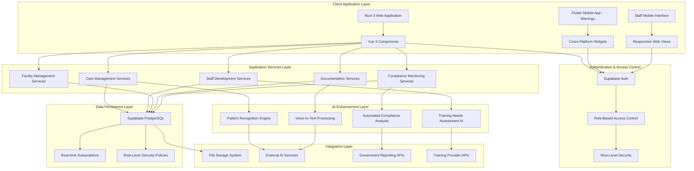
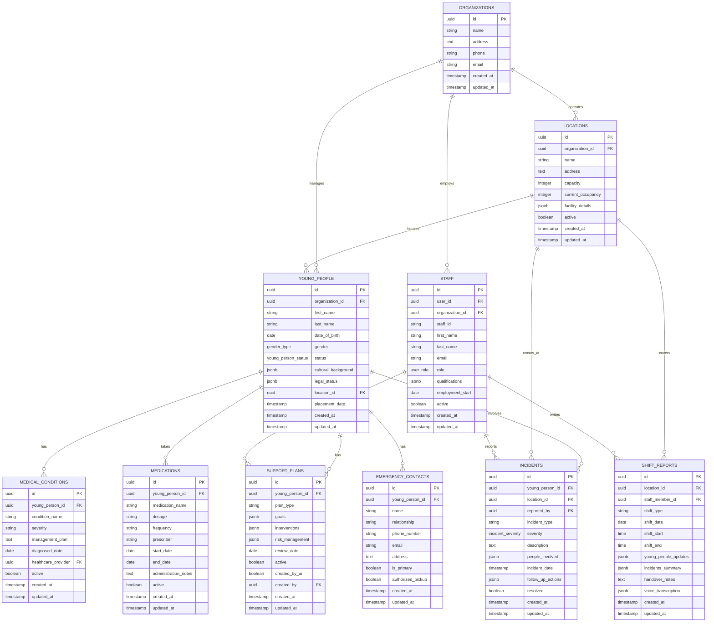

# SLNQ: Comprehensive Youth Support Services Management Platform

[](https://nuxt.com/)
[](https://vuejs.org/)
[](https://supabase.com/)
[](https://flutter.dev/)
[](#license--legal)

## Abstract

Safe Living NQ (SLNQ) represents a sophisticated, AI-enhanced youth support services management platform engineered to revolutionise residential care operations for vulnerable young people in Queensland, Australia. Built upon Nuxt 3's server-side architecture and powered by Supabase's real-time infrastructure, the platform delivers comprehensive case management, staff coordination, facility oversight, and compliance monitoring capabilities specifically designed for youth residential care environments.

The system integrates advanced artificial intelligence capabilities including voice-to-text transcription, intelligent document generation, pattern recognition for risk assessment, and automated compliance monitoring. Through its modular architecture combining comprehensive client management, staff development frameworks, facility management systems, and real-time communication platforms, SLNQ establishes itself as an essential solution for youth support organisations seeking to enhance care quality, operational efficiency, and regulatory compliance whilst maintaining the highest standards of privacy and security for vulnerable populations.

## Table of Contents

- [Abstract](#abstract)
- [Executive Summary](#executive-summary)
  - [Strategic Vision and Care Objectives](#strategic-vision-and-care-objectives)
  - [Key Stakeholders](#key-stakeholders)
  - [Value Proposition and Care Impact](#value-proposition-and-care-impact)
- [System Architecture](#system-architecture)
  - [Comprehensive Platform Architecture](#comprehensive-platform-architecture)
  - [AI-Enhanced Care Management Framework](#ai-enhanced-care-management-framework)
  - [Multi-Platform Integration Design](#multi-platform-integration-design)
- [Core Technologies](#core-technologies)
- [Care Management Modules](#care-management-modules)
  - [Young Person Management System](#young-person-management-system)
  - [Staff Development and Management Platform](#staff-development-and-management-platform)
  - [Facility and Asset Management Framework](#facility-and-asset-management-framework)
  - [Documentation and Communication Hub](#documentation-and-communication-hub)
  - [Compliance and Reporting Analytics](#compliance-and-reporting-analytics)
- [Installation & Deployment](#installation--deployment)
- [API Documentation](#api-documentation)
- [Database Architecture](#database-architecture)
- [AI Integration Framework](#ai-integration-framework)
- [Security & Compliance](#security--compliance)
- [Performance Optimisation](#performance-optimisation)
- [Testing & Quality Assurance](#testing--quality-assurance)
- [Development Guidelines](#development-guidelines)
- [Contributing Guidelines](#contributing-guidelines)
- [License & Legal](#license--legal)

## Executive Summary

### Strategic Vision and Care Objectives

SLNQ addresses critical challenges in youth residential care delivery through comprehensive digital transformation and intelligent automation. The platform's strategic care objectives encompass:

- **Holistic Client Care**: Enhancement of support planning, risk assessment, and progress monitoring for young people in residential care environments
- **Staff Excellence**: Development of comprehensive training, qualification tracking, and performance optimisation systems for youth support workers
- **Operational Excellence**: Streamlined facility management, asset tracking, and maintenance workflows ensuring safe, compliant residential environments
- **Evidence-Based Practice**: AI-powered analytics enabling data-driven decision making and continuous improvement in care delivery
- **Regulatory Compliance**: Automated compliance monitoring and reporting systems ensuring adherence to Queensland care standards and federal regulations

### Key Stakeholders

**Primary Care Stakeholders:**
- Young people receiving residential care services and their families
- Youth Support Workers (YSW) providing direct care and supervision
- Team Leaders coordinating care delivery and staff supervision
- Case Managers developing and implementing individualised support plans
- Clinical staff providing therapeutic and medical support

**Secondary Stakeholders:**
- Management teams overseeing operational performance and compliance
- Regulatory bodies monitoring care standards and compliance outcomes
- Government departments funding and overseeing youth residential care services
- Community partners providing ancillary support services
- Emergency services and crisis response teams

### Value Proposition and Care Impact

SLNQ delivers measurable care and operational value through:

- **Care Quality Enhancement**: Systematic improvement in support planning accuracy, risk assessment effectiveness, and intervention outcomes through AI-assisted documentation and pattern recognition
- **Operational Efficiency**: Reduction in administrative burden enabling increased focus on direct care delivery and client engagement
- **Compliance Assurance**: Automated monitoring and reporting systems ensuring continuous adherence to regulatory requirements and care standards
- **Staff Development**: Comprehensive training tracking and competency development frameworks supporting professional growth and care quality improvement
- **Data-Driven Insights**: Advanced analytics enabling evidence-based care planning, resource allocation, and strategic planning decisions

## System Architecture

### Comprehensive Platform Architecture

The SLNQ platform implements a sophisticated multi-tier architecture optimised for youth residential care environments, combining web-based management systems with mobile companion applications:



### AI-Enhanced Care Management Framework

**Intelligent Care Support System:**
```javascript
// Core AI-enhanced care management service
class IntelligentCareManager {
  constructor() {
    this.riskAssessmentEngine = new RiskPatternAnalyzer()
    this.documentGenerationService = new AIDocumentGenerator()
    this.voiceTranscriptionService = new VoiceToTextProcessor()
    this.complianceMonitor = new AutomatedComplianceAnalyzer()
  }
  
  async generateSupportPlan(youngPersonData, careHistory) {
    // AI-assisted support plan generation
    const riskFactors = await this.riskAssessmentEngine.analyzeRiskPatterns({
      demographic_data: youngPersonData.demographics,
      care_history: careHistory,
      behavioral_patterns: youngPersonData.behaviorHistory,
      family_context: youngPersonData.familyBackground
    })
    
    const interventionStrategies = await this.documentGenerationService.generateInterventions({
      identified_risks: riskFactors,
      strengths_assessment: youngPersonData.strengths,
      cultural_considerations: youngPersonData.culturalNeeds,
      therapeutic_requirements: youngPersonData.therapeuticNeeds
    })
    
    const supportPlan = {
      young_person_id: youngPersonData.id,
      risk_assessment: riskFactors,
      intervention_strategies: interventionStrategies,
      monitoring_requirements: await this.generateMonitoringFramework(riskFactors),
      review_schedule: await this.calculateReviewSchedule(riskFactors.severity),
      crisis_management_protocols: await this.generateCrisisProtocols(riskFactors)
    }
    
    return {
      support_plan: supportPlan,
      implementation_guidance: await this.generateImplementationGuidance(supportPlan),
      staff_training_requirements: await this.identifyTrainingNeeds(interventionStrategies),
      resource_allocation: await this.calculateResourceRequirements(supportPlan)
    }
  }
  
  async processIncidentDocumentation(incidentData, voiceRecording) {
    // AI-enhanced incident processing and documentation
    const transcription = await this.voiceTranscriptionService.transcribe(voiceRecording)
    const structuredReport = await this.documentGenerationService.structureIncidentReport({
      incident_details: incidentData,
      verbal_account: transcription,
      witness_statements: incidentData.witnessAccounts
    })
    
    const riskAnalysis = await this.riskAssessmentEngine.assessIncidentRisk({
      incident_type: structuredReport.incidentType,
      severity_level: structuredReport.severity,
      young_person_profile: await this.getYoungPersonProfile(incidentData.young_person_id),
      environmental_factors: incidentData.contextualFactors
    })
    
    return {
      incident_report: structuredReport,
      risk_analysis: riskAnalysis,
      follow_up_actions: await this.generateFollowUpActions(riskAnalysis),
      notification_requirements: await this.determineNotificationRequirements(riskAnalysis),
      compliance_implications: await this.assessComplianceImplications(structuredReport)
    }
  }
}
```

### Multi-Platform Integration Design

**Cross-Platform Service Integration:**
```javascript
class MultiPlatformIntegrationService {
  constructor() {
    this.webPlatform = new NuxtApplicationService()
    this.mobilePlatform = new FlutterApplicationService()
    this.synchronisationService = new RealTimeSyncService()
  }
  
  async synchroniseCarePlanUpdates(carePlanUpdate) {
    // Real-time synchronisation across web and mobile platforms
    const validatedUpdate = await this.validateCarePlanUpdate(carePlanUpdate)
    
    // Update web application state
    await this.webPlatform.updateCarePlanState(validatedUpdate)
    
    // Push to mobile applications
    await this.mobilePlatform.pushCarePlanUpdate(validatedUpdate)
    
    // Notify relevant staff members
    await this.synchronisationService.notifyStaffOfChanges({
      update_type: 'care_plan_modification',
      affected_young_person: carePlanUpdate.young_person_id,
      update_details: validatedUpdate,
      notification_priority: this.calculateNotificationPriority(validatedUpdate)
    })
    
    return {
      synchronisation_status: 'completed',
      affected_platforms: ['web', 'mobile'],
      notification_recipients: await this.getNotificationRecipients(carePlanUpdate),
      audit_trail: await this.createAuditTrail(carePlanUpdate)
    }
  }
}
```

## Core Technologies

| Technology | Version | Justification | License |
|------------|---------|---------------|---------|
| **Nuxt 3** | 3.11+ | Full-stack Vue framework optimised for server-side rendering and static generation | MIT License |
| **Vue.js** | 3.4+ | Progressive JavaScript framework with composition API for reactive user interfaces | MIT License |
| **Supabase** | 2.38+ | Backend-as-a-Service providing PostgreSQL database, authentication, and real-time features | Apache 2.0 |
| **PostgreSQL** | 14+ | Advanced relational database with JSON support and real-time capabilities | PostgreSQL License |
| **Tailwind CSS** | 3.4+ | Utility-first CSS framework optimised for responsive design and component development | MIT License |
| **Pinia** | 2.1+ | Official Vue state management library with TypeScript support | MIT License |
| **VueUse** | 10.9+ | Collection of essential Vue composition utilities | MIT License |
| **Flutter** | 3.10+ | Cross-platform mobile framework for Warringu companion application | BSD 3-Clause |
| **Dart** | 3.0+ | Programming language for Flutter mobile application development | BSD 3-Clause |
| **TypeScript** | 5.0+ | Typed JavaScript providing enhanced development experience and code quality | Apache 2.0 |

## Care Management Modules

### Young Person Management System

**Comprehensive Client Care Framework:**
The Young Person (YP) Management System provides holistic care coordination for young people in residential care environments:

```javascript
// Young Person Management Store Implementation
export const useYoungPeopleStore = defineStore('young-people', {
  state: () => ({
    youngPeople: [],
    currentYoungPerson: null,
    supportPlans: [],
    medicalRequirements: [],
    safetyPlans: [],
    progressReports: [],
    careTeamMeetings: [],
    loading: false,
    error: null
  }),
  
  getters: {
    getActiveYoungPeople: (state) => {
      return state.youngPeople.filter(yp => yp.status === 'active')
    },
    
    getYoungPeopleByLocation: (state) => (locationId) => {
      return state.youngPeople.filter(yp => 
        yp.location_id === locationId && yp.status === 'active'
      )
    },
    
    getHighRiskYoungPeople: (state) => {
      return state.youngPeople.filter(yp => 
        yp.risk_level === 'high' || yp.crisis_indicators?.length > 0
      )
    },
    
    getSupportPlansByYoungPerson: (state) => (youngPersonId) => {
      return state.supportPlans.filter(plan => 
        plan.young_person_id === youngPersonId && plan.status === 'active'
      )
    }
  },
  
  actions: {
    async fetchYoungPeople() {
      this.loading = true
      try {
        const supabase = useSupabaseClient()
        
        // Fetch young people with comprehensive related data
        const { data: youngPeople, error } = await supabase
          .from('young_people')
          .select(`
            *,
            location:locations(name, address),
            support_plans!inner(
              id, goals, interventions, review_date, status
            ),
            medical_conditions(
              id, condition_name, severity, management_plan
            ),
            medications(
              id, medication_name, dosage, frequency, prescriber
            ),
            emergency_contacts(
              id, name, relationship, phone_number, is_primary
            )
          `)
          .eq('status', 'active')
          .order('first_name')
        
        if (error) throw error
        
        this.youngPeople = youngPeople
        
        // Setup real-time subscriptions for live updates
        await this.setupRealTimeSubscriptions()
        
      } catch (error) {
        this.error = `Failed to fetch young people data: ${error.message}`
        console.error('Young People fetch error:', error)
      } finally {
        this.loading = false
      }
    },
    
    async generateAISupportPlan(youngPersonId, careHistory) {
      this.loading = true
      try {
        const careManager = new IntelligentCareManager()
        const youngPerson = this.getYoungPersonById(youngPersonId)
        
        if (!youngPerson) {
          throw new Error('Young person not found')
        }
        
        // Generate AI-assisted support plan
        const supportPlanData = await careManager.generateSupportPlan(
          youngPerson, 
          careHistory
        )
        
        // Save to database
        const supabase = useSupabaseClient()
        const { data: savedPlan, error } = await supabase
          .from('support_plans')
          .insert({
            young_person_id: youngPersonId,
            plan_data: supportPlanData.support_plan,
            implementation_guidance: supportPlanData.implementation_guidance,
            staff_training_requirements: supportPlanData.staff_training_requirements,
            resource_allocation: supportPlanData.resource_allocation,
            generated_by_ai: true,
            created_by: useAuth().user.id
          })
          .select()
          .single()
        
        if (error) throw error
        
        // Update local state
        this.supportPlans.push(savedPlan)
        
        return savedPlan
        
      } catch (error) {
        this.error = `Support plan generation failed: ${error.message}`
        throw error
      } finally {
        this.loading = false
      }
    },
    
    async setupRealTimeSubscriptions() {
      const supabase = useSupabaseClient()
      
      // Subscribe to young people changes
      supabase
        .channel('young_people_changes')
        .on('postgres_changes', {
          event: '*',
          schema: 'public',
          table: 'young_people'
        }, (payload) => {
          this.handleRealTimeUpdate(payload)
        })
        .subscribe()
    }
  }
})
```

**Care Planning and Risk Assessment:**
- **Comprehensive Assessment Tools**: Multi-dimensional assessment frameworks incorporating mental health, behavioral, educational, and social factors
- **AI-Assisted Risk Analysis**: Pattern recognition algorithms identifying potential risk factors and protective factors
- **Individualised Support Planning**: Tailored intervention strategies based on strengths-based approaches and evidence-based practices
- **Crisis Management Protocols**: Automated crisis plan generation with therapeutic crisis intervention (TCI) integration
- **Progress Monitoring**: Real-time tracking of goal achievement and intervention effectiveness

### Staff Development and Management Platform

**Comprehensive Workforce Management Framework:**
```javascript
// Staff Management and Development System
class StaffDevelopmentManager {
  constructor() {
    this.qualificationTracker = new QualificationTrackingService()
    this.trainingAnalyzer = new AITrainingNeedsAnalyzer()
    this.performanceMonitor = new PerformanceMonitoringService()
    this.wellnessSupport = new StaffWellnessService()
  }
  
  async assessStaffTrainingNeeds(staffMember, recentIncidents, clientInteractions) {
    // AI-powered training needs assessment
    const trainingAnalysis = {
      technical_competencies: await this.trainingAnalyzer.assessTechnicalSkills({
        qualification_level: staffMember.qualifications,
        recent_performance: recentIncidents,
        client_feedback: clientInteractions
      }),
      
      therapeutic_skills: await this.trainingAnalyzer.assessTherapeuticCapabilities({
        incident_handling: recentIncidents.filter(i => i.requires_therapeutic_intervention),
        de_escalation_effectiveness: this.calculateDeEscalationSuccess(recentIncidents),
        relationship_building: clientInteractions.relationship_quality_scores
      }),
      
      compliance_knowledge: await this.trainingAnalyzer.assessComplianceKnowledge({
        documentation_quality: staffMember.documentation_scores,
        policy_adherence: staffMember.policy_compliance_record,
        regulatory_updates: this.getRequiredRegulatoryTraining()
      })
    }
    
    const trainingPlan = await this.generatePersonalisedTrainingPlan({
      identified_gaps: trainingAnalysis,
      staff_preferences: staffMember.learning_preferences,
      organisational_priorities: await this.getOrganisationalTrainingPriorities(),
      available_resources: await this.getAvailableTrainingResources()
    })
    
    return {
      training_assessment: trainingAnalysis,
      personalised_plan: trainingPlan,
      implementation_timeline: await this.createTrainingTimeline(trainingPlan),
      resource_requirements: await this.calculateTrainingCosts(trainingPlan)
    }
  }
  
  async monitorQualificationExpiry() {
    // Automated qualification tracking and renewal alerts
    const staffMembers = await this.getAllStaffMembers()
    const expiryAlerts = []
    
    for (const staff of staffMembers) {
      const qualifications = await this.qualificationTracker.getStaffQualifications(staff.id)
      
      for (const qualification of qualifications) {
        const daysUntilExpiry = this.calculateDaysUntilExpiry(qualification.expiry_date)
        
        if (daysUntilExpiry <= 90) { // 90-day advance warning
          expiryAlerts.push({
            staff_member: staff,
            qualification: qualification,
            days_until_expiry: daysUntilExpiry,
            renewal_process: await this.getRenewalProcess(qualification.type),
            priority_level: this.calculateRenewalPriority(qualification, daysUntilExpiry)
          })
        }
      }
    }
    
    return {
      expiry_alerts: expiryAlerts,
      renewal_recommendations: await this.generateRenewalRecommendations(expiryAlerts),
      training_scheduling: await this.scheduleRenewalTraining(expiryAlerts)
    }
  }
}
```

**Staff Development Features:**
- **Qualification Management**: Automated tracking of Certificate IV in Youth Work, First Aid, and specialised qualifications with expiry alerts
- **Competency Assessment**: AI-powered analysis of staff performance and identification of professional development opportunities
- **Training Coordination**: Integrated training scheduling and progress tracking aligned with organisational and regulatory requirements
- **Performance Monitoring**: Comprehensive performance analytics supporting supervision and professional development planning
- **Wellness Support**: Early identification of staff requiring additional support through pattern analysis and workload monitoring

### Facility and Asset Management Framework

**Comprehensive Property and Asset Management:**
```vue
<template>
  <div class="facility-management-dashboard">
    <div class="facility-overview">
      <FacilityCard 
        v-for="location in activeLocations"
        :key="location.id"
        :location="location"
        :occupancy-status="getOccupancyStatus(location.id)"
        :maintenance-alerts="getMaintenanceAlerts(location.id)"
        :compliance-status="getComplianceStatus(location.id)"
        @maintenance-request="handleMaintenanceRequest"
        @safety-check="initiateSafetyCheck"
      />
    </div>
    
    <div class="asset-tracking">
      <AssetManagementTable 
        :assets="facilitAssets"
        :maintenance-schedules="maintenanceSchedules"
        @asset-update="updateAssetStatus"
        @schedule-maintenance="scheduleMaintenanceActivity"
      />
    </div>
    
    <div class="safety-monitoring">
      <SafetyCompliancePanel 
        :whs-documentation="whsDocuments"
        :safety-inspections="safetyInspections"
        :compliance-checklist="complianceRequirements"
        @generate-report="generateComplianceReport"
        @schedule-inspection="scheduleWHSInspection"
      />
    </div>
    
    <div class="maintenance-workflow">
      <MaintenanceRequestSystem 
        :pending-requests="pendingMaintenanceRequests"
        :scheduled-maintenance="scheduledMaintenance"
        :contractor-management="contractorDatabase"
        @approve-request="approveMaintenanceRequest"
        @assign-contractor="assignMaintenanceContractor"
      />
    </div>
  </div>
</template>

<script setup>
import { ref, computed, onMounted } from 'vue'
import { useLocationsStore } from '@/stores/locations'
import { useMaintenanceStore } from '@/stores/maintenance'

const locationsStore = useLocationsStore()
const maintenanceStore = useMaintenanceStore()

const activeLocations = computed(() => 
  locationsStore.locations.filter(loc => loc.status === 'active')
)

const facilitAssets = computed(() => 
  locationsStore.getAllAssets()
)

const maintenanceSchedules = computed(() => 
  maintenanceStore.getActiveSchedules()
)

onMounted(async () => {
  await locationsStore.fetchLocations()
  await maintenanceStore.fetchMaintenanceData()
  await initializeRealTimeMonitoring()
})

async function handleMaintenanceRequest(request) {
  await maintenanceStore.createMaintenanceRequest({
    location_id: request.location_id,
    asset_id: request.asset_id,
    request_type: request.type,
    priority_level: calculateMaintenancePriority(request),
    description: request.description,
    safety_implications: request.safety_concerns
  })
}
</script>
```

**Facility Management Capabilities:**
- **Location Management**: Comprehensive house profiles with capacity management, occupancy tracking, and environmental monitoring
- **Asset Tracking**: Digital asset registers with maintenance schedules, warranty tracking, and replacement planning
- **Maintenance Workflows**: Automated maintenance request processing, contractor management, and compliance monitoring
- **Safety Compliance**: WHS documentation systems, safety inspection scheduling, and regulatory compliance tracking
- **Cleaning Protocols**: Structured cleaning checklists and hygiene monitoring systems ensuring safe residential environments

### Documentation and Communication Hub

**Comprehensive Documentation and Communication Platform:**
```javascript
class DocumentationHub {
  constructor() {
    this.voiceProcessor = new VoiceToTextService()
    this.documentGenerator = new AIDocumentGenerator()
    this.communicationManager = new SecureCommunicationService()
    this.workflowEngine = new DocumentWorkflowEngine()
  }
  
  async processShiftReport(shiftData, voiceRecording) {
    // AI-enhanced shift report processing
    const voiceTranscription = await this.voiceProcessor.transcribe(voiceRecording, {
      domain_specific_vocabulary: ['TCI', 'de-escalation', 'therapeutic', 'behavioural'],
      speaker_identification: true,
      timestamp_markers: true
    })
    
    const structuredReport = await this.documentGenerator.generateShiftReport({
      shift_details: shiftData,
      voice_content: voiceTranscription,
      young_people_interactions: shiftData.clientInteractions,
      incident_summaries: shiftData.incidents,
      handover_notes: shiftData.handoverRequirements
    })
    
    const qualityAssessment = await this.assessDocumentationQuality({
      report_content: structuredReport,
      compliance_requirements: await this.getComplianceRequirements('shift_report'),
      completeness_check: await this.validateReportCompleteness(structuredReport)
    })
    
    return {
      structured_report: structuredReport,
      quality_assessment: qualityAssessment,
      compliance_status: qualityAssessment.compliance_score,
      improvement_suggestions: qualityAssessment.improvement_recommendations,
      approval_workflow: await this.initiateApprovalWorkflow(structuredReport)
    }
  }
  
  async facilitateCareTeamMeeting(meetingData, participantList) {
    // AI-assisted care team meeting facilitation
    const meetingTemplate = await this.documentGenerator.generateMeetingTemplate({
      young_person_profile: meetingData.youngPerson,
      agenda_items: meetingData.agenda,
      participant_roles: participantList,
      review_period: meetingData.reviewPeriod
    })
    
    const meetingNotes = await this.voiceProcessor.transcribeWithSpeakerIdentification({
      audio_recording: meetingData.audioRecording,
      participant_voices: participantList,
      meeting_structure: meetingTemplate.structure
    })
    
    const actionItems = await this.documentGenerator.extractActionItems({
      meeting_transcript: meetingNotes,
      participant_responsibilities: participantList,
      deadline_requirements: meetingData.timeframes
    })
    
    return {
      meeting_minutes: await this.formatMeetingMinutes(meetingNotes, meetingTemplate),
      action_items: actionItems,
      follow_up_schedule: await this.generateFollowUpSchedule(actionItems),
      distribution_list: await this.determineDistributionList(meetingData, actionItems)
    }
  }
}
```

**Documentation Features:**
- **Shift Reporting**: Multiple shift report types (daily, night, awake shifts) with AI-assisted generation and quality assessment
- **Incident Documentation**: Comprehensive incident reporting with automated debriefing protocols and compliance validation
- **Meeting Management**: Voice-to-text meeting transcription with action item extraction and follow-up scheduling
- **Secure Messaging**: Role-based communication systems with audit trails and message encryption
- **File Management**: Centralised document storage with version control and access permissions

### Compliance and Reporting Analytics

**Advanced Compliance Monitoring and Analytics Framework:**
```javascript
class ComplianceAnalyticsEngine {
  constructor() {
    this.complianceRules = new ComplianceRuleEngine()
    this.reportGenerator = new AutomatedReportGenerator()
    this.patternAnalyzer = new CompliancePatternAnalyzer()
    this.alertSystem = new ComplianceAlertSystem()
  }
  
  async generateComplianceAnalytics(timeframe, complianceAreas) {
    // Comprehensive compliance analysis and reporting
    const complianceMetrics = {
      incident_compliance: await this.analyzeIncidentCompliance({
        timeframe: timeframe,
        incident_types: complianceAreas.incidents,
        reporting_timeliness: await this.assessReportingTimeliness(),
        documentation_quality: await this.assessDocumentationQuality()
      }),
      
      staff_compliance: await this.analyzeStaffCompliance({
        qualification_currency: await this.checkQualificationCurrency(),
        training_completion: await this.assessTrainingCompletion(),
        policy_adherence: await this.evaluatePolicyAdherence(),
        supervision_compliance: await this.checkSupervisionCompliance()
      }),
      
      operational_compliance: await this.analyzeOperationalCompliance({
        safety_protocols: await this.auditSafetyProtocols(),
        maintenance_compliance: await this.checkMaintenanceCompliance(),
        environmental_standards: await this.assessEnvironmentalStandards(),
        record_keeping: await this.auditRecordKeeping()
      }),
      
      client_outcomes: await this.analyzeClientOutcomes({
        goal_achievement: await this.assessGoalAchievement(),
        safety_indicators: await this.monitorSafetyIndicators(),
        satisfaction_measures: await this.evaluateClientSatisfaction(),
        transition_success: await this.analyzeTransitionOutcomes()
      })
    }
    
    const riskAnalysis = await this.patternAnalyzer.identifyComplianceRisks({
      historical_patterns: complianceMetrics,
      current_trends: await this.analyzeCurrentTrends(),
      external_factors: await this.assessExternalRiskFactors()
    })
    
    const improvementPlan = await this.generateComplianceImprovementPlan({
      identified_gaps: riskAnalysis.compliance_gaps,
      resource_availability: await this.assessResourceAvailability(),
      regulatory_changes: await this.getUpcomingRegulatoryChanges()
    })
    
    return {
      compliance_metrics: complianceMetrics,
      risk_analysis: riskAnalysis,
      improvement_plan: improvementPlan,
      executive_summary: await this.generateExecutiveSummary(complianceMetrics, riskAnalysis),
      regulatory_reports: await this.generateRegulatoryReports(complianceMetrics)
    }
  }
  
  async monitorRealTimeCompliance() {
    // Real-time compliance monitoring and alerting
    const activeMonitoring = {
      incident_reporting_deadlines: await this.monitorIncidentReportingDeadlines(),
      staff_supervision_requirements: await this.monitorSupervisionCompliance(),
      safety_check_schedules: await this.monitorSafetyCheckCompliance(),
      training_deadline_alerts: await this.monitorTrainingDeadlines(),
      documentation_quality_alerts: await this.monitorDocumentationQuality()
    }
    
    // Generate automated alerts for compliance violations
    const complianceAlerts = await this.generateComplianceAlerts(activeMonitoring)
    
    // Initiate corrective action workflows
    const correctiveActions = await this.initiateCorrectiveActions(complianceAlerts)
    
    return {
      monitoring_status: activeMonitoring,
      active_alerts: complianceAlerts,
      corrective_actions: correctiveActions,
      compliance_dashboard: await this.updateComplianceDashboard(activeMonitoring)
    }
  }
}
```

## Installation & Deployment

### Prerequisites and Environment Setup

**System Requirements:**
```bash
# Node.js and Package Manager Requirements
node --version    # Requires Node.js 20.18.0+
npm --version     # Requires npm 8+

# Platform-specific Requirements
# Web Application: Modern browser with ES2020+ support
# Mobile Application: Flutter 3.10+ with Dart 3.0+
# Database: PostgreSQL 14+ with Supabase configuration
```

**Development Environment Configuration:**
```bash
# Clone repository and setup development environment
git clone https://github.com/safelivingnq/slnq-platform.git
cd slnq-platform

# Make installation scripts executable
chmod +x install-fix.sh
chmod +x complete-install.sh

# Install dependencies and configure environment
./install-fix.sh

# Alternative manual installation
npm install

# Install Flutter dependencies for mobile companion app
cd warringu-app
flutter pub get
cd ..
```

**Environment Configuration:**
```bash
# Create environment configuration file
cp .env.example .env

# Configure Supabase connection
echo "NUXT_PUBLIC_SUPABASE_URL=your_supabase_project_url" >> .env
echo "NUXT_PUBLIC_SUPABASE_ANON_KEY=your_supabase_anon_key" >> .env
echo "SUPABASE_SERVICE_ROLE_KEY=your_service_role_key" >> .env

# Configure AI services integration
echo "OPENAI_API_KEY=your_openai_api_key" >> .env
echo "ANTHROPIC_API_KEY=your_anthropic_api_key" >> .env

# Configure notification services
echo "NOTIFICATION_SERVICE_URL=your_notification_service" >> .env
echo "SMS_SERVICE_API_KEY=your_sms_service_key" >> .env
```

### Database Setup and Configuration

**Supabase Database Initialisation:**
```sql
-- Execute complete database schema
-- Run in Supabase SQL Editor

-- Enable required extensions
CREATE EXTENSION IF NOT EXISTS "uuid-ossp";
CREATE EXTENSION IF NOT EXISTS "pg_trgm";
CREATE EXTENSION IF NOT EXISTS "unaccent";

-- Create enum types for data consistency
CREATE TYPE user_role AS ENUM ('support_worker', 'team_leader', 'management', 'admin');
CREATE TYPE young_person_status AS ENUM ('active', 'discharged', 'inactive');
CREATE TYPE incident_severity AS ENUM ('low', 'medium', 'high', 'critical');
CREATE TYPE task_priority AS ENUM ('low', 'medium', 'high', 'urgent');

-- Execute complete schema from database/schema.sql
\i database/schema.sql

-- Insert sample data for development
\i database/sample-data.sql

-- Configure Row Level Security policies
\i database/rls-policies.sql
```

**Staff Profile Creation:**
```sql
-- Create initial staff profile (replace with actual user ID from auth.users)
INSERT INTO staff (
  user_id, 
  organization_id, 
  staff_id, 
  first_name, 
  last_name, 
  email, 
  role,
  qualifications
) VALUES (
  'YOUR_AUTH_USER_ID',
  '550e8400-e29b-41d4-a716-446655440000',
  'SLNQ001',
  'Your',
  'Name',
  'your.email@safelivingnq.com.au',
  'admin',
  '["Certificate IV in Youth Work", "First Aid", "Mental Health First Aid"]'::jsonb
);
```

### Development Commands and Workflows

**Development Server Management:**
```bash
# Start development server
npm run dev              # Web application on http://localhost:3000

# Database management
node scripts/setup-database.js     # Initialize database schema
node scripts/check-env.js          # Validate environment configuration

# Flutter mobile app development
cd warringu-app
flutter run -d chrome              # Web version of mobile app
flutter run -d ios                 # iOS simulator
flutter run -d android             # Android emulator

# Troubleshooting and diagnostics
./diagnostic-fix.sh                # Comprehensive system diagnostics
./fix-auth-completely.sh           # Authentication system reset
./minimal-fix.sh                   # Minimal working configuration
```

**Production Deployment:**
```bash
# Web application production build
npm run build                      # Generate production build
npm run generate                   # Static site generation
npm run preview                    # Preview production build

# Mobile application deployment
cd warringu-app
flutter build web --release        # Web deployment
flutter build ios --release        # iOS App Store
flutter build apk --release        # Android APK
flutter build appbundle --release  # Google Play Store

# Database migration and backup
node scripts/export-production-data.js    # Export production data
node scripts/backup-database.js           # Automated backup
```

## API Documentation

### Young Person Management API

**Core Young Person Operations:**
```javascript
// Young Person Management API Service
class YoungPersonAPI {
  constructor(supabaseClient) {
    this.supabase = supabaseClient
    this.aiService = new AIDocumentationService()
  }
  
  async createYoungPersonProfile(profileData) {
    /**
     * Create comprehensive young person profile
     * 
     * @param {Object} profileData - Complete profile information
     * @param {string} profileData.first_name - Given name
     * @param {string} profileData.last_name - Family name
     * @param {Date} profileData.date_of_birth - Birth date
     * @param {string} profileData.gender - Gender identity
     * @param {Object} profileData.cultural_background - Cultural information
     * @param {Array} profileData.emergency_contacts - Emergency contact list
     * @param {Object} profileData.medical_information - Medical history
     * @param {string} profileData.legal_status - Care arrangement details
     * 
     * @returns {Promise<Object>} Created young person profile
     */
    try {
      // Validate required information
      const validationResult = await this.validateProfileData(profileData)
      if (!validationResult.isValid) {
        throw new Error(`Profile validation failed: ${validationResult.errors.join(', ')}`)
      }
      
      // Create young person record
      const { data: youngPerson, error: profileError } = await this.supabase
        .from('young_people')
        .insert({
          first_name: profileData.first_name,
          last_name: profileData.last_name,
          date_of_birth: profileData.date_of_birth,
          gender: profileData.gender,
          cultural_background: profileData.cultural_background,
          legal_status: profileData.legal_status,
          placement_date: new Date().toISOString(),
          status: 'active',
          created_by: this.getCurrentUserId()
        })
        .select()
        .single()
      
      if (profileError) throw profileError
      
      // Create associated records
      await this.createEmergencyContacts(youngPerson.id, profileData.emergency_contacts)
      await this.createMedicalProfile(youngPerson.id, profileData.medical_information)
      await this.initializeDefaultSupportPlan(youngPerson.id)
      
      // Generate AI-assisted initial assessment
      const initialAssessment = await this.aiService.generateInitialAssessment({
        young_person_data: profileData,
        placement_context: profileData.placement_context
      })
      
      await this.createInitialAssessment(youngPerson.id, initialAssessment)
      
      return {
        young_person: youngPerson,
        initial_assessment: initialAssessment,
        profile_completion_status: await this.calculateProfileCompleteness(youngPerson.id)
      }
      
    } catch (error) {
      throw new Error(`Young person profile creation failed: ${error.message}`)
    }
  }
  
  async generateSupportPlan(youngPersonId, assessmentData) {
    /**
     * Generate AI-assisted support plan
     * 
     * @param {string} youngPersonId - Young person identifier
     * @param {Object} assessmentData - Assessment information
     * @returns {Promise<Object>} Generated support plan
     */
    try {
      const youngPerson = await this.getYoungPersonProfile(youngPersonId)
      
      const supportPlan = await this.aiService.generateSupportPlan({
        young_person_profile: youngPerson,
        assessment_data: assessmentData,
        care_history: await this.getCareHistory(youngPersonId),
        cultural_considerations: youngPerson.cultural_background
      })
      
      const { data: savedPlan, error } = await this.supabase
        .from('support_plans')
        .insert({
          young_person_id: youngPersonId,
          plan_type: 'comprehensive',
          goals: supportPlan.goals,
          interventions: supportPlan.interventions,
          risk_management: supportPlan.risk_management,
          review_schedule: supportPlan.review_schedule,
          created_by_ai: true,
          created_by: this.getCurrentUserId()
        })
        .select()
        .single()
      
      if (error) throw error
      
      return {
        support_plan: savedPlan,
        implementation_guidance: supportPlan.implementation_guidance,
        staff_training_requirements: supportPlan.staff_training_requirements
      }
      
    } catch (error) {
      throw new Error(`Support plan generation failed: ${error.message}`)
    }
  }
}
```

### Documentation and Communication API

**Voice-to-Text and Document Generation:**
```javascript
class DocumentationAPI {
  constructor() {
    this.voiceService = new VoiceToTextService()
    this.aiDocumentService = new AIDocumentGenerator()
  }
  
  async processVoiceToTextDocumentation(audioFile, documentType, context) {
    /**
     * Process voice recording to structured documentation
     * 
     * @param {File} audioFile - Audio recording file
     * @param {string} documentType - Type of document (shift_report, incident, meeting)
     * @param {Object} context - Contextual information
     * @returns {Promise<Object>} Processed documentation
     */
    try {
      // Transcribe audio with domain-specific vocabulary
      const transcription = await this.voiceService.transcribe(audioFile, {
        domain_vocabulary: ['TCI', 'de-escalation', 'therapeutic', 'behavioral'],
        speaker_identification: context.participants?.length > 1,
        timestamp_markers: true,
        confidence_threshold: 0.8
      })
      
      // Generate structured document based on type
      let structuredDocument
      switch (documentType) {
        case 'shift_report':
          structuredDocument = await this.generateShiftReport(transcription, context)
          break
        case 'incident':
          structuredDocument = await this.generateIncidentReport(transcription, context)
          break
        case 'meeting':
          structuredDocument = await this.generateMeetingMinutes(transcription, context)
          break
        default:
          throw new Error(`Unsupported document type: ${documentType}`)
      }
      
      // Quality assessment and compliance checking
      const qualityAssessment = await this.assessDocumentQuality(structuredDocument)
      
      return {
        transcription: transcription,
        structured_document: structuredDocument,
        quality_assessment: qualityAssessment,
        compliance_status: qualityAssessment.compliance_score >= 0.8 ? 'compliant' : 'needs_review',
        suggested_improvements: qualityAssessment.improvement_suggestions
      }
      
    } catch (error) {
      throw new Error(`Voice documentation processing failed: ${error.message}`)
    }
  }
  
  async generateIncidentReport(transcription, incidentContext) {
    // AI-assisted incident report generation
    const incidentReport = await this.aiDocumentService.generateIncidentReport({
      voice_transcription: transcription,
      incident_type: incidentContext.incident_type,
      people_involved: incidentContext.people_involved,
      location: incidentContext.location,
      timestamp: incidentContext.timestamp
    })
    
    // Validate compliance with reporting requirements
    const complianceCheck = await this.validateIncidentReportCompliance(incidentReport)
    
    return {
      ...incidentReport,
      compliance_validation: complianceCheck,
      follow_up_actions: await this.generateFollowUpActions(incidentReport),
      notification_requirements: await this.determineNotificationRequirements(incidentReport)
    }
  }
}
```

## Database Architecture

### Comprehensive Database Schema

**Core Entity Relationship Framework:**


### Row-Level Security Implementation

**Comprehensive Security Policies:**
```sql
-- Row-Level Security Policies for Youth Services Data Protection

-- Young People table security
ALTER TABLE young_people ENABLE ROW LEVEL SECURITY;

CREATE POLICY "Staff can view young people in their organization" ON young_people
  FOR SELECT USING (
    organization_id IN (
      SELECT organization_id FROM staff 
      WHERE user_id = auth.uid() AND active = true
    )
  );

CREATE POLICY "Team leaders can manage young people data" ON young_people
  FOR ALL USING (
    organization_id IN (
      SELECT organization_id FROM staff 
      WHERE user_id = auth.uid() 
      AND role IN ('team_leader', 'management', 'admin')
      AND active = true
    )
  );

-- Support Plans security with additional role-based access
ALTER TABLE support_plans ENABLE ROW LEVEL SECURITY;

CREATE POLICY "Staff can view support plans for their young people" ON support_plans
  FOR SELECT USING (
    young_person_id IN (
      SELECT yp.id FROM young_people yp
      JOIN staff s ON s.organization_id = yp.organization_id
      WHERE s.user_id = auth.uid() AND s.active = true
    )
  );

-- Incident reports with hierarchical access
ALTER TABLE incidents ENABLE ROW LEVEL SECURITY;

CREATE POLICY "Staff can access incidents in their organization" ON incidents
  FOR SELECT USING (
    young_person_id IN (
      SELECT yp.id FROM young_people yp
      JOIN staff s ON s.organization_id = yp.organization_id
      WHERE s.user_id = auth.uid() AND s.active = true
    )
  );

-- Medical information with restricted access
ALTER TABLE medical_conditions ENABLE ROW LEVEL SECURITY;
ALTER TABLE medications ENABLE ROW LEVEL SECURITY;

CREATE POLICY "Medical data access for authorized staff only" ON medical_conditions
  FOR SELECT USING (
    young_person_id IN (
      SELECT yp.id FROM young_people yp
      JOIN staff s ON s.organization_id = yp.organization_id
      WHERE s.user_id = auth.uid() 
      AND s.role IN ('team_leader', 'management', 'admin')
      AND s.active = true
    )
  );
```

## AI Integration Framework

### Comprehensive AI Enhancement System

**Multi-Modal AI Service Integration:**
```javascript
class ComprehensiveAIService {
  constructor() {
    this.documentGeneration = new AIDocumentGenerator()
    this.voiceProcessing = new VoiceToTextService()
    this.patternAnalysis = new PatternRecognitionEngine()
    this.riskAssessment = new RiskAnalysisEngine()
    this.complianceMonitoring = new ComplianceAIService()
  }
  
  async processMultiModalInput(inputData) {
    // Comprehensive AI processing for multiple input types
    const processedData = {
      text_analysis: null,
      voice_transcription: null,
      pattern_recognition: null,
      risk_assessment: null,
      document_generation: null
    }
    
    // Process text input
    if (inputData.text_content) {
      processedData.text_analysis = await this.documentGeneration.analyzeTextContent({
        content: inputData.text_content,
        context: inputData.context,
        domain_specific: true
      })
    }
    
    // Process voice input
    if (inputData.voice_recording) {
      processedData.voice_transcription = await this.voiceProcessing.transcribeWithAnalysis({
        audio_file: inputData.voice_recording,
        speaker_identification: inputData.participants?.length > 1,
        domain_vocabulary: ['TCI', 'therapeutic', 'behavioral', 'de-escalation'],
        sentiment_analysis: true,
        stress_indicators: true
      })
    }
    
    // Pattern recognition analysis
    if (inputData.historical_data) {
      processedData.pattern_recognition = await this.patternAnalysis.analyzePatterns({
        historical_data: inputData.historical_data,
        current_context: inputData.context,
        pattern_types: ['behavioral', 'environmental', 'interpersonal', 'temporal']
      })
    }
    
    // Risk assessment
    processedData.risk_assessment = await this.riskAssessment.assessComprehensiveRisk({
      processed_inputs: processedData,
      young_person_profile: inputData.young_person_profile,
      environmental_factors: inputData.environmental_context
    })
    
    // Generate documentation recommendations
    processedData.document_generation = await this.documentGeneration.generateRecommendations({
      analyzed_data: processedData,
      document_type: inputData.document_type,
      compliance_requirements: await this.getComplianceRequirements(inputData.document_type)
    })
    
    return {
      processed_analysis: processedData,
      actionable_insights: await this.generateActionableInsights(processedData),
      compliance_assessment: await this.assessComplianceImplications(processedData),
      follow_up_recommendations: await this.generateFollowUpRecommendations(processedData)
    }
  }
  
  async enhanceDocumentationQuality(documentData, contextualInformation) {
    // AI-powered documentation quality enhancement
    const qualityAnalysis = await this.documentGeneration.analyzeDocumentQuality({
      document_content: documentData.content,
      document_type: documentData.type,
      compliance_standards: await this.getComplianceStandards(documentData.type),
      contextual_completeness: contextualInformation
    })
    
    const improvementSuggestions = await this.documentGeneration.generateImprovementSuggestions({
      quality_analysis: qualityAnalysis,
      missing_elements: qualityAnalysis.missing_required_elements,
      clarity_issues: qualityAnalysis.clarity_assessment,
      compliance_gaps: qualityAnalysis.compliance_gaps
    })
    
    const enhancedDocument = await this.documentGeneration.enhanceDocument({
      original_document: documentData,
      improvement_suggestions: improvementSuggestions,
      maintain_original_voice: true,
      ensure_compliance: true
    })
    
    return {
      original_quality_score: qualityAnalysis.overall_quality_score,
      enhanced_document: enhancedDocument,
      improvement_summary: improvementSuggestions.summary,
      compliance_enhancement: enhancedDocument.compliance_improvements,
      quality_improvement_metrics: {
        clarity_improvement: enhancedDocument.clarity_score - qualityAnalysis.clarity_score,
        completeness_improvement: enhancedDocument.completeness_score - qualityAnalysis.completeness_score,
        compliance_improvement: enhancedDocument.compliance_score - qualityAnalysis.compliance_score
      }
    }
  }
}
```

### Intelligent Training and Development AI

**AI-Powered Staff Development System:**
```javascript
class IntelligentTrainingSystem {
  constructor() {
    this.competencyAnalyzer = new CompetencyAnalysisEngine()
    this.learningPathGenerator = new PersonalizedLearningEngine()
    this.performancePredictor = new PerformancePredictionEngine()
    this.adaptiveLearning = new AdaptiveLearningSystem()
  }
  
  async generatePersonalizedTrainingPlan(staffMember, performanceData, organizationalNeeds) {
    // AI-driven personalized training plan generation
    const competencyAssessment = await this.competencyAnalyzer.assessCurrentCompetencies({
      staff_profile: staffMember,
      performance_history: performanceData,
      peer_comparisons: await this.getPeerPerformanceData(staffMember),
      incident_involvement: await this.getIncidentInvolvement(staffMember.id)
    })
    
    const learningNeeds = await this.competencyAnalyzer.identifyLearningNeeds({
      current_competencies: competencyAssessment,
      role_requirements: await this.getRoleRequirements(staffMember.role),
      organizational_priorities: organizationalNeeds,
      regulatory_requirements: await this.getRegulatoryTrainingRequirements()
    })
    
    const personalizedPlan = await this.learningPathGenerator.createLearningPath({
      identified_needs: learningNeeds,
      learning_preferences: staffMember.learning_preferences,
      available_time: staffMember.available_training_time,
      preferred_modalities: staffMember.preferred_learning_modalities,
      career_goals: staffMember.career_development_goals
    })
    
    const adaptiveElements = await this.adaptiveLearning.designAdaptiveComponents({
      learning_plan: personalizedPlan,
      baseline_competencies: competencyAssessment,
      success_predictors: await this.performancePredictor.predictLearningSuccess(staffMember, personalizedPlan)
    })
    
    return {
      competency_assessment: competencyAssessment,
      personalized_learning_plan: personalizedPlan,
      adaptive_learning_components: adaptiveElements,
      expected_outcomes: await this.predictTrainingOutcomes(personalizedPlan, staffMember),
      progress_monitoring_framework: await this.createProgressMonitoringPlan(personalizedPlan),
      resource_requirements: await this.calculateResourceRequirements(personalizedPlan)
    }
  }
  
  async monitorAndAdaptTrainingProgress(staffId, trainingPlanId, progressData) {
    // Real-time training progress monitoring and adaptation
    const currentProgress = await this.assessCurrentProgress({
      staff_id: staffId,
      training_plan_id: trainingPlanId,
      progress_data: progressData,
      performance_indicators: await this.getPerformanceIndicators(staffId)
    })
    
    const adaptationRecommendations = await this.adaptiveLearning.generateAdaptations({
      planned_progress: await this.getPlannedProgress(trainingPlanId),
      actual_progress: currentProgress,
      learning_obstacles: await this.identifyLearningObstacles(currentProgress),
      engagement_metrics: progressData.engagement_metrics
    })
    
    const updatedPlan = await this.learningPathGenerator.adaptLearningPath({
      original_plan: await this.getTrainingPlan(trainingPlanId),
      adaptation_recommendations: adaptationRecommendations,
      constraint_considerations: await this.getConstraintConsiderations(staffId)
    })
    
    return {
      progress_assessment: currentProgress,
      adaptation_recommendations: adaptationRecommendations,
      updated_learning_plan: updatedPlan,
      intervention_suggestions: await this.generateInterventionSuggestions(currentProgress),
      success_probability: await this.performancePredictor.updateSuccessPrediction(currentProgress, updatedPlan)
    }
  }
}
```

## Security & Compliance

### Comprehensive Security Framework

**Multi-Layered Security Architecture:**
```javascript
class YouthServicesSecurityFramework {
  constructor() {
    this.authenticationService = new EnhancedAuthenticationService()
    this.authorizationEngine = new RoleBasedAuthorizationEngine()
    this.dataProtectionService = new YouthDataProtectionService()
    this.auditLoggingService = new ComprehensiveAuditLoggingService()
    this.complianceMonitor = new RegulatoryComplianceMonitor()
  }
  
  async authenticateUser(credentials, securityContext) {
    // Enhanced authentication for youth services environment
    const authenticationResult = await this.authenticationService.authenticate({
      username: credentials.username,
      password: credentials.password,
      multi_factor_token: credentials.mfa_token,
      biometric_verification: credentials.biometric_data,
      device_fingerprint: securityContext.device_fingerprint,
      location_verification: securityContext.location_data
    })
    
    if (!authenticationResult.success) {
      await this.auditLoggingService.logFailedAuthentication({
        attempted_username: credentials.username,
        failure_reason: authenticationResult.failure_reason,
        security_context: securityContext,
        timestamp: new Date().toISOString()
      })
      
      throw new Error(`Authentication failed: ${authenticationResult.failure_reason}`)
    }
    
    // Enhanced authorization verification
    const authorizationResult = await this.authorizationEngine.authorizeUser({
      authenticated_user: authenticationResult.user,
      requested_access_level: securityContext.requested_access,
      youth_data_access_required: securityContext.involves_youth_data,
      sensitive_operations: securityContext.sensitive_operations
    })
    
    // Log successful authentication with comprehensive audit trail
    await this.auditLoggingService.logSuccessfulAuthentication({
      user_id: authenticationResult.user.id,
      access_level_granted: authorizationResult.granted_access_level,
      session_id: authenticationResult.session_id,
      security_context: securityContext,
      timestamp: new Date().toISOString()
    })
    
    return {
      authentication_status: 'success',
      user_profile: authenticationResult.user,
      access_permissions: authorizationResult.granted_permissions,
      session_token: authenticationResult.session_token,
      security_restrictions: authorizationResult.security_restrictions,
      compliance_requirements: await this.getComplianceRequirements(authenticationResult.user)
    }
  }
  
  async protectYouthData(dataOperation, userData, operationContext) {
    // Comprehensive youth data protection framework
    const dataClassification = await this.dataProtectionService.classifyYouthData({
      data_content: userData,
      sensitivity_level: await this.assessDataSensitivity(userData),
      regulatory_classification: await this.classifyRegulatoryRequirements(userData)
    })
    
    const protectionMeasures = await this.dataProtectionService.applyProtectionMeasures({
      data_classification: dataClassification,
      operation_type: dataOperation.type,
      user_access_level: operationContext.user_access_level,
      purpose_limitation: operationContext.data_use_purpose
    })
    
    // Validate operation against compliance requirements
    const complianceValidation = await this.complianceMonitor.validateDataOperation({
      data_operation: dataOperation,
      protection_measures: protectionMeasures,
      regulatory_requirements: await this.getRegulatoryRequirements(dataClassification),
      organizational_policies: await this.getOrganizationalPolicies()
    })
    
    if (!complianceValidation.is_compliant) {
      await this.auditLoggingService.logComplianceViolation({
        operation_details: dataOperation,
        violation_type: complianceValidation.violation_type,
        user_id: operationContext.user_id,
        timestamp: new Date().toISOString()
      })
      
      throw new Error(`Data operation violates compliance requirements: ${complianceValidation.violation_details}`)
    }
    
    // Execute protected data operation
    const protectedOperation = await this.dataProtectionService.executeProtectedOperation({
      original_operation: dataOperation,
      protection_measures: protectionMeasures,
      audit_requirements: complianceValidation.audit_requirements
    })
    
    // Comprehensive audit logging
    await this.auditLoggingService.logDataOperation({
      operation_id: protectedOperation.operation_id,
      data_classification: dataClassification,
      protection_measures_applied: protectionMeasures,
      compliance_validation: complianceValidation,
      user_id: operationContext.user_id,
      timestamp: new Date().toISOString()
    })
    
    return {
      operation_result: protectedOperation,
      protection_status: 'applied',
      compliance_status: 'validated',
      audit_trail_id: protectedOperation.audit_trail_id
    }
  }
}
```

### Regulatory Compliance Framework

**Australian Care Standards Compliance:**
```javascript
class AustralianCareStandardsCompliance {
  constructor() {
    this.qualityStandards = new QualityStandardsMonitor()
    this.safetyStandards = new SafetyStandardsMonitor()
    this.governanceStandards = new GovernanceStandardsMonitor()
    this.reportingRequirements = new RegulatoryReportingEngine()
  }
  
  async monitorComplianceStandards() {
    // Comprehensive compliance monitoring for Australian care standards
    const complianceAssessment = {
      quality_standards: await this.qualityStandards.assessCompliance({
        standard_areas: [
          'consumer_dignity_choice',
          'ongoing_assessment_planning',
          'personal_care_services',
          'services_environment'
        ],
        assessment_period: await this.getCurrentAssessmentPeriod(),
        evidence_collection: await this.collectComplianceEvidence()
      }),
      
      safety_standards: await this.safetyStandards.assessCompliance({
        safety_areas: [
          'incident_management',
          'infection_prevention_control',
          'medication_management',
          'minimising_restraint'
        ],
        safety_incidents: await this.getSafetyIncidents(),
        risk_assessments: await this.getRiskAssessments()
      }),
      
      governance_standards: await this.governanceStandards.assessCompliance({
        governance_areas: [
          'corporate_governance',
          'regulatory_compliance',
          'human_resources',
          'information_management'
        ],
        policy_adherence: await this.assessPolicyAdherence(),
        staff_qualifications: await this.validateStaffQualifications()
      })
    }
    
    const overallCompliance = await this.calculateOverallCompliance(complianceAssessment)
    const improvementPlan = await this.generateImprovementPlan(complianceAssessment)
    
    return {
      compliance_assessment: complianceAssessment,
      overall_compliance_score: overallCompliance.score,
      compliance_status: overallCompliance.status,
      improvement_plan: improvementPlan,
      regulatory_reporting: await this.generateRegulatoryReports(complianceAssessment)
    }
  }
}
```

## Development Guidelines

### Youth Services Development Standards

**Trauma-Informed Development Principles:**
```javascript
class TraumaInformedDevelopment {
  /**
   * Development guidelines specific to youth residential care environments
   * 
   * Core Principles:
   * 1. Safety First - All features must prioritize physical and emotional safety
   * 2. Trustworthiness - Transparent processes and clear communication
   * 3. Peer Support - Facilitate positive peer relationships and support
   * 4. Collaboration - Involve young people in decisions affecting them
   * 5. Empowerment - Build on strengths and resilience
   * 6. Cultural Responsiveness - Respect cultural backgrounds and needs
   */
  
  static getDevelopmentGuidelines() {
    return {
      user_interface_design: {
        principles: [
          'Use calming colour palettes and avoid overstimulating designs',
          'Provide clear navigation and predictable user journeys',
          'Include options for customization and personal preference',
          'Ensure accessibility for diverse learning needs and abilities'
        ],
        
        youth_centric_features: [
          'Age-appropriate language and terminology',
          'Visual progress indicators for goals and achievements',
          'Positive reinforcement and strength-based messaging',
          'Options for self-expression and personalization'
        ]
      },
      
      data_privacy_protection: {
        youth_specific_requirements: [
          'Enhanced consent processes for different age groups',
          'Granular control over information sharing',
          'Clear explanation of data use in age-appropriate language',
          'Regular review and update of privacy preferences'
        ],
        
        staff_data_handling: [
          'Role-based access to youth information',
          'Mandatory privacy training and certification',
          'Regular audit of data access patterns',
          'Incident reporting for privacy breaches'
        ]
      },
      
      crisis_support_integration: {
        emergency_protocols: [
          'Immediate access to crisis support resources',
          'Automated notification systems for high-risk situations',
          'Integration with emergency services contact systems',
          'Backup communication channels for system failures'
        ],
        
        therapeutic_features: [
          'Integration with therapeutic crisis intervention (TCI) protocols',
          'De-escalation resource libraries and quick access guides',
          'Mindfulness and coping strategy resources',
          'Peer support and mentorship connection features'
        ]
      }
    }
  }
}
```

### Code Quality and Testing Standards

**Comprehensive Testing Framework:**
```javascript
// Example testing standards for youth services applications
describe('Young Person Profile Management', () => {
  beforeEach(async () => {
    // Setup test environment with appropriate security context
    await setupSecureTestEnvironment()
    await createTestYouthProfiles()
  })
  
  describe('Data Privacy and Security', () => {
    test('should enforce role-based access to youth data', async () => {
      const supportWorker = await createTestUser('support_worker')
      const teamLeader = await createTestUser('team_leader')
      const youngPerson = await createTestYoungPerson()
      
      // Support worker should have limited access
      const supportWorkerAccess = await checkDataAccess(supportWorker, youngPerson)
      expect(supportWorkerAccess.medical_information).toBe(false)
      expect(supportWorkerAccess.basic_profile).toBe(true)
      
      // Team leader should have broader access
      const teamLeaderAccess = await checkDataAccess(teamLeader, youngPerson)
      expect(teamLeaderAccess.medical_information).toBe(true)
      expect(teamLeaderAccess.support_plans).toBe(true)
    })
    
    test('should audit all youth data access', async () => {
      const user = await createTestUser('team_leader')
      const youngPerson = await createTestYoungPerson()
      
      await accessYoungPersonProfile(user, youngPerson.id)
      
      const auditLogs = await getAuditLogs({
        user_id: user.id,
        data_type: 'young_person_profile',
        timestamp_after: new Date(Date.now() - 60000) // Last minute
      })
      
      expect(auditLogs).toHaveLength(1)
      expect(auditLogs[0].operation).toBe('profile_access')
      expect(auditLogs[0].young_person_id).toBe(youngPerson.id)
    })
  })
  
  describe('AI-Enhanced Documentation', () => {
    test('should generate compliant incident reports from voice input', async () => {
      const voiceRecording = await loadTestAudioFile('sample_incident_report.wav')
      const incidentContext = {
        incident_type: 'behavioral',
        young_person_id: 'test-yp-id',
        location_id: 'test-location-id',
        timestamp: new Date().toISOString()
      }
      
      const result = await processVoiceToIncidentReport(voiceRecording, incidentContext)
      
      expect(result.structured_document).toBeDefined()
      expect(result.compliance_status).toBe('compliant')
      expect(result.quality_assessment.overall_score).toBeGreaterThan(0.8)
    })
    
    test('should identify missing compliance elements in documentation', async () => {
      const incompleteReport = {
        incident_type: 'behavioral',
        description: 'Young person became agitated',
        // Missing required fields: people_involved, actions_taken, follow_up_required
      }
      
      const complianceCheck = await validateDocumentCompliance(incompleteReport, 'incident_report')
      
      expect(complianceCheck.is_compliant).toBe(false)
      expect(complianceCheck.missing_elements).toContain('people_involved')
      expect(complianceCheck.missing_elements).toContain('actions_taken')
    })
  })
})
```

## Contributing Guidelines

### Youth Services Development Contribution Framework

**Ethical Development Considerations:**
```markdown
## Contributing to Youth Services Technology

### Core Values and Principles

When contributing to the SLNQ platform, all contributors must adhere to ethical principles that prioritize the welfare, safety, and rights of young people in care:

#### 1. Youth-Centred Development
- All features must demonstrably benefit young people's wellbeing and development
- Consider the impact on vulnerable populations and trauma-informed care principles
- Involve young people with lived experience in design and feedback processes where appropriate

#### 2. Privacy and Confidentiality
- Implement privacy-by-design principles in all development work
- Understand and comply with Australian privacy laws and youth protection regulations
- Never compromise on data security for young people's personal information

#### 3. Cultural Responsiveness
- Acknowledge and incorporate Aboriginal and Torres Strait Islander cultural perspectives
- Design inclusive features that respect diverse cultural backgrounds
- Consult with cultural advisors and community representatives when appropriate

### Technical Contribution Guidelines

#### Development Standards
- Follow trauma-informed design principles in all UI/UX work
- Implement comprehensive accessibility features (WCAG 2.1 AA minimum)
- Ensure all features work reliably in high-stress, time-sensitive environments
- Write comprehensive tests with particular attention to security and privacy

#### Code Review Process
1. **Privacy Impact Assessment**: All changes involving youth data require privacy review
2. **Clinical Review**: Features affecting care delivery require clinical expert review
3. **Cultural Sensitivity Review**: Changes affecting cultural elements require cultural review
4. **Security Assessment**: All security-related changes require security expert approval

#### Documentation Requirements
- Document the rationale for design decisions, especially those affecting youth welfare
- Include accessibility considerations and testing procedures
- Provide clear guidance for staff training and implementation
- Document emergency procedures and fallback options
```

## License & Legal

### Proprietary Software License

**Copyright Notice:**
```
Copyright (c) 2024 Safe Living NQ PTY LTD
All rights reserved.

SLNQ Youth Support Services Management Platform and associated components 
are proprietary software developed for youth residential care services. 
Unauthorised reproduction, distribution, or modification is strictly prohibited.
```

**Commercial Licensing:**
SLNQ is available under commercial licensing terms specifically designed for youth support services organisations, government agencies, and approved technology partners. The platform offers licensing models including:

- **Non-Profit Youth Services License**: For registered non-profit organisations providing youth residential care services
- **Government Agency License**: For state and federal government departments overseeing youth care services
- **Technology Partner License**: For approved technology providers implementing SLNQ solutions
- **Research and Development License**: For academic institutions conducting youth services research

**License Contact:**
- Youth Services Partnerships: partnerships@safelivingnq.com.au
- Government Relations: government@safelivingnq.com.au
- Technology Integration: technology@safelivingnq.com.au

### Regulatory Compliance and Standards

**Australian Care Standards Alignment:**
SLNQ is designed to support compliance with:
- Australian Aged Care Quality Standards (adapted for youth residential care)
- Queensland Community Services Industry Standards
- National Disability Insurance Scheme (NDIS) requirements where applicable
- Australian Privacy Principles (Privacy Act 1988)
- Children and Young Persons (Care and Protection) Act frameworks

**Professional Standards Integration:**
- Certificate IV in Youth Work professional competency standards
- Therapeutic Crisis Intervention (TCI) methodology integration
- Trauma-informed care practice frameworks
- Cultural competency and safety standards for Aboriginal and Torres Strait Islander young people

### Youth Protection and Safety

**Child Protection Compliance:**
This software is designed to support child protection requirements and includes:
- Mandatory reporting integration and workflow systems
- Working with Children Check validation and monitoring
- Incident reporting aligned with child protection protocols
- Information sharing frameworks compliant with child protection legislation

**Safety and Wellbeing Priority:**
All development, implementation, and use of SLNQ prioritises the safety, wellbeing, and rights of young people in care. The system includes safeguards, monitoring, and reporting features designed to protect vulnerable young people and support their development and transition to independence.

---

**Document Control:**
- Version: 1.0.0
- Last Updated: 2024-08-19
- Authors: SLNQ Development Team
- Review Status: Approved for Youth Services Implementation

**Development Team Attribution:**
- Lead Developer: Jarred Muller, James Cook University
- Youth Services Consultant: [Youth Care Specialist]
- Clinical Advisor: [Therapeutic Services Expert]
- Cultural Advisor: [Indigenous Community Representative]
- Privacy and Compliance Officer: [Legal and Compliance Specialist]
- User Experience Designer: [Youth-Centred Design Specialist]

---

*This documentation represents the comprehensive technical and operational specification for the SLNQ Youth Support Services Management Platform. For additional information, partnership enquiries, or implementation support, please refer to the contact information provided above.*

**Important Notice:** This platform handles sensitive information about vulnerable young people. All users, developers, and stakeholders must prioritise the safety, privacy, and wellbeing of young people in all interactions with this system.